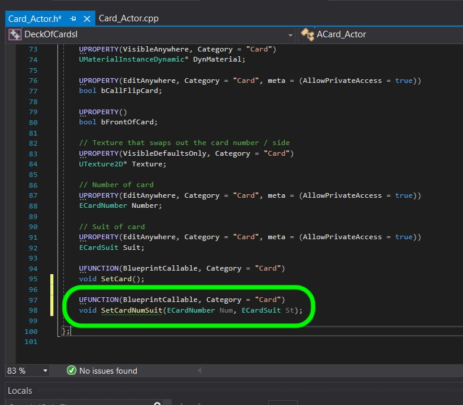
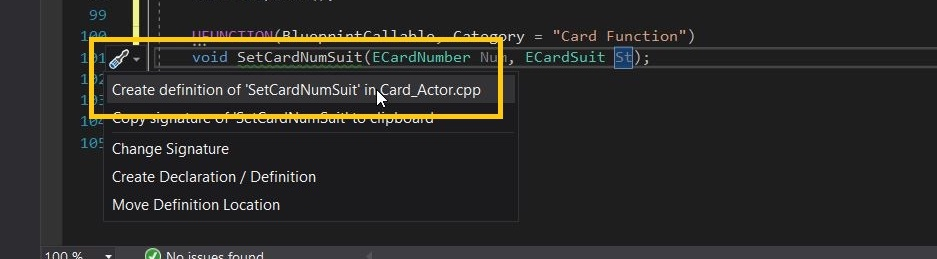
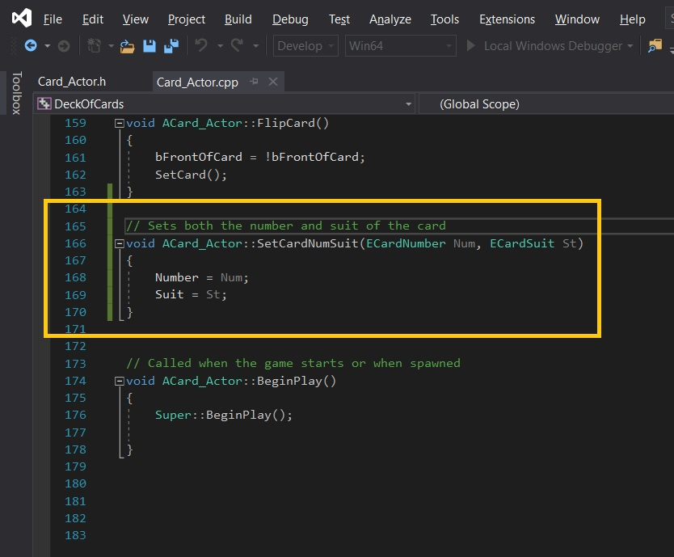
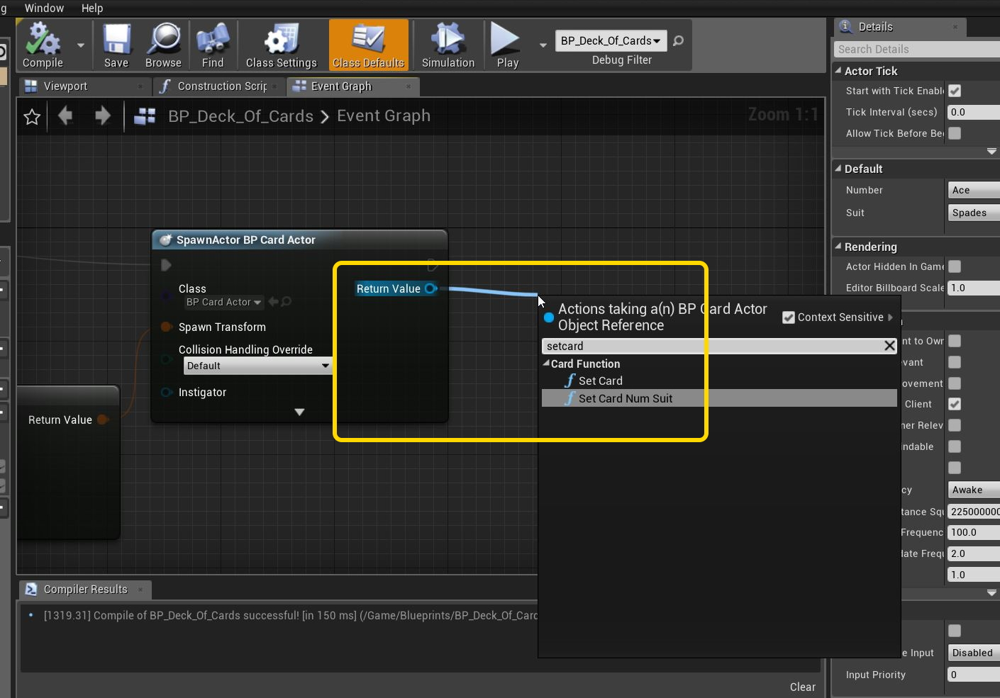
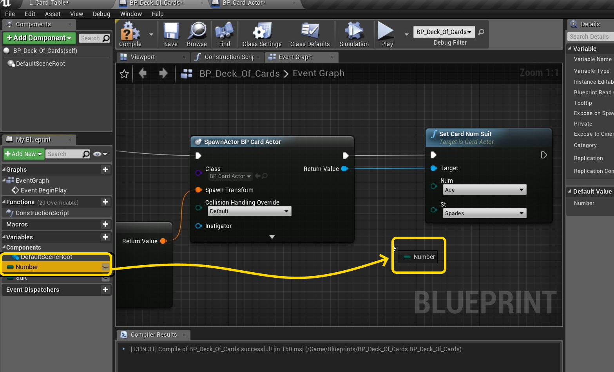
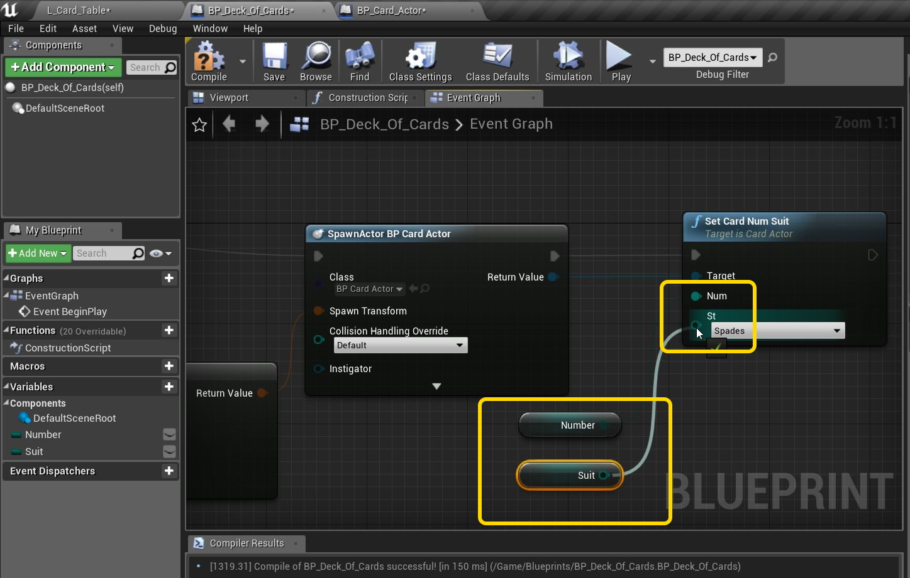
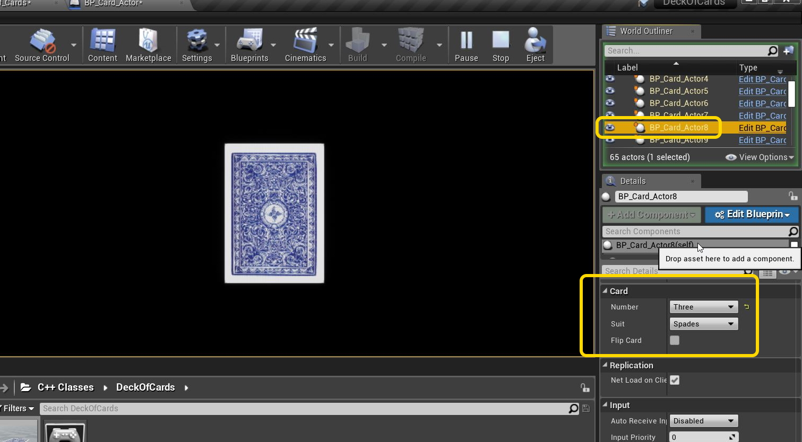

### Add Set Card Suit

[previous](../) • [home](../README.md#user-content-gms2-top-down-shooter) • [next](../)

Now we need to set each card to a unique number and suit.  Lets add this functionality to our Card C++ class.

 

---

##### `Step 1.`\|`SPCRK`|:small_blue_diamond:

Now we have fifty two ace of spades.  We forgot to write a function to set the card number and suit.  Open up **Card_Actor.h** and add to the bottom a new blueprint callable unction called `SetCardNumSuit()` and pass it a number and card enumerator.

##### `Step 2.`\|`FHIU`|:small_blue_diamond: :small_blue_diamond: 

Now we can click on the brush icon and select **Create definition of SetCardNumbSuit in Card_Actor.cpp**.

##### `Step 3.`\|`SPCRK`|:small_blue_diamond: :small_blue_diamond: :small_blue_diamond:

The function is quite simple where we set the number and suit.  Press **cntrl b** to compile the game.

##### `Step 4.`\|`SPCRK`|:small_blue_diamond: :small_blue_diamond: :small_blue_diamond: :small_blue_diamond:

Now go back to the game and make sure it has compiled.  Go to the **BP_Deck_Of_Cards** blueprint and after you create the actor pull off of the return value (reference to the neew actor you just created) and select a **Set Card Num Suit** node.

##### `Step 5.`\|`SPCRK`| :small_orange_diamond:

Drag a get reference to **Number** and drag it to the graph.

##### `Step 6.`\|`SPCRK`| :small_orange_diamond: :small_blue_diamond:

The repeat this for the suit and connect these two nodes to the **SetCardNumSuit**.

##### `Step 7.`\|`SPCRK`| :small_orange_diamond: :small_blue_diamond: :small_blue_diamond:

Now compile the blueprint and run the game.  Pick a card later in the deck and we should now have a full deck with the an individual card number. Next Up lets add interactivity to the button click and turn a card over.

___

| [previous](../)| [home](../README.md#user-content-gms2-top-down-shooter) | [next](../)|
|---|---|---|
