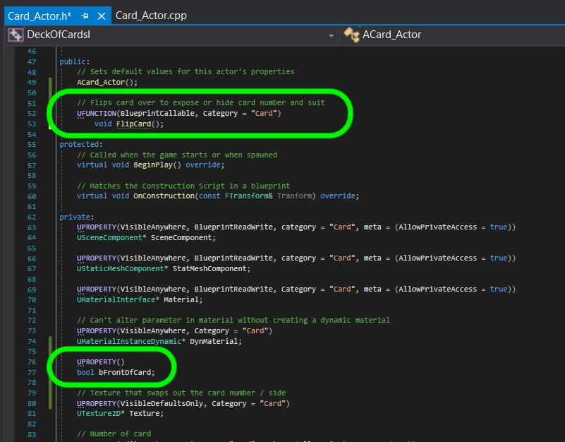
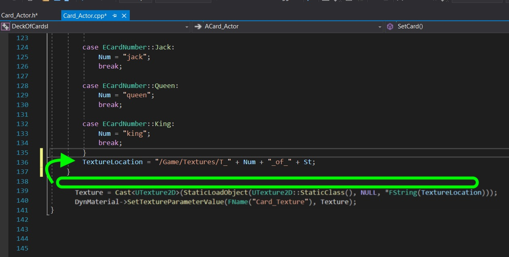
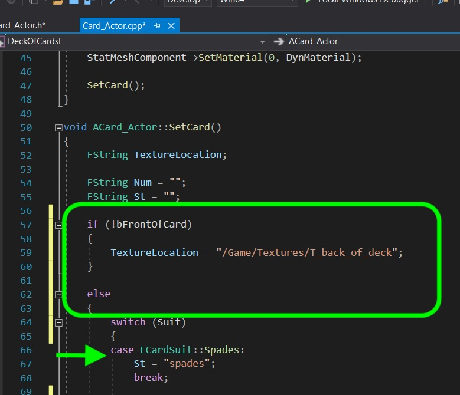
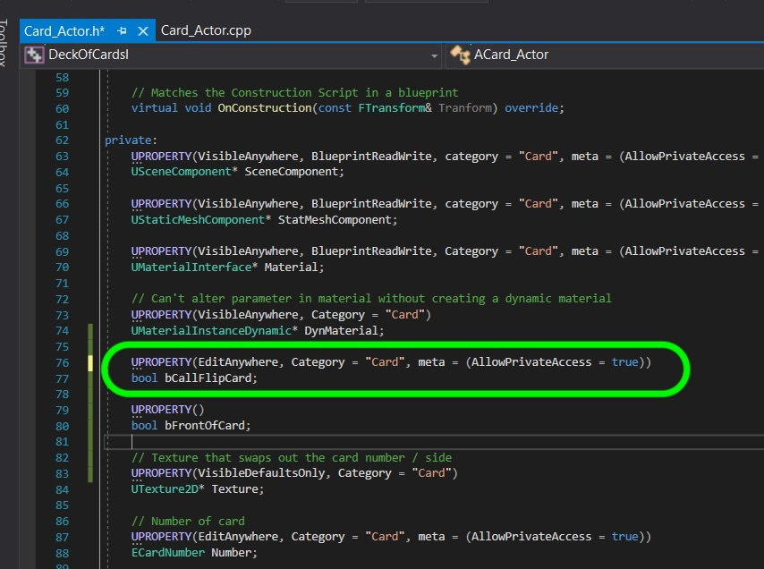
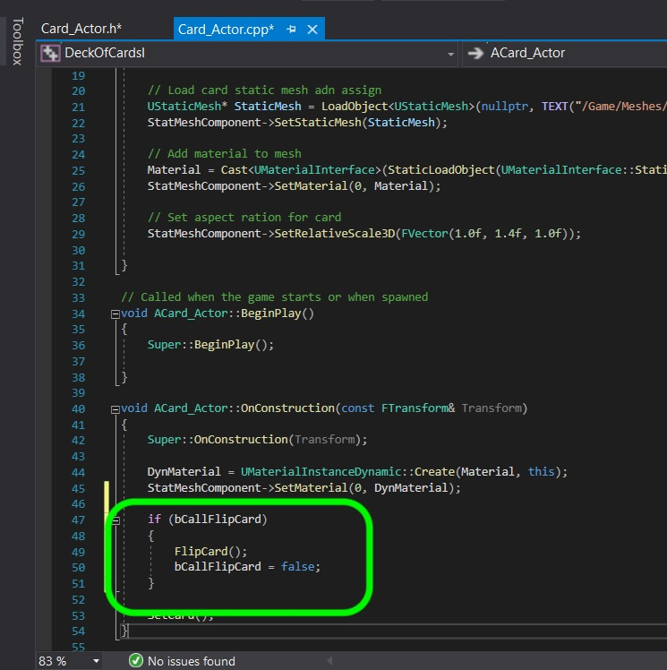

### Show Back of Cards

[previous](../) • [home](../README.md#user-content-gms2-top-down-shooter) • [next](../)

Lets finish up our card class and try it out.  I would like to have a a deck of cards with the cards facing down and facing up.  So we need the ability to flip a card over and hide the number and suit.  We will use an implentation detail in the **OnConstruction()** event.  We will use a boolean so that the user can flip the card in the editor without having to run the game.

 

---

##### `Step 1.`\|`SPCRK`|:small_blue_diamond:

Now we do not want someone else to toggle the card or accidentally change the boolean that represents whether the card is face up or face down.  So we will make it private and not expose it to the editor **or** to the blueprint.  We will create a variable called `bFrontOfCard`.  A user of this class can still flip it with a function we will declare next.  Now we will create a funcation called `void FlipCard()` to allow us to flip the card over and back in the editor.

##### `Step 2.`\|`FHIU`|:small_blue_diamond: :small_blue_diamond: 

Now we can automatically have Visual Studio set up the definition in the .cpp file. Click on the icon next to the new function declaration and select Create definition of FlipCard in Card_Actor.cpp.   Change the truthiness of the boolean for `bFrontOfCard` then call the `SetCard()` function to reset the texture.

##### `Step 3.`\|`SPCRK`|:small_blue_diamond: :small_blue_diamond: :small_blue_diamond:

We need to change **SetCard()** to first check to see if the caller wants the front or back of the card.  So add an **if** statement to check if it is showing the back of the card.  If so then add the location for the back of card texture and add an `else` statement after in case you need to pick the front of card texture:

##### `Step 4.`\|`SPCRK`|:small_blue_diamond: :small_blue_diamond: :small_blue_diamond: :small_blue_diamond:

We need to move the `TexutureLocation` for the front of card just before the end of the `else` statement so it doesn't override the setting for the back of the card.

##### `Step 5.`\|`SPCRK`| :small_orange_diamond:

Now lets add a boolean for debug that allows the user in the EDITOR ONLY to flip the card to see both sides.  Create a edit anywhere boolean that will call the function from the editor.  It will not be exposed to blurprints and not meant to be used during the game.

##### `Step 6.`\|`SPCRK`| :small_orange_diamond: :small_blue_diamond:

Lets add the boolean to the **On Construction** method and when it is true call the flip card function then set the boolean to false again.  So every time it is clicked in the editor it will call the function then go back to being false.  This is a great way to call and test functions in the editor.

##### `Step 7.`\|`SPCRK`| :small_orange_diamond: :small_blue_diamond: :small_blue_diamond:

Now the default for booleans is false so the card should start on its back side.  Compile and click the boolean in the editor and the card should flip sides. 

___

| [previous](../)| [home](../README.md#user-content-gms2-top-down-shooter) | [next](../)|
|---|---|---|
