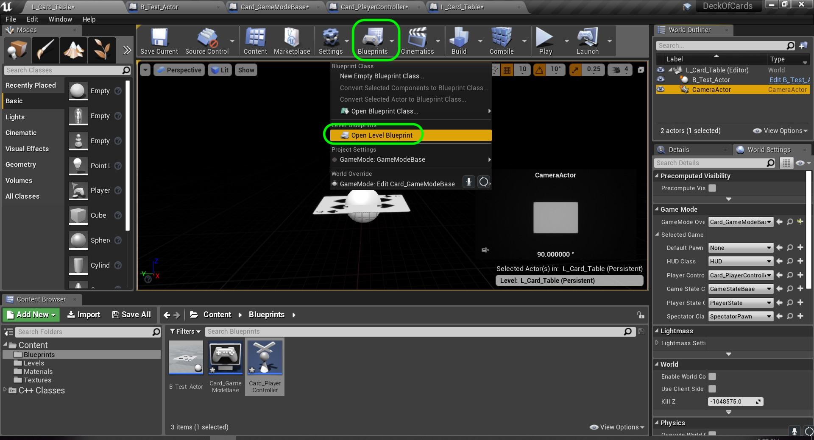
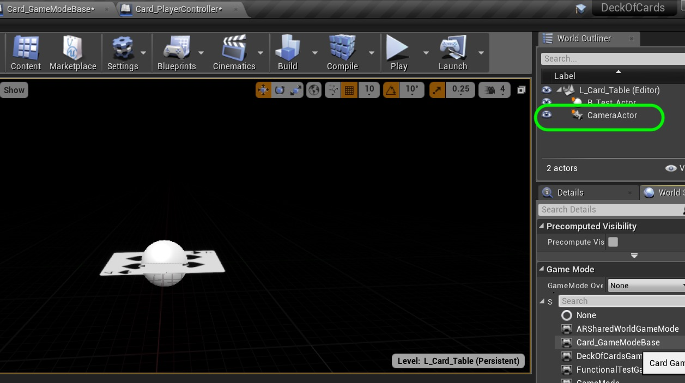
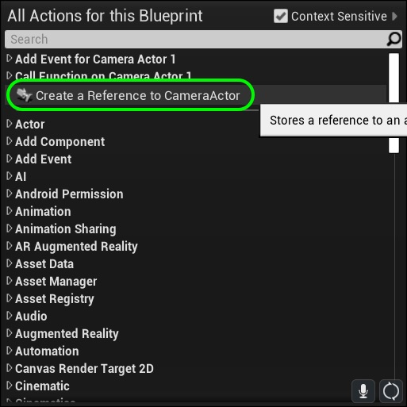
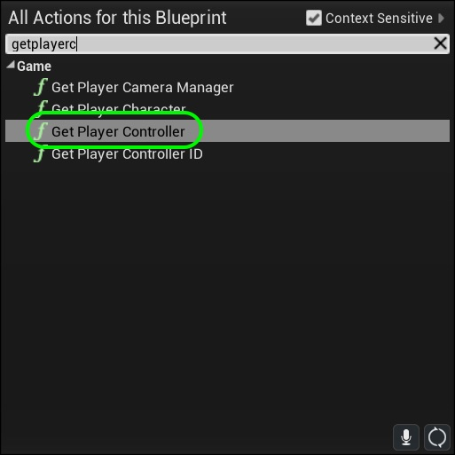
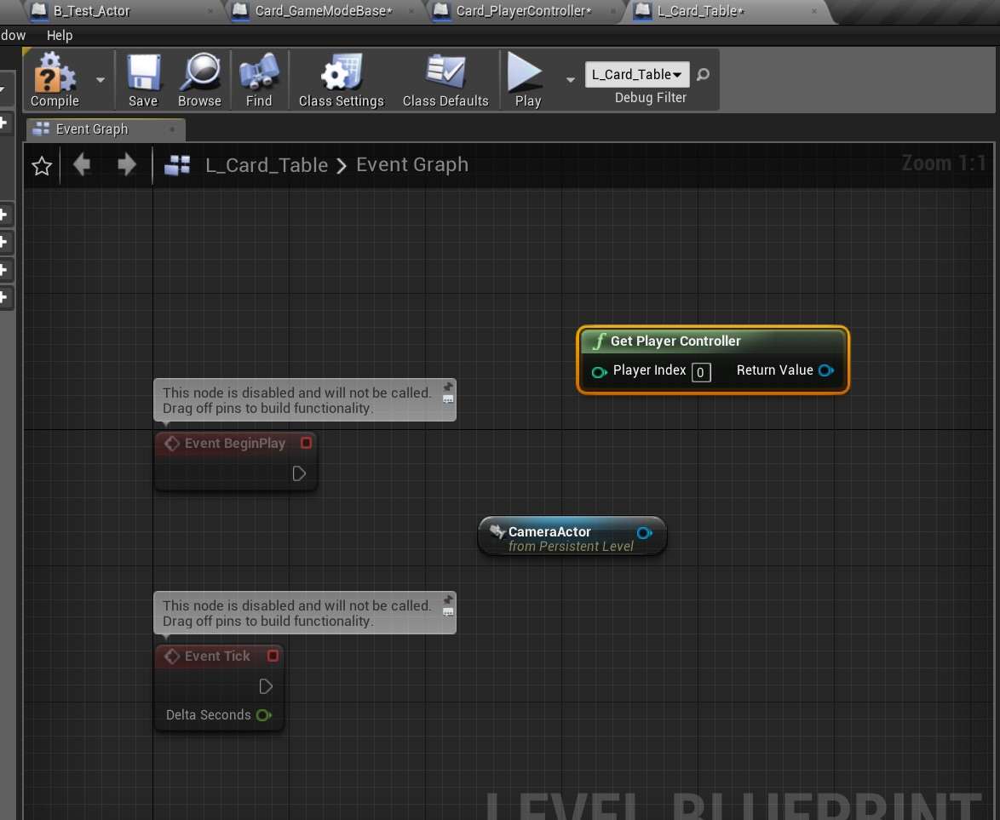
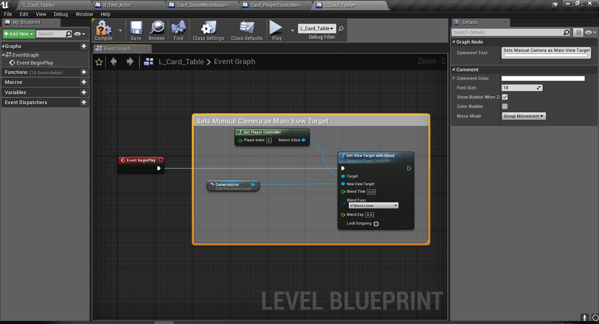

### Make Camera Default

[previous](../) • [home](../README.md#user-content-gms2-top-down-shooter) • [next](../)

Now Unreal expects a camera to be attached to a player whether the game is 2-d or 3-d.  Now our little game here is a card game, so there is no player as you are just controlling a cursor.  There is a way of telling the engine that this camera is the one we want to use.  .  Now whenever you create a new level the game creates a special blueprint.  It is called a **Level Blueprint**.  This special blueprint allows us to access objects in the game scene.  

 

---

##### `Step 1.`\|`SPCRK`|:small_blue_diamond:

Press the **Blueprints** button then select **Open Level Blueprint**:

##### `Step 2.`\|`FHIU`|:small_blue_diamond: :small_blue_diamond: 

Select in the game level the camera actor.

##### `Step 3.`\|`SPCRK`|:small_blue_diamond: :small_blue_diamond: :small_blue_diamond:

Now go back to the **Level Blueprint** and right click on the graph.  You will notice that it adds to the top a **Create a Reference to CameraActor**.  Press this to add this node.

##### `Step 4.`\|`SPCRK`|:small_blue_diamond: :small_blue_diamond: :small_blue_diamond: :small_blue_diamond:

 Now again press the right mouse button on the empty graph and select a **Get Player Controller** node.

##### `Step 5.`\|`SPCRK`| :small_orange_diamond:

So your level blueprint should look like this:

##### `Step 6.`\|`SPCRK`| :small_orange_diamond: :small_blue_diamond:

Add a **Set View Target With Blend** node and plug the **Player Controller** into the target and plug in the **Camer Actor** to the **New View Target** input node.  Then connect the execution pin from **EventBeginPlay** to the **Set View Target** node.  Add a comment that describes what we are doing.

##### `Step 7.`\|`SPCRK`| :small_orange_diamond: :small_blue_diamond: :small_blue_diamond:

Run the game and now it selects the camera you set.  You can't control a player, and it is pretty much set up so we can begin.

___

| [previous](../)| [home](../README.md#user-content-gms2-top-down-shooter) | [next](../)|
|---|---|---|
