### Make Card Clickable

[previous](../) • [home](../README.md#user-content-gms2-top-down-shooter) • [next](../)

Now we have a deck of cards but can't do anything with them.  We have a deck face down but it would be nice to click on a card and have it turn the card over in a pile next to it.  

 

---

##### `Step 1.`\|`SPCRK`|:small_blue_diamond:

Open up **BP_Card_Actor** blueprint and we will add this functionality in blueprints as opposed to the underlying class.  I want the class to be somewhat generic of the immplementation.  I want to simulate a class that you would hand over to a design team.  When you open a blueprint with no nodes often you don't get the normal view.  You get the data only view.  It just takes pressing **Open in Full Blueprint Editor** to get back to the programming view.

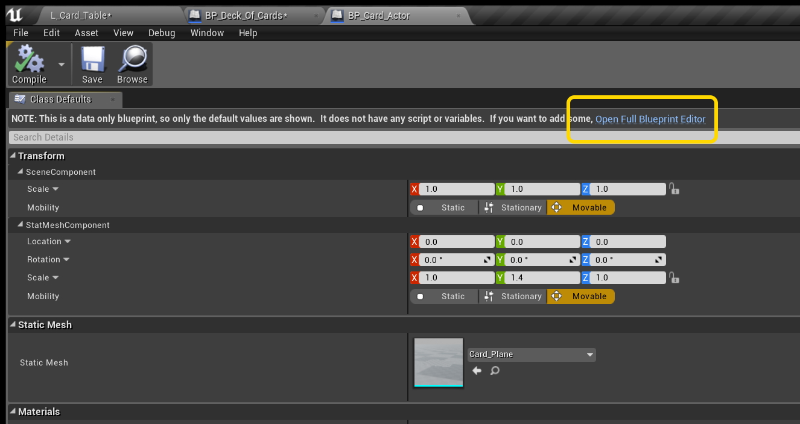

##### `Step 2.`\|`FHIU`|:small_blue_diamond: :small_blue_diamond: 

 Now select the **Static Mesh** in the blueprint and right click on the graph.  At the top you can access events attached to the actor.  Select **Add Event for Stat Mesh Component \| Input \| Mouse Input \| Add On Clicked**.

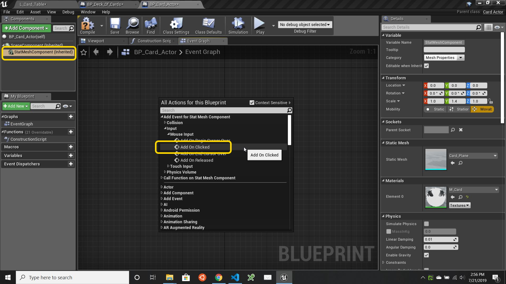

##### `Step 3.`\|`SPCRK`|:small_blue_diamond: :small_blue_diamond: :small_blue_diamond:

Add a **Print String** node and connect the execution pin.  Type a message so we can test to see that clicking on the object works.

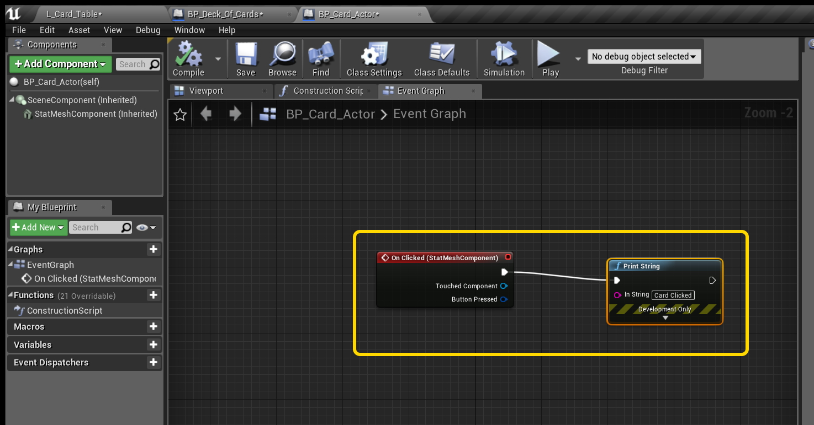

##### `Step 4.`\|`SPCRK`|:small_blue_diamond: :small_blue_diamond: :small_blue_diamond: :small_blue_diamond:

Run the game and click on the deck of cards.  Do we see a message appear each time you click?

##### `Step 5.`\|`SPCRK`| :small_orange_diamond:

Now we need to shift the card over to the right.  We need to get the existing location of the card then move it in negative x to move the card.  Right click on the graph and add a **Get Actor Location** node.  Right click on the output pin and select **Split Struct Pin**.

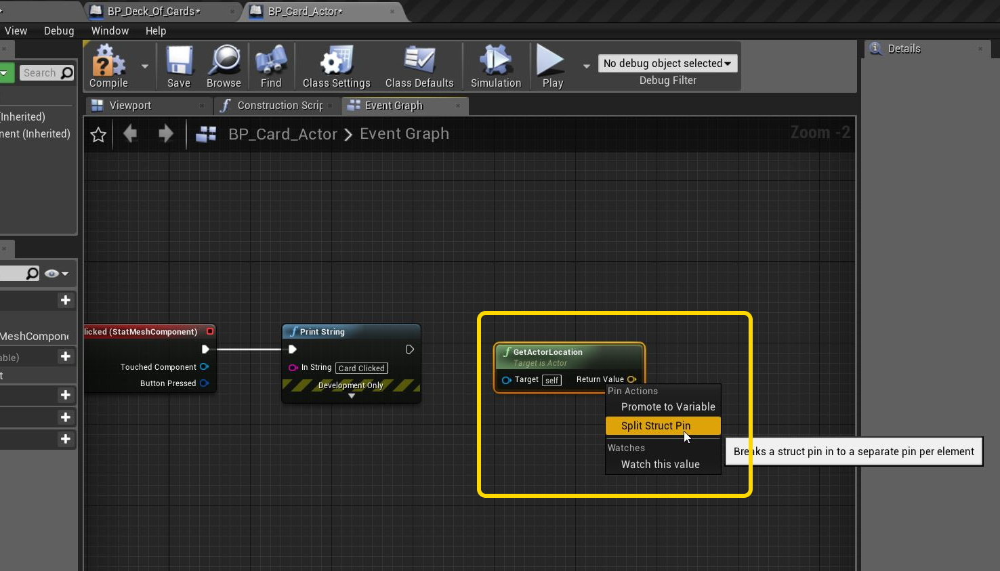

##### `Step 6.`\|`SPCRK`| :small_orange_diamond: :small_blue_diamond:

Pull off of the **Return Value X** output pin and select a **Float + Float** node:

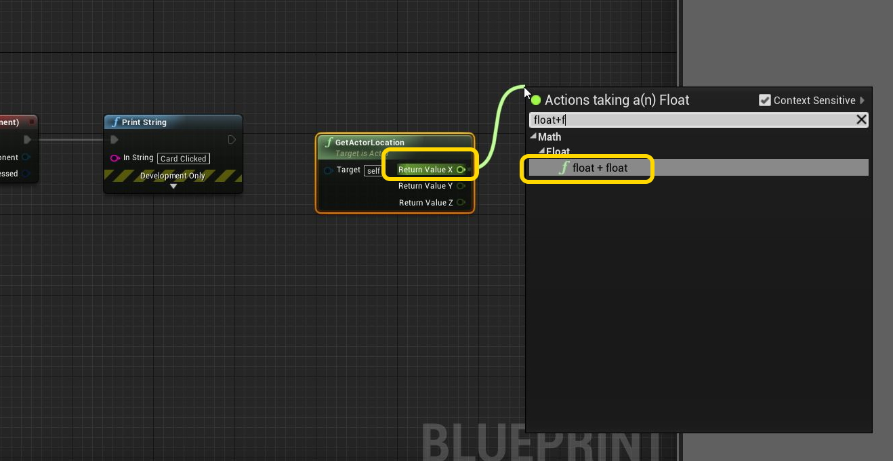

##### `Step 7.`\|`SPCRK`| :small_orange_diamond: :small_blue_diamond: :small_blue_diamond:

Set the value in the addition node to `-30` and add a **Set Actor Location** node to reposition the card with.

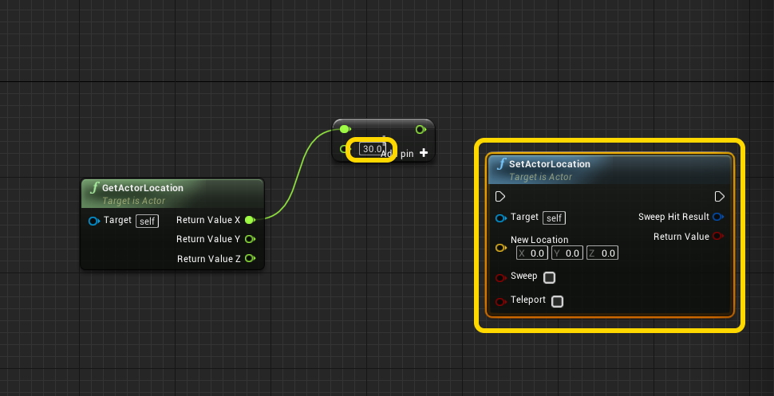

##### `Step 8.`\|`SPCRK`| :small_orange_diamond: :small_blue_diamond: :small_blue_diamond: :small_blue_diamond:

Split the struct pin on the **Set Actor Location New Location** pin.

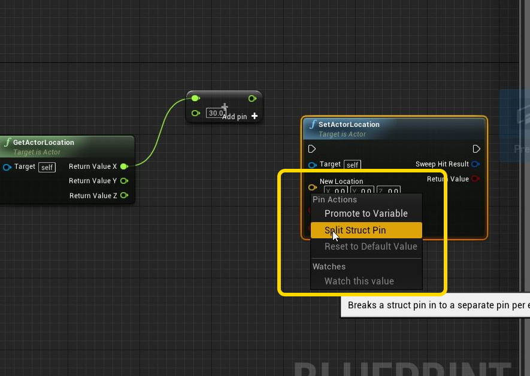

##### `Step 9.`\|`SPCRK`| :small_orange_diamond: :small_blue_diamond: :small_blue_diamond: :small_blue_diamond: :small_blue_diamond:

Connect the **X Y Z** pins in **Set Actor Location** and add a **Flip Card** function call to the function we wrote in the C++ class.  This will move the card `-30` pixels to the right and flip the card. Then delete the **Print String** node and connect the execution pin from **On Clicked** node to **SetActorLocation** to **Flip Card** nodes.

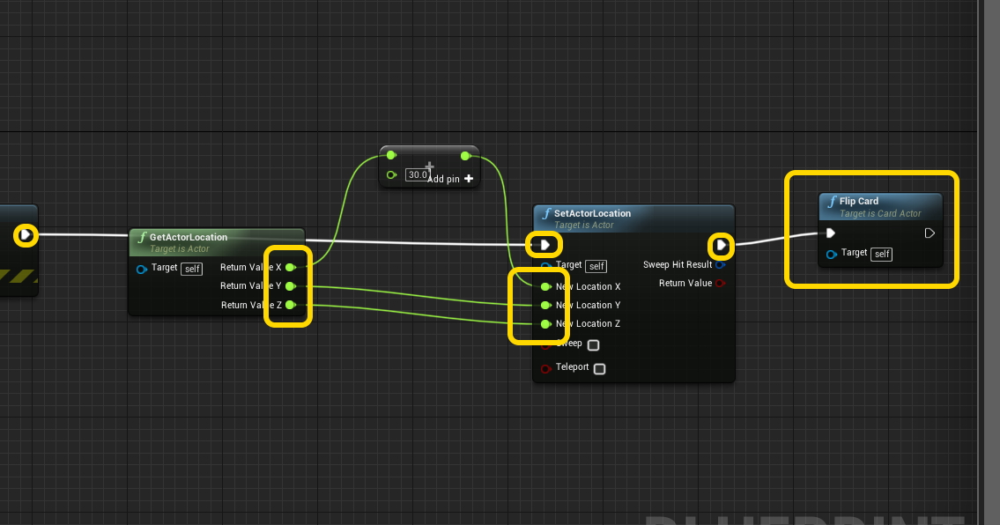

##### `Step 10.`\|`SPCRK`| :large_blue_diamond:

Now compile and run and click on the top card.  Notice that it turns over, but it doesn't really go far enough.  Also when I move the deck over to the left in the editor it goes back to the center when running the game.  Lets fix this and adjust the distance the card goes in.

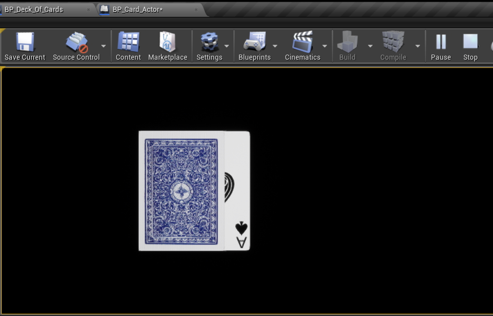

##### `Step 11.`\|`SPCRK`| :large_blue_diamond: :small_blue_diamond: 

Open up **BP_Deck_Of_Cards** and add a **Get Actor Location** node and send the output into the **Make Transform Location** pin.  This way it will remember the location you placed the deck on the table and leave it alone.

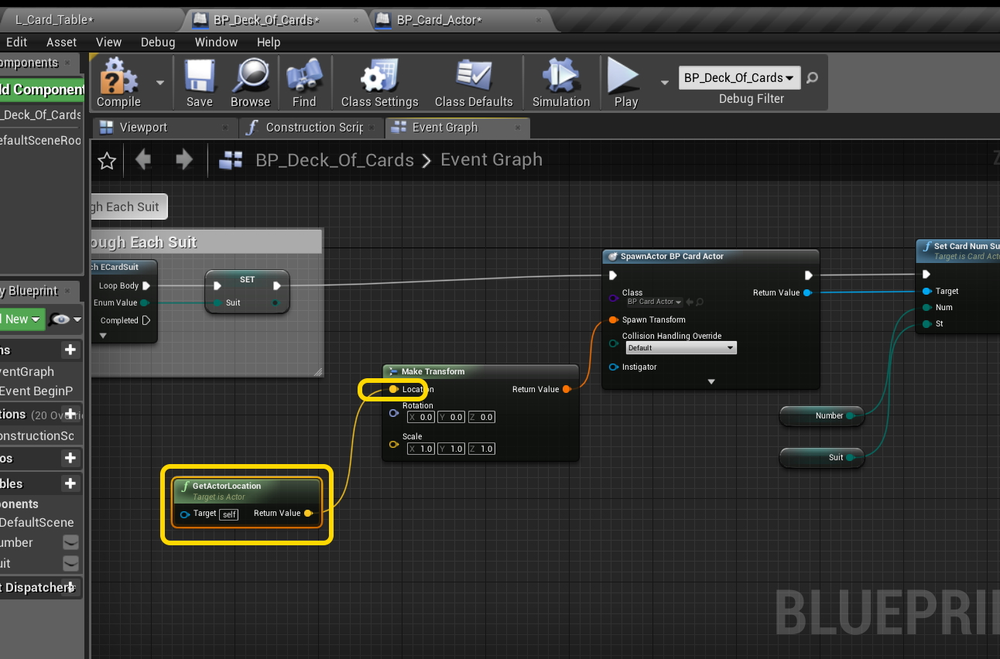

##### `Step 12.`\|`SPCRK`| :large_blue_diamond: :small_blue_diamond: :small_blue_diamond: 

Open up **BP_Card_Actor** and this time try moving the card `-120` on the **X** axis.

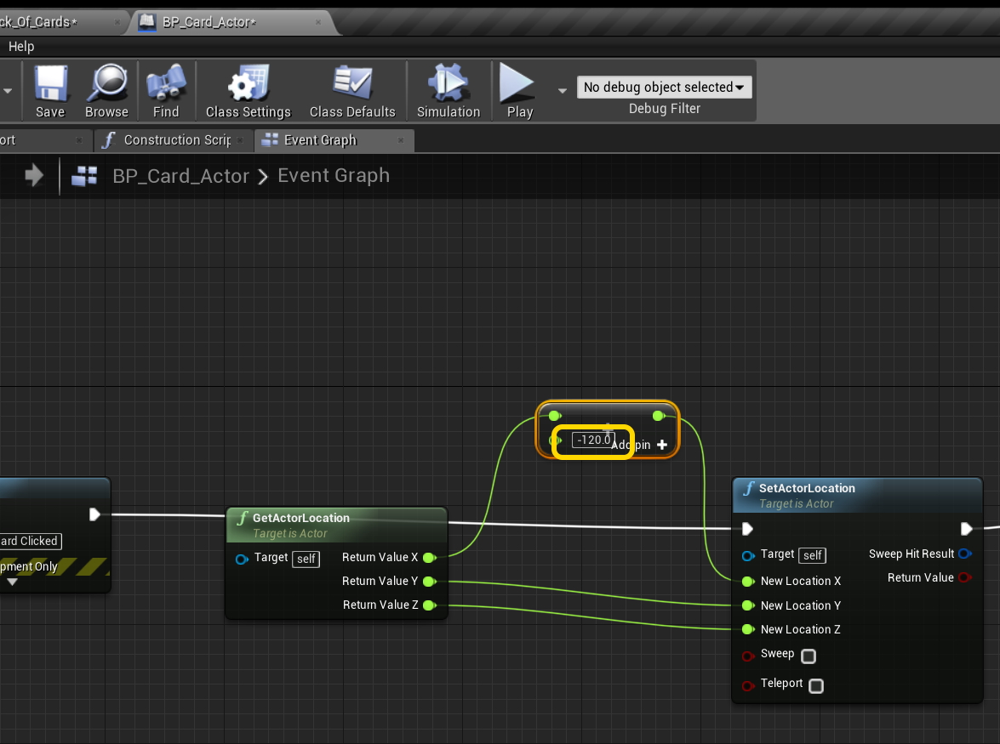

##### `Step 13.`\|`SPCRK`| :large_blue_diamond: :small_blue_diamond: :small_blue_diamond:  :small_blue_diamond: 

Compile and run the game.  Click on the cards.  There are a few obvious issues. The cards just keep moving to the right.  We should only have one card up pile.  The other thing is that the engine is sorting the cards in **Z** even though they are all set to `0.0f`.  But it is rembering that the one placed their first gets higher priority and it remebers that setting when switching piles.  Lets fix this.

___

| [previous](../)| [home](../README.md#user-content-gms2-top-down-shooter) | [next](../)|
|---|---|---|
