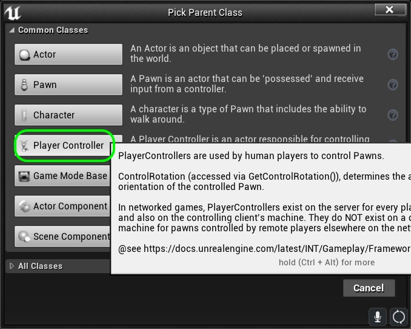
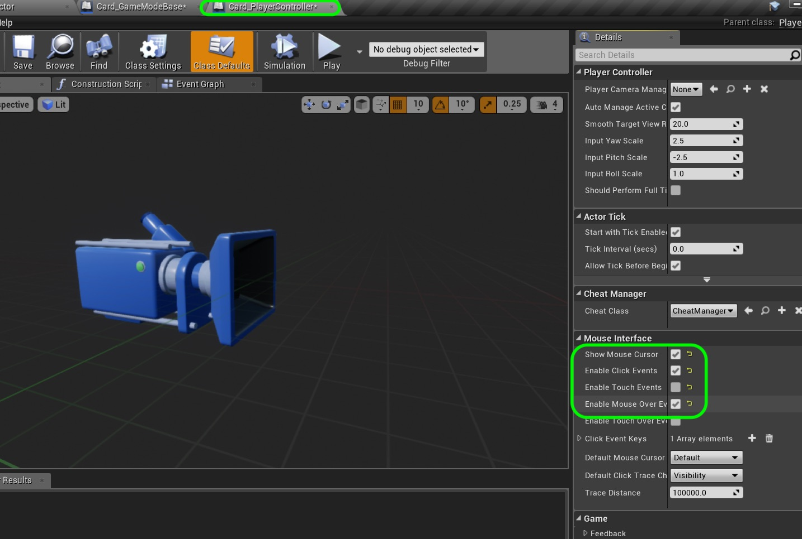
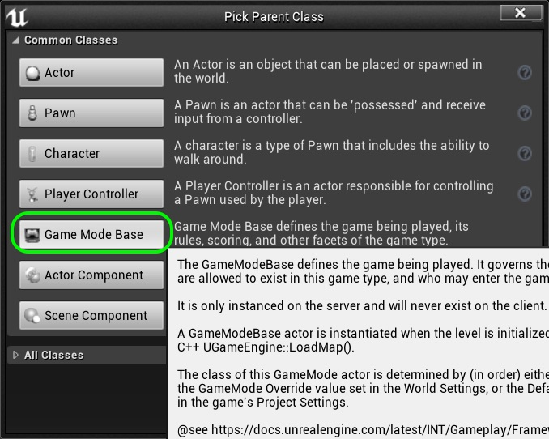
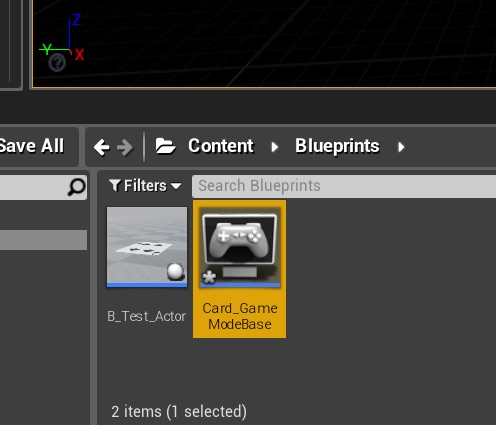
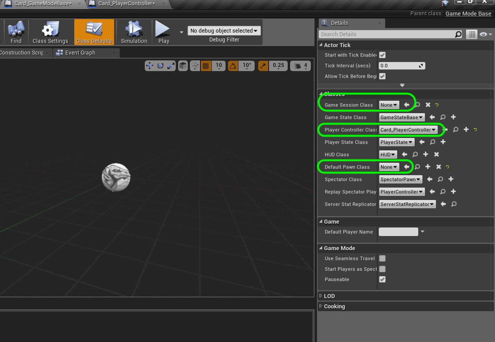
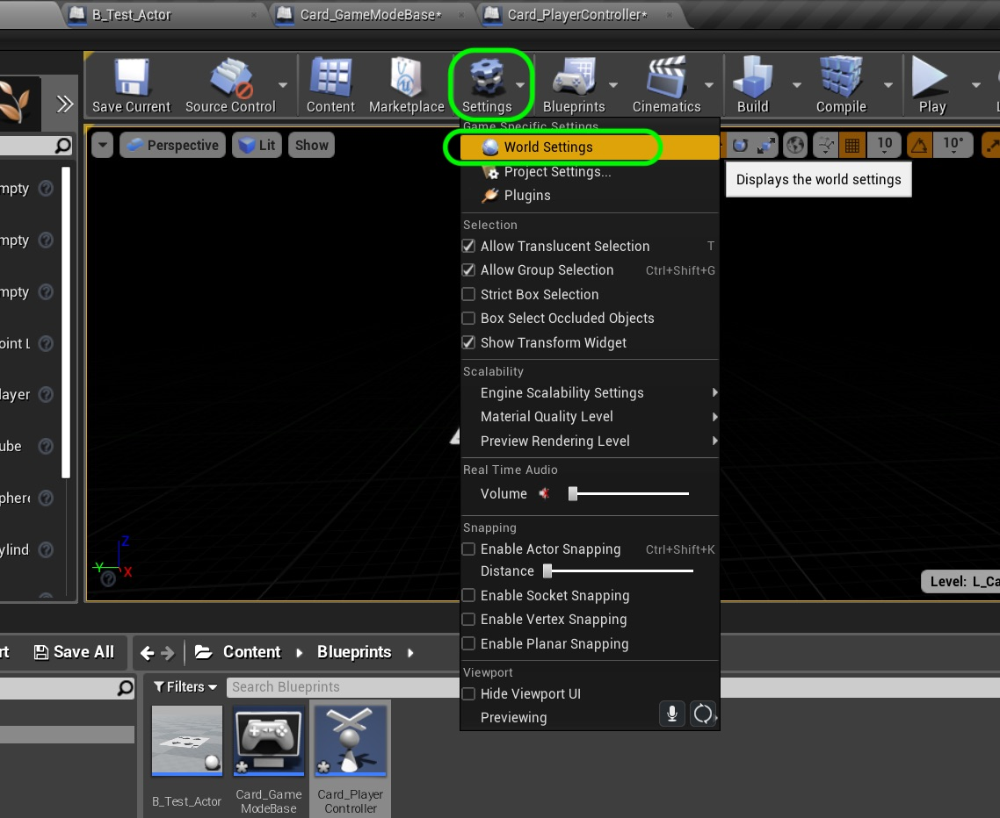
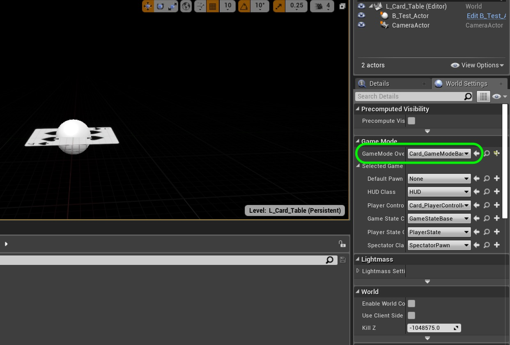

### Configure Projects

[previous](../) • [home](../README.md#user-content-gms2-top-down-shooter) • [next](../)

Now we want to take out the extraneous object we don't need and set the default camera to the one we loaded into the scene.  We do this by adding some custom setup files that default ones are provided for us (and add all these files).

 

---

##### `Step 1.`\|`SPCRK`|:small_blue_diamond:

Add a new **Blueprint** and this time select a **Player Controller** class.  We need to add a cursor and cursor events as we will be handling the cards with a mouse.

##### `Step 2.`\|`FHIU`|:small_blue_diamond: :small_blue_diamond: 

Now name the blueprint `BP_Card_PlayerController` and make sure that you enable **Show Mouse Cursor**, **Enable Click Events** and **Enable Mouse Over Events**.  We are not supporting mobile so you can leave the touch events disabled.

##### `Step 3.`\|`SPCRK`|:small_blue_diamond: :small_blue_diamond: :small_blue_diamond:

Now create a new **Blueprint** and select **Game Mode Base** as the base class.

##### `Step 4.`\|`SPCRK`|:small_blue_diamond: :small_blue_diamond: :small_blue_diamond: :small_blue_diamond:

Call this file `BP_Card_GameModeBase`.

##### `Step 5.`\|`SPCRK`| :small_orange_diamond:

 Now double click this blueprint and turn off the **Game Session Class** as we will not be using networking features.  Change the **Player Controller Class** to `BP_Card_PlayerController`.  Turn off the **Default Pawn Class** so that you don't control a player when playing the game.

##### `Step 6.`\|`SPCRK`| :small_orange_diamond: :small_blue_diamond:

 Now we are not done.  This Game Mode still won't launch until we set it.  Press the **Settings** button and select **World Settings**.

##### `Step 7.`\|`SPCRK`| :small_orange_diamond: :small_blue_diamond: :small_blue_diamond:

Now the **World Settings** tab appears to the right behind the **Details** panel.  Change the **GameMode Override** to `BP_Card_GameModeBase`.

___

| [previous](../)| [home](../README.md#user-content-gms2-top-down-shooter) | [next](../)|
|---|---|---|
