### Deck of Cards

[previous](../) • [home](../README.md#user-content-gms2-top-down-shooter) • [next](../)

Now we have a starting point for a working class that we can use in a game.  Lets create a class that is a deck of cards that handles the individual card actors. Let's open the game in UE4.

 

---

##### `Step 1.`\|`SPCRK`|:small_blue_diamond:

Let's take a look at the **BP_Card** class to see what it looks as a blueprint.  We will be adding user interaction within the blueprint later on.

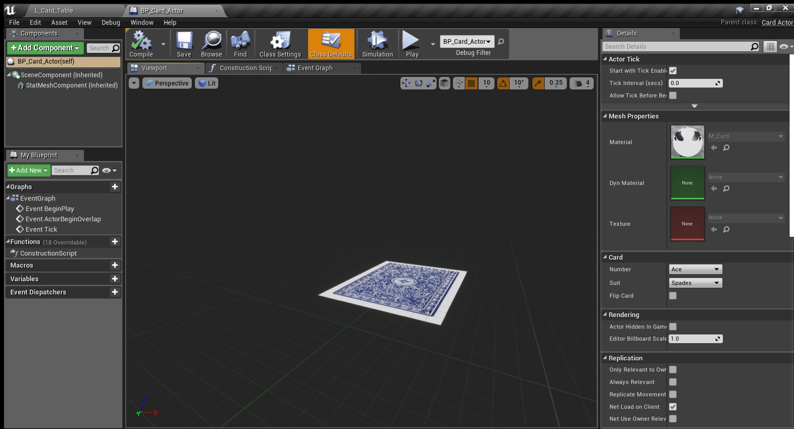

##### `Step 2.`\|`FHIU`|:small_blue_diamond: :small_blue_diamond: 

Create a new **Actor Blueprint** and add it to the **Blueprints** folder and call it `BP_Deck_Of_Cards`.

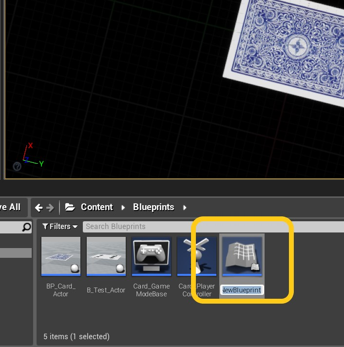

##### `Step 3.`\|`SPCRK`|:small_blue_diamond: :small_blue_diamond: :small_blue_diamond:

Open the blueprint and add a new **Variable**.  You will notice that Unreal makes the UClass Enumerators globally accessible in the editor.  Press type and put in `ECard...` and you will see the two enumerators we added to the C++ class accessible.

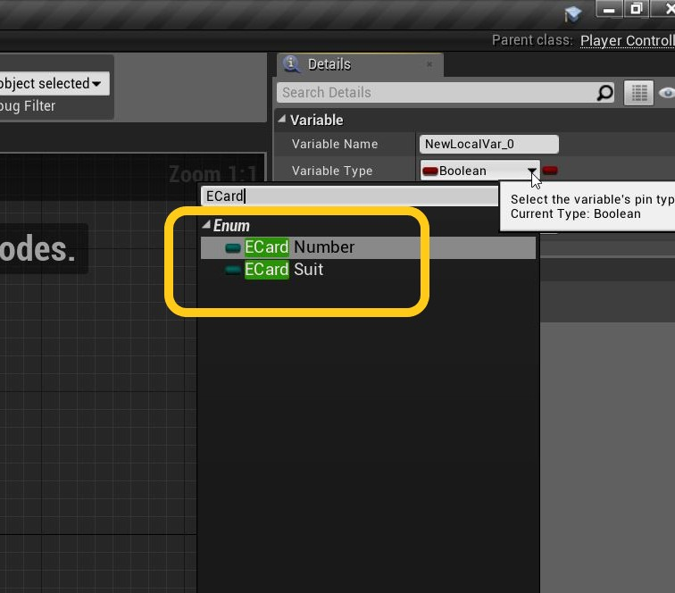

##### `Step 4.`\|`SPCRK`|:small_blue_diamond: :small_blue_diamond: :small_blue_diamond: :small_blue_diamond:

Name the variable `Number` and make it a type of `ECardNumber`.  We should make it **Private** by default as another object does not need access to it at this moment.  Lets put it in caterogy `Card`.

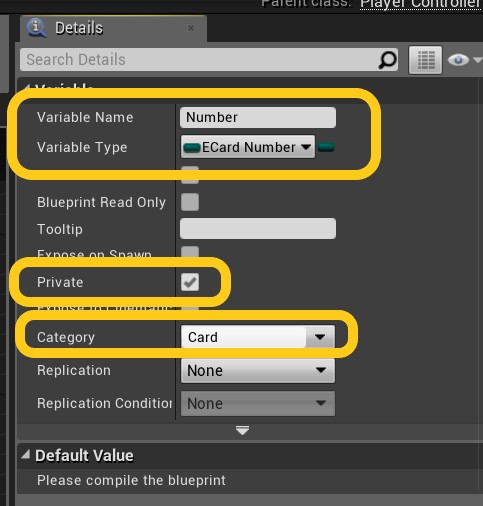

##### `Step 5.`\|`SPCRK`| :small_orange_diamond:

Create another variable called `Suit` with type `ECardSuit` and make it **Private** and of category `Card`.

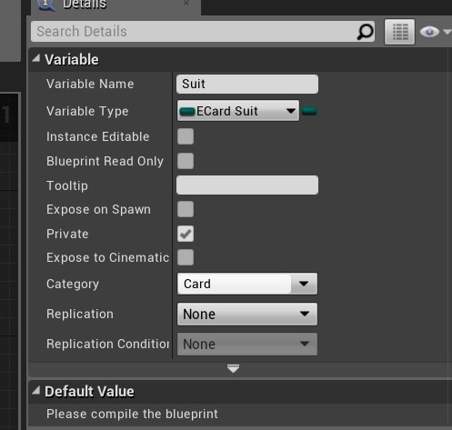

##### `Step 6.`\|`SPCRK`| :small_orange_diamond: :small_blue_diamond:

Open the **Event Graph** tab and add a **For Each ECardNumber** node which will go through each number in the Enumerator list.

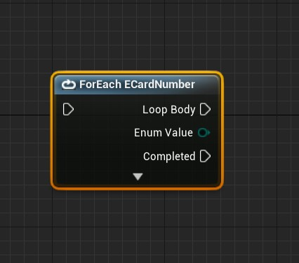

##### `Step 7.`\|`SPCRK`| :small_orange_diamond: :small_blue_diamond: :small_blue_diamond:

Connect ther exeuction pin from the **Begin Play** node to the **For Each** loop.  We need to set the variable **Number** so we can build a new card actor with it.  Drag a **Set** reference onto the open grid.

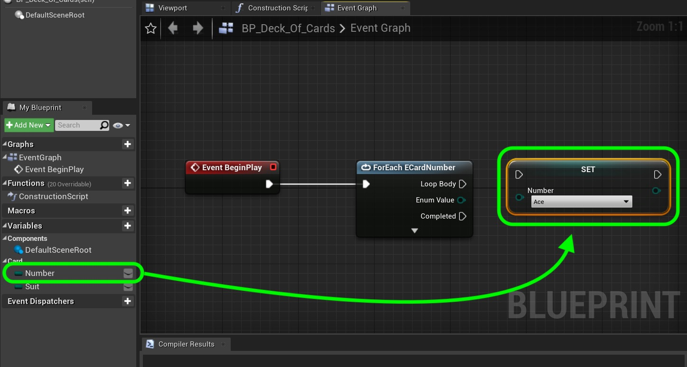

##### `Step 8.`\|`SPCRK`| :small_orange_diamond: :small_blue_diamond: :small_blue_diamond: :small_blue_diamond:

We need to set the card to the latest one in the **For Each** loop and hook up the execution pins to **Begin Play** execution pin.

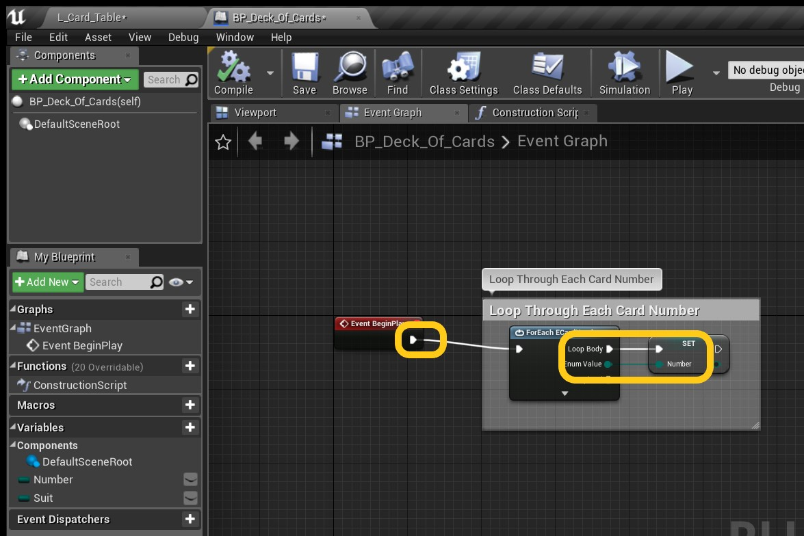

##### `Step 9.`\|`SPCRK`| :small_orange_diamond: :small_blue_diamond: :small_blue_diamond: :small_blue_diamond: :small_blue_diamond:

Now lets loop through each suit so we can create an **Actor** in the scene with each card of the 52 card deck.

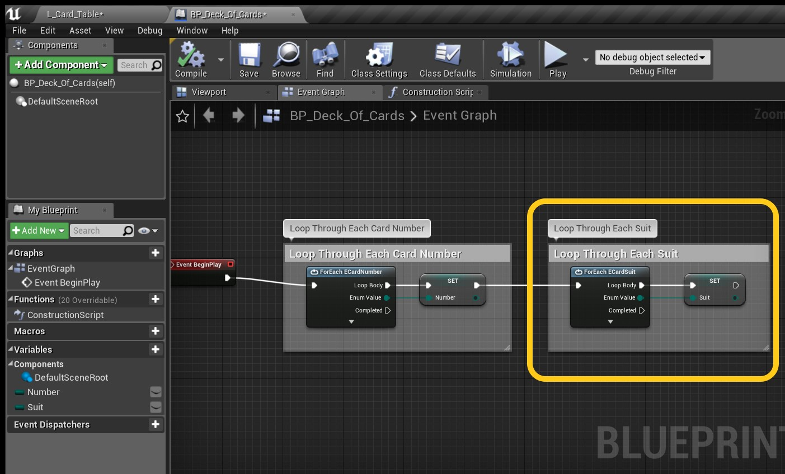

##### `Step 10.`\|`SPCRK`| :large_blue_diamond:

Now we will create a card and add it to the deck. Right click on graph and look for a **Spawn Actor of Class** node.

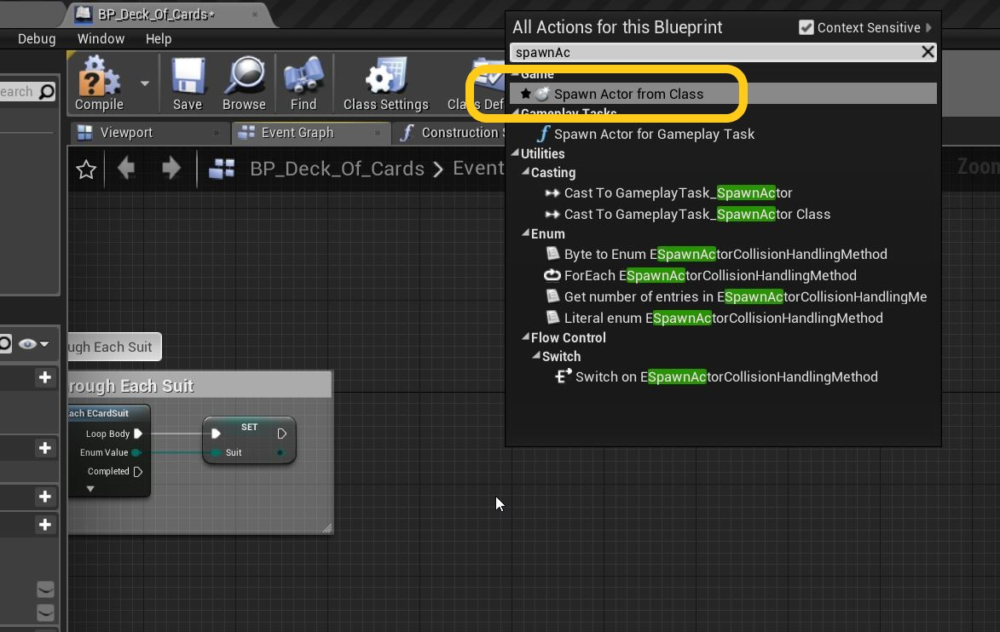

##### `Step 11.`\|`SPCRK`| :large_blue_diamond: :small_blue_diamond: 

OK, set the class in this node to `BP_Card_Actor` and press compile.  Look at the error it wants to add a transform into the **Transform** input pin.

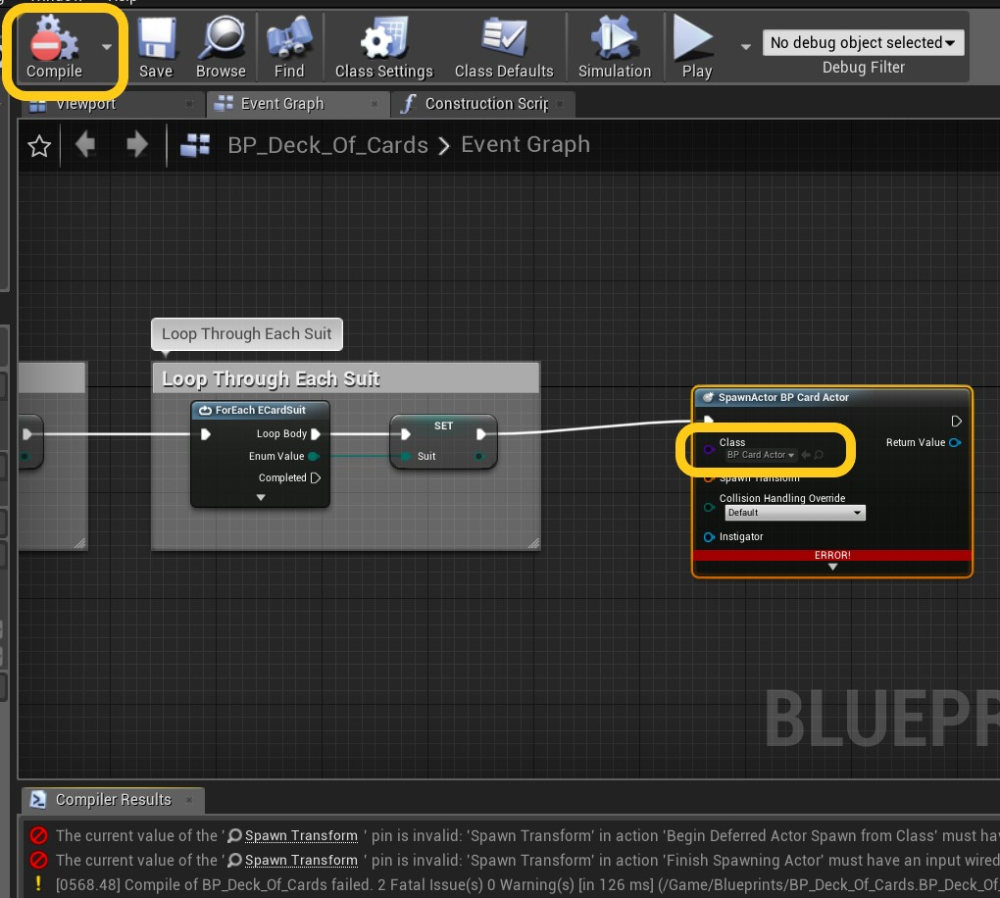

##### `Step 12.`\|`SPCRK`| :large_blue_diamond: :small_blue_diamond: :small_blue_diamond: 

 Right click on the graph and select a **Make Transform** node:

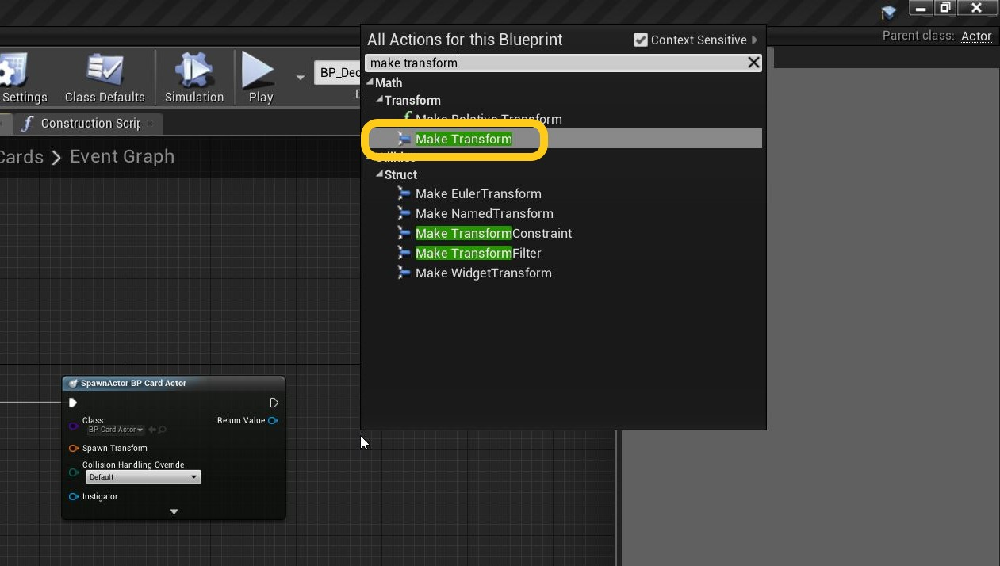

##### `Step 13.`\|`SPCRK`| :large_blue_diamond: :small_blue_diamond: :small_blue_diamond:  :small_blue_diamond: 

 Leave the default settings and connect the output pin to the **Spawn Class** node.  Connect the execution pins where needed.

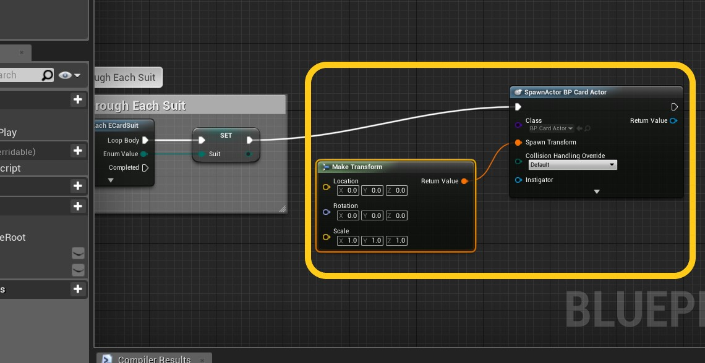

##### `Step 14.`\|`SPCRK`| :large_blue_diamond: :small_blue_diamond: :small_blue_diamond: :small_blue_diamond:  :small_blue_diamond: 

Go back to game level and remove the old card blueprint.  Replace it with the new **BP_Deck_Of_Cards** class.  Press run and notice that it spawns all the card classes. If the card is not vertical and is horizontal you can rotate the camera by 90 or -90 on the Z Rotation.

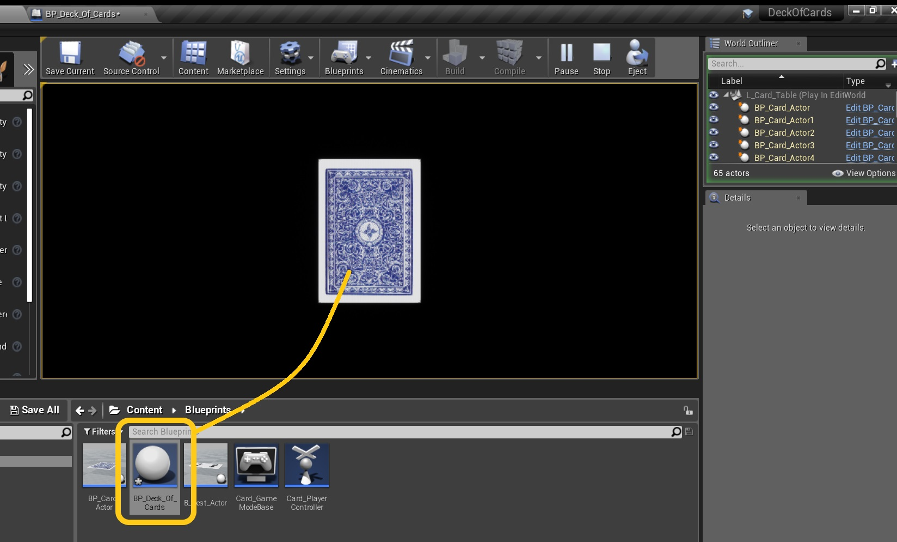

##### `Step 15.`\|`SPCRK`| :large_blue_diamond: :small_orange_diamond: 

Scroll down and you will see the 52nd card and the deck of card actor.  Next up lets have the card flip over if you click on it with the left mouse button.

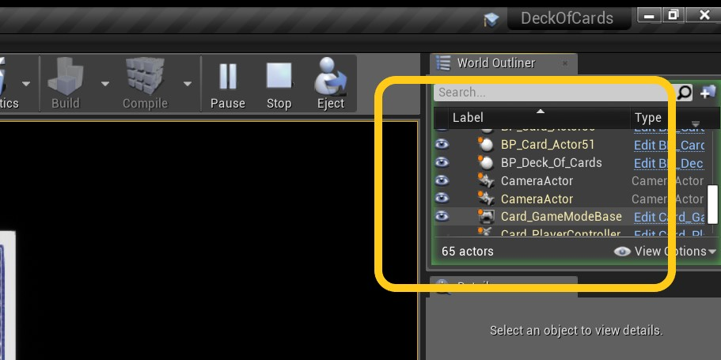

___

| [previous](../)| [home](../README.md#user-content-gms2-top-down-shooter) | [next](../)|
|---|---|---|
