### Dynamic Material

[previous](../) • [home](../README.md#user-content-gms2-top-down-shooter) • [next](../)

A UE4 material in its default state can't be changed at runtime.  To be able to change a material, we need to add a dynamic material and attach it to the existing material on the object.

 

---

##### `Step 1.`\|`SPCRK`|:small_blue_diamond:

We cannot create a dynamic material in the C++ class constructor.  We need to do this in the C++ equivalent of the blueprint constructor, which is called `OnConstruction`.  Add this to the `.h` file:

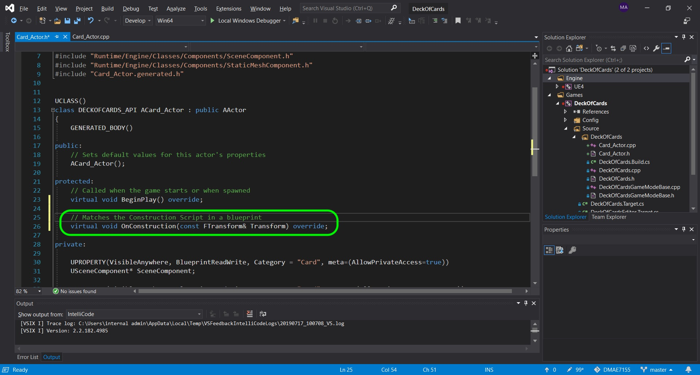

##### `Step 2.`\|`FHIU`|:small_blue_diamond: :small_blue_diamond: 

You can click on the link above for the method and read the description of this function.

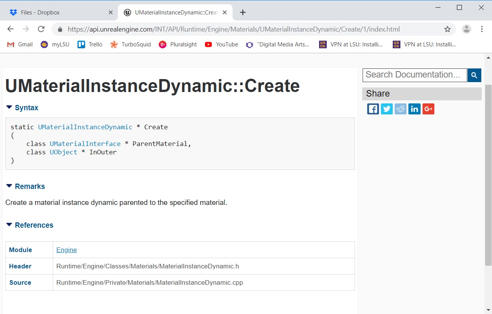

##### `Step 3.`\|`SPCRK`|:small_blue_diamond: :small_blue_diamond: :small_blue_diamond:

Lets define it in the `.cpp` file and call the parent classes implementation that we can add to (with the **Super::** directive)

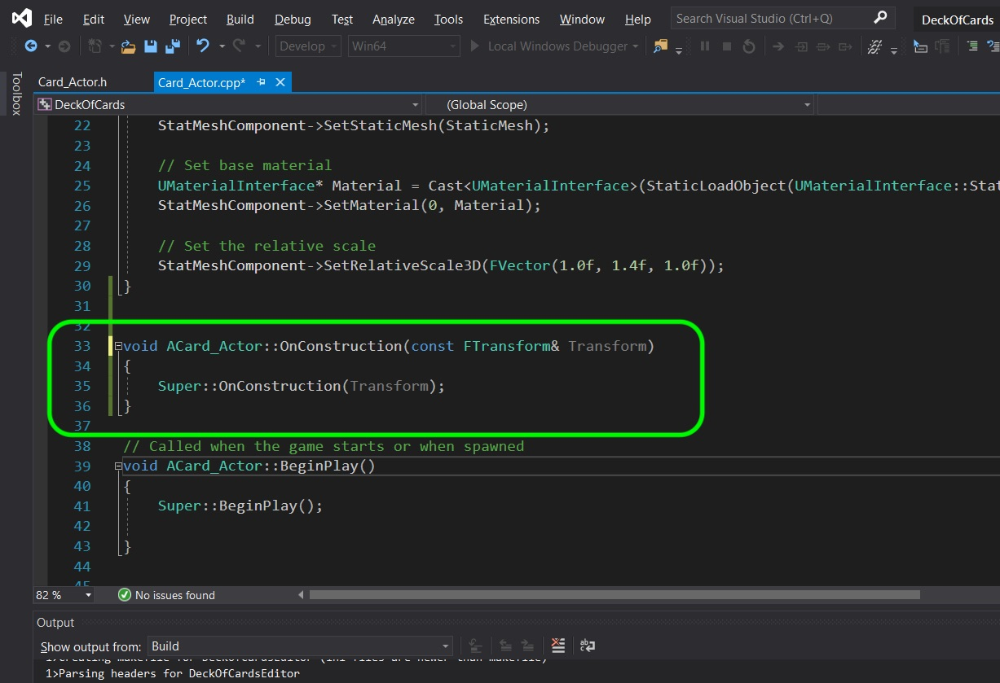

##### `Step 4.`\|`SPCRK`|:small_blue_diamond: :small_blue_diamond: :small_blue_diamond: :small_blue_diamond:

Go back to the `.h` and lets add a pointer to a [UMaterialInstanceDynamic](https://api.unrealengine.com/INT/API/Runtime/Engine/Materials/UMaterialInstanceDynamic/index.html).

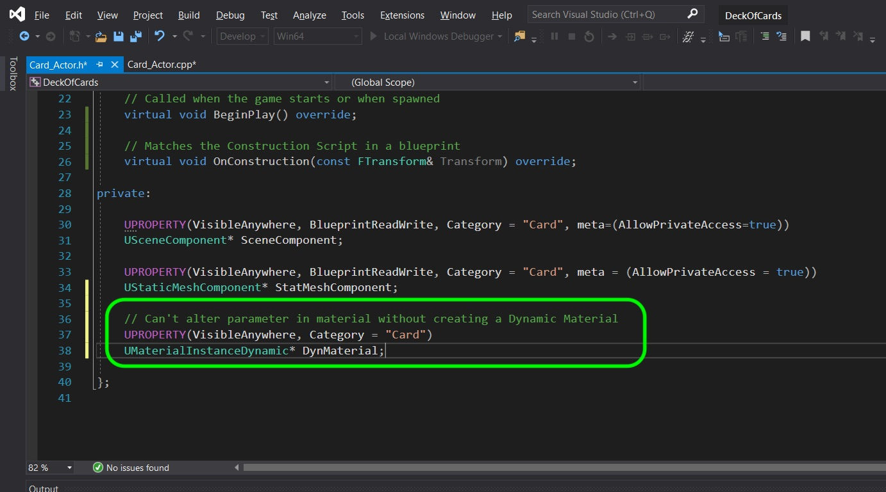

##### `Step 5.`\|`SPCRK`| :small_orange_diamond:

Include the appropriate header file that we linked to above.

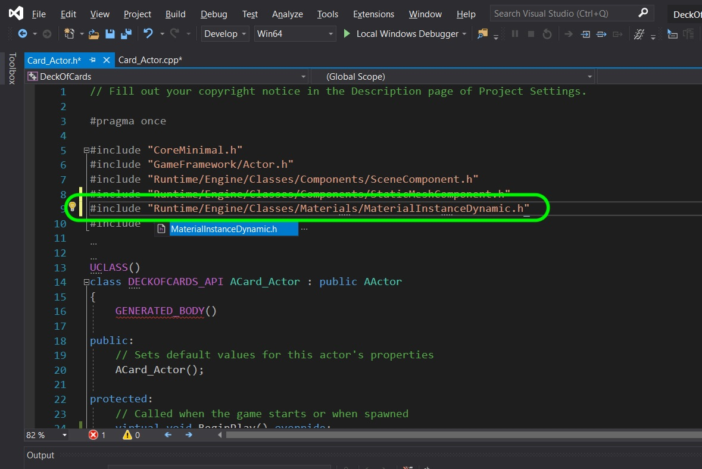

##### `Step 6.`\|`SPCRK`| :small_orange_diamond: :small_blue_diamond:

We need to run **Create** and we need to pass it the pointer to the dynamic material as well as a pointer to ones parent class **UObject**. We get to this by passing a reference to the instance we are calling from using the `this` keyword.

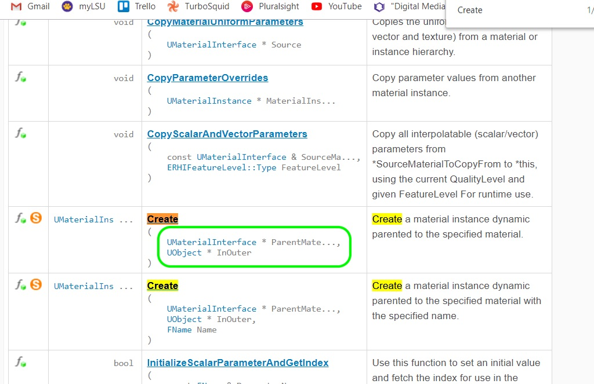

##### `Step 7.`\|`SPCRK`| :small_orange_diamond: :small_blue_diamond: :small_blue_diamond:

So lets call the **Create** function. Compile.  There is a problem, Material is local to the constructor.  We need to move the pointer declaration to the `.h` file.  Lets do that.

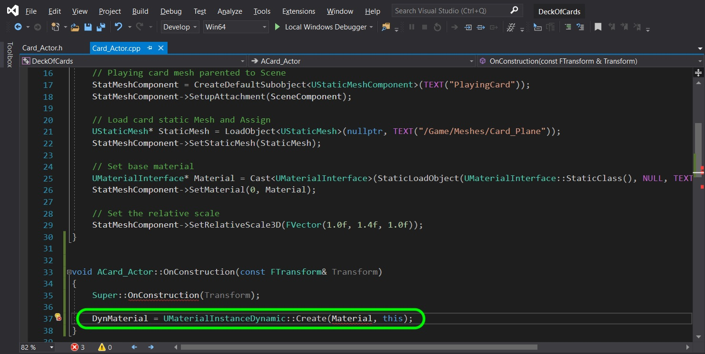

##### `Step 8.`\|`SPCRK`| :small_orange_diamond: :small_blue_diamond: :small_blue_diamond: :small_blue_diamond:

 Remove the type identifyer in front of **Material** in the `.cpp`.

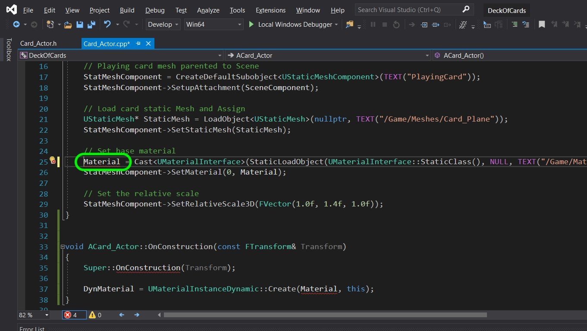

##### `Step 9.`\|`SPCRK`| :small_orange_diamond: :small_blue_diamond: :small_blue_diamond: :small_blue_diamond: :small_blue_diamond:

Lets make this pointer available to the entire class.  Add this variable to the class `.h` file:

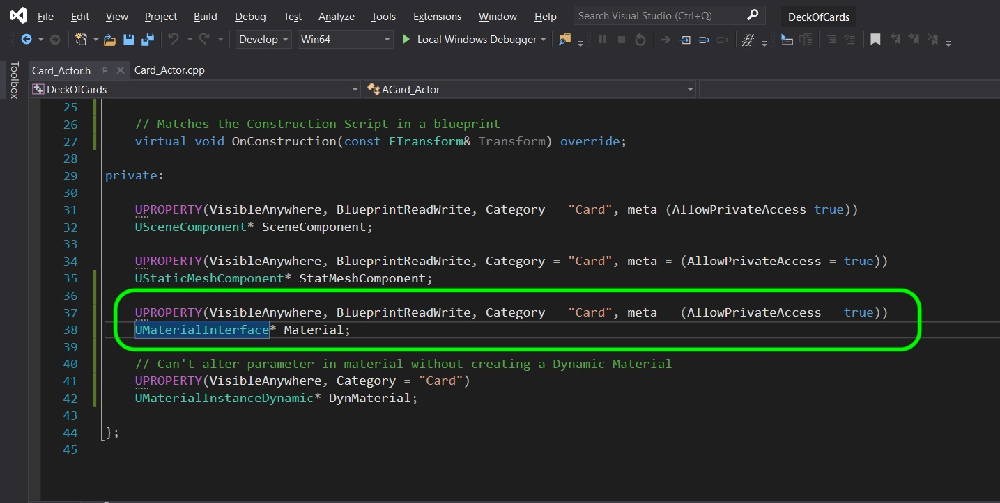

##### `Step 10.`\|`SPCRK`| :large_blue_diamond:

Go back to the CPP and add a call to set the current material to the dynamic one we just created.

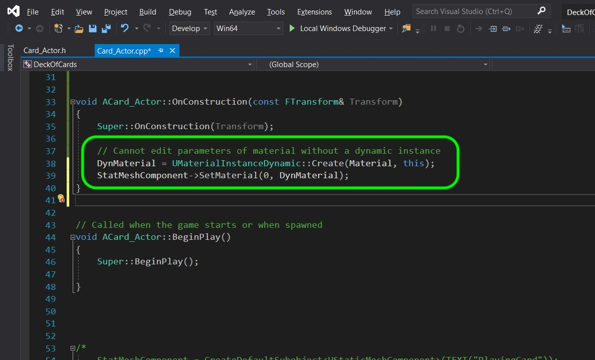

##### `Step 11.`\|`SPCRK`| :large_blue_diamond: :small_blue_diamond: 

We need to create a new class method to alter the card.  We want the user to switch cards in the editor and have it updated in game.  Lets start by creating a `void` method `SetCard()` that updates the card to a desired number and suit.  Create a declaration in the `.h` file.

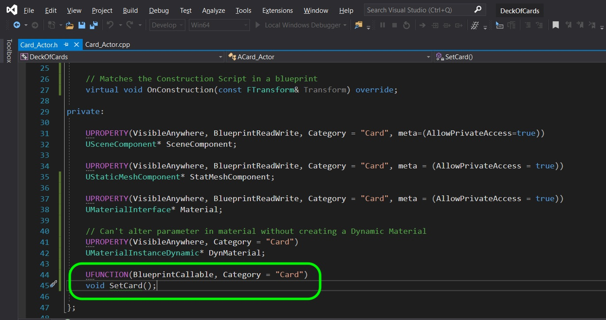

##### `Step 12.`\|`SPCRK`| :large_blue_diamond: :small_blue_diamond: :small_blue_diamond: 

There is a shortcut to creating a defintion in the `.cpp` file.  Hover over `SetCard` and you will see a hint button that you can click on.  Select `Create definition of SetCard in Card_Actor.cpp`.  Select this option.  It will then open a window under.  You can close it then go to the `.cpp` file.

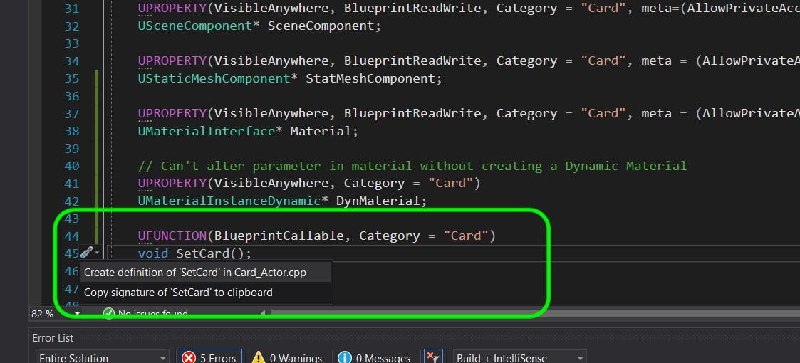

##### `Step 13.`\|`SPCRK`| :large_blue_diamond: :small_blue_diamond: :small_blue_diamond:  :small_blue_diamond: 

Now in the `.cpp` file you will see that it automatically created an empty definition file that we can work with!

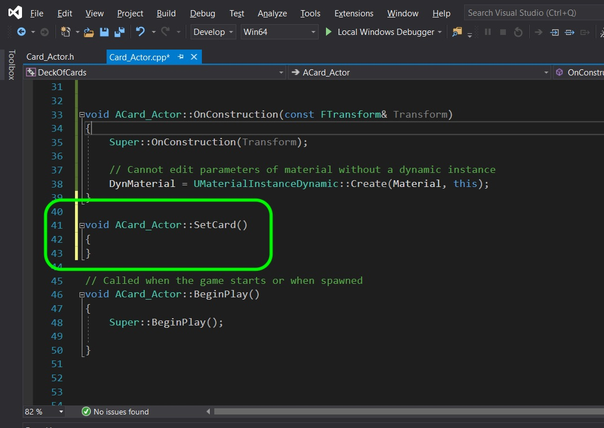

##### `Step 14.`\|`SPCRK`| :large_blue_diamond: :small_blue_diamond: :small_blue_diamond: :small_blue_diamond:  :small_blue_diamond: 

If we look at our **Material** blueprint we will want to update the **Texture Parameter** that we named `Card Texture`.  Now we need to add a `UTexture2D` to the `.h` file:

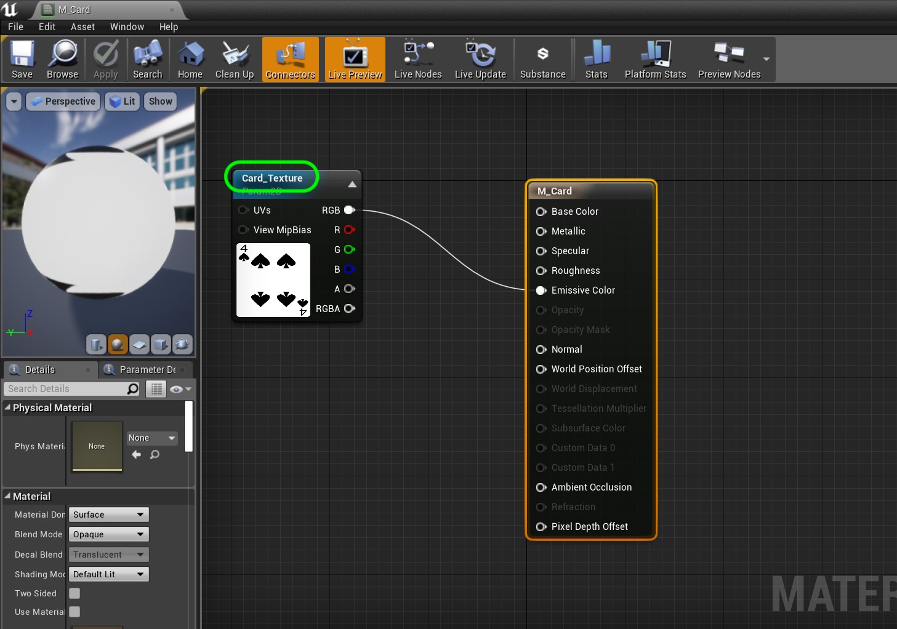

##### `Step 15.`\|`SPCRK`| :large_blue_diamond: :small_orange_diamond: 

Include the `.h` for the texture to the `.h` file. Now remember to always leave the `.generated.h` as the last include.  Now look up in google the `UTexture2D` and find the location of the header and add it to the your header.

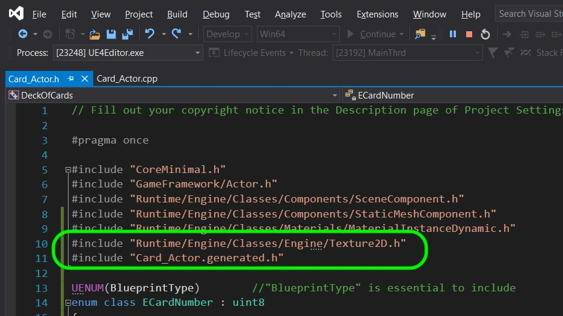

##### `Step 16.`\|`SPCRK`| :large_blue_diamond: :small_orange_diamond:   :small_blue_diamond: 

Now declare the texture pointer:

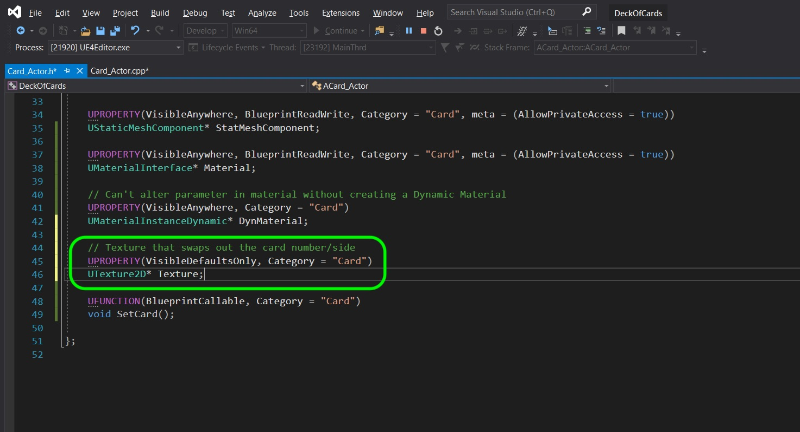

##### `Step 17.`\|`SPCRK`| :large_blue_diamond: :small_orange_diamond: :small_blue_diamond: :small_blue_diamond:

I load the texture the same way we loaded the mesh and material.  I pasted the entire location.

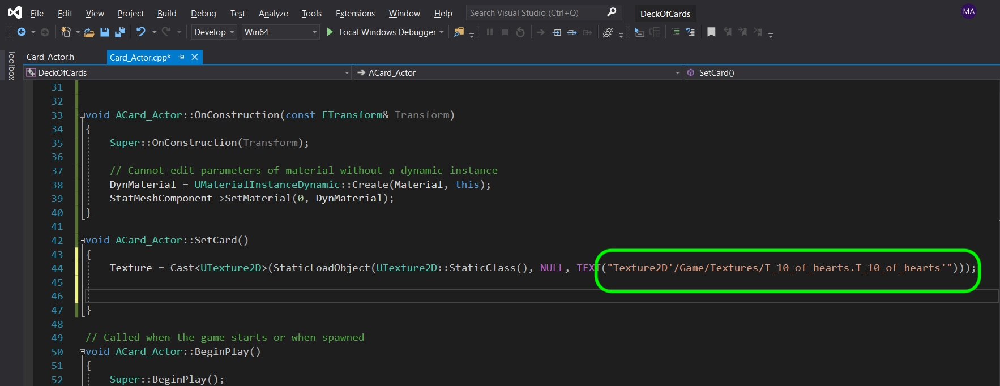

##### `Step 18.`\|`SPCRK`| :large_blue_diamond: :small_orange_diamond: :small_blue_diamond: :small_blue_diamond: :small_blue_diamond:

I remove what is outside the single quotes and get rid of the extension so it should end up looking like:

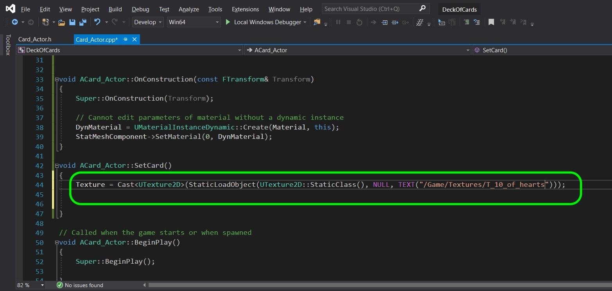

##### `Step 19.`\|`SPCRK`| :large_blue_diamond: :small_orange_diamond: :small_blue_diamond: :small_blue_diamond: :small_blue_diamond: :small_blue_diamond:

Now we call a method in the **Dynamic Instance Material** called `SetTextureParameterValue` that changes the parameter with the name we used in the editor and pass it the texture of 10 of hearts we just loaded.

##### `Step 20.`\|`SPCRK`| :large_blue_diamond: :large_blue_diamond:

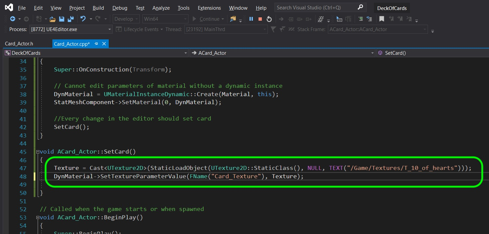

##### `Step 21.`\|`SPCRK`| :large_blue_diamond: :large_blue_diamond: :small_blue_diamond:

Now call this method we just created in the `OnConstruction` event.

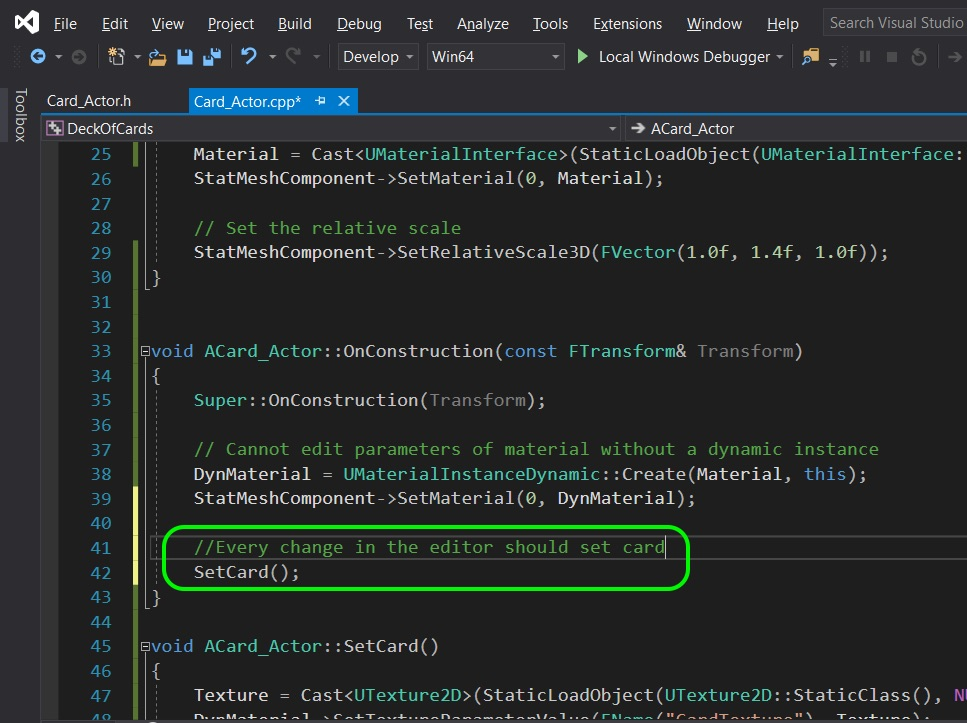

##### `Step 22.`\|`SPCRK`| :large_blue_diamond: :large_blue_diamond: :small_blue_diamond: :small_blue_diamond:

Compile and Run the game and notice it now loads up to the ten of hearts.  Our dynamic material change worked!

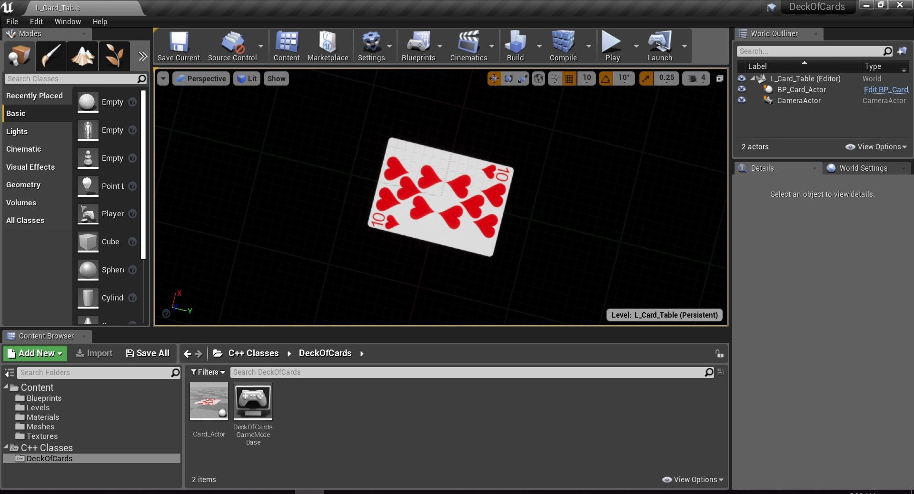

___

| [previous](../)| [home](../README.md#user-content-gms2-top-down-shooter) | [next](../)|
|---|---|---|
