### Finish Two Piles

[previous](../) • [home](../README.md#user-content-gms2-top-down-shooter) • [next](../)

Now we want to deal with getting cards back and forth between the two piles.  We will start by adding a variable to the **BP_Card_Actor** to hold what pile the card is in.

 

---

##### `Step 1.`\|`SPCRK`|:small_blue_diamond:

Open up **BP_Card_Actor** and add a new **Integer** variabled called `OnPileNumber`. Press the **compile** button as we need access to this variable in another actor.

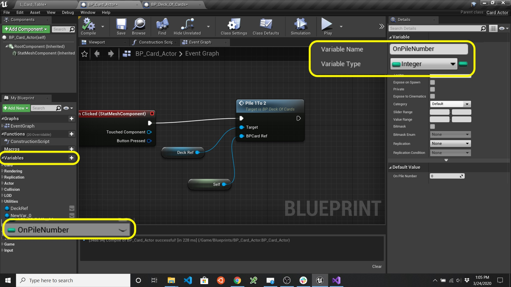

##### `Step 2.`\|`FHIU`|:small_blue_diamond: :small_blue_diamond: 

Now lets go back to **BP_Deck_Of_Cards** and pull from the **Return Value** pin from the **SpwanActor BP Card Actor** and add a **Set Pile Number** set to `0` to begin play. Be sure **not** to leave target empty (the same as putting **this**) as this variable does not exist in the deck. 

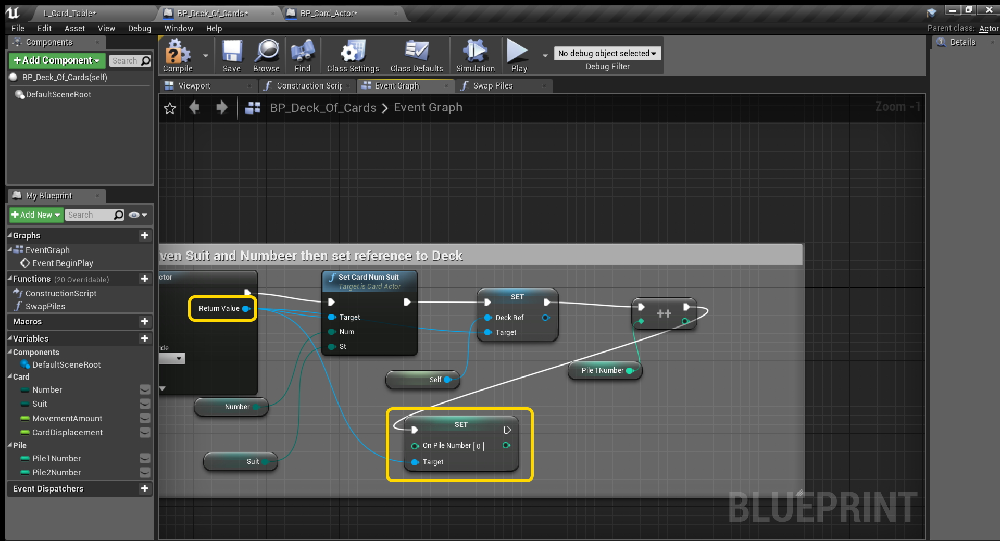

##### `Step 3.`\|`SPCRK`|:small_blue_diamond: :small_blue_diamond: :small_blue_diamond:

 Now rename to the **Function** in the card deck blueprint to from `Pile1To2` to `Swap Piles` and open the function graph.  Double click on the blue line going into **Flip Card** and drag from it and select a **Get On Pile Number** node.  Pull off of it and select a **Integer \| Equal** node (same as **==** in c++).

##### `Step 4.`\|`SPCRK`|:small_blue_diamond: :small_blue_diamond: :small_blue_diamond: :small_blue_diamond:

Add a branch node and highjack the execution pin to go from **Flip Card** to **Branch** to **\-\-** execution pin. Take the output of the **==** pin and put it into the input of the **Branch** pin node.  Add a comment to the nodes here to indicate that this is for a card in the first pile.

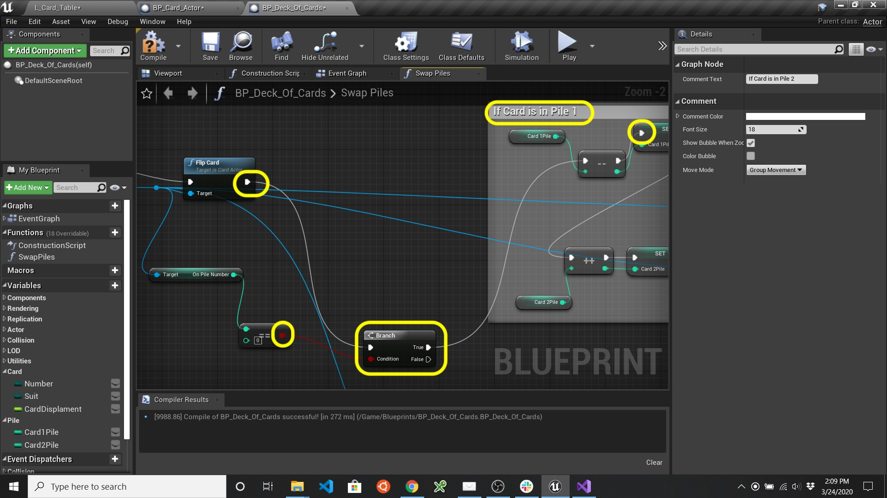

##### `Step 5.`\|`SPCRK`| :small_orange_diamond:

We also need the card to go from the face up pile back on to the face down pile. For going from pile 2 back to pile 1 copy the nodes and comments box and paste another copy below changing the comment.

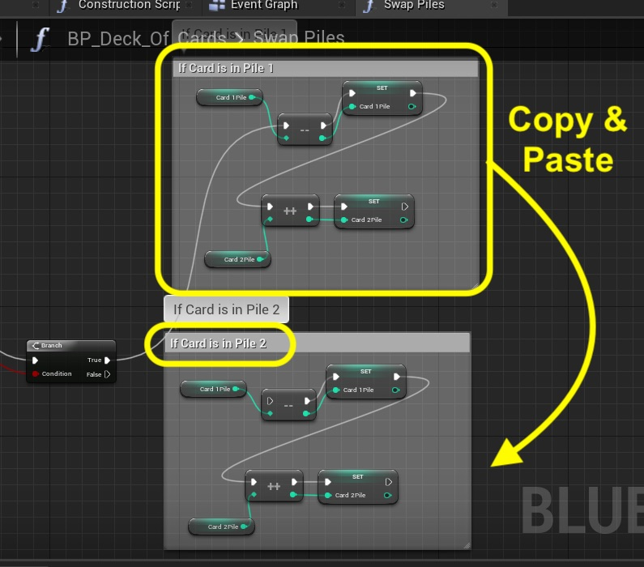

##### `Step 6.`\|`SPCRK`| :small_orange_diamond: :small_blue_diamond:

Now we need to reverse which variables get decrimented and incremented.  We are decrimenting deck 2 and incrementing deck 1.  We don't need to delete the nodes we can change them by right clicking on **Card 1 Pile** and select **Replace variable Card1Pile** with **Card2Pile**. Repeat this for all **Card 2 Pile** and for both setters as well.

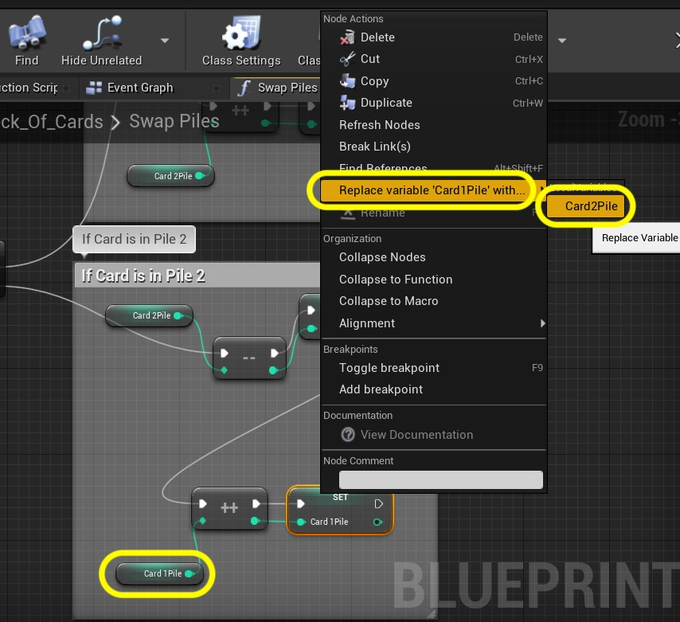

##### `Step 7.`\|`SPCRK`| :small_orange_diamond: :small_blue_diamond: :small_blue_diamond:

So your Card2Pile and Card1Pile nodes should all be reversed.

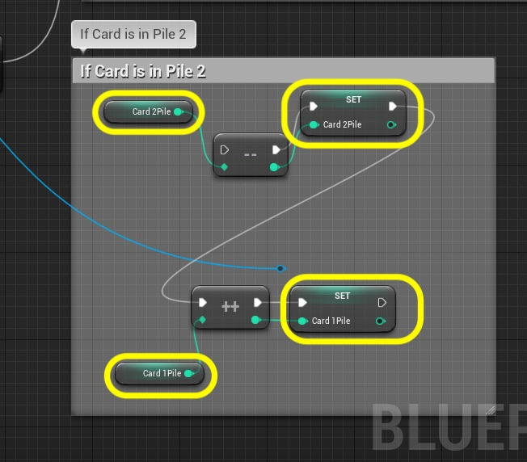

##### `Step 8.`\|`SPCRK`| :small_orange_diamond: :small_blue_diamond: :small_blue_diamond: :small_blue_diamond:

Connect the **\-\-** execution input node to the **False** execution pin from the **Branch** node.
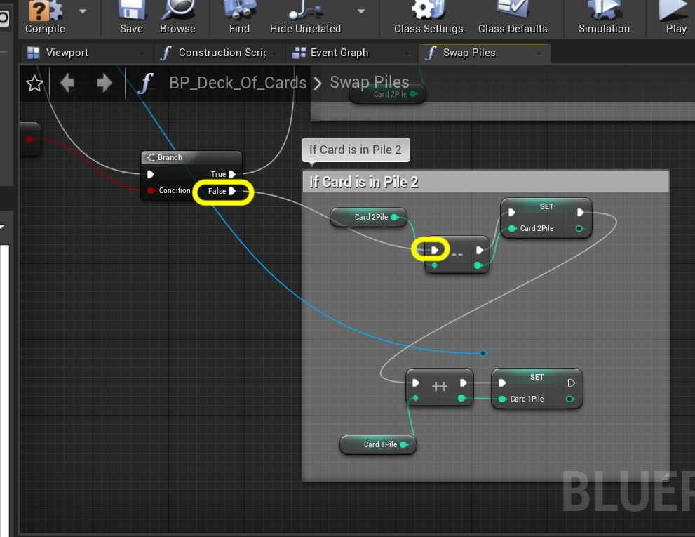

##### `Step 9.`\|`SPCRK`| :small_orange_diamond: :small_blue_diamond: :small_blue_diamond: :small_blue_diamond: :small_blue_diamond:

Now we need to change the variable that stores the pile the card is on so we need to pull from the card reference and select the **Set On Pile Number** node:

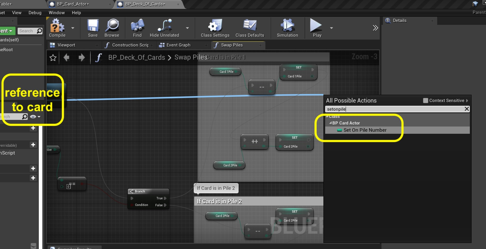

##### `Step 10.`\|`SPCRK`| :large_blue_diamond:

Change the variable to `1` to indicate the second pile.

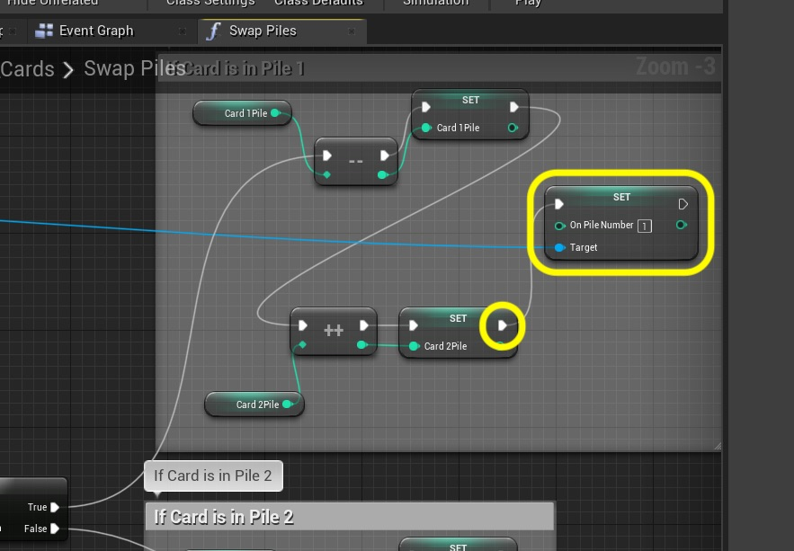

##### `Step 11.`\|`SPCRK`| :large_blue_diamond: :small_blue_diamond: 

Copy and paste the **Set On Pile Number** and do the same to thee nodes below and change the value to `0`. Connect the **Target** pin back to the **Card Reference**.

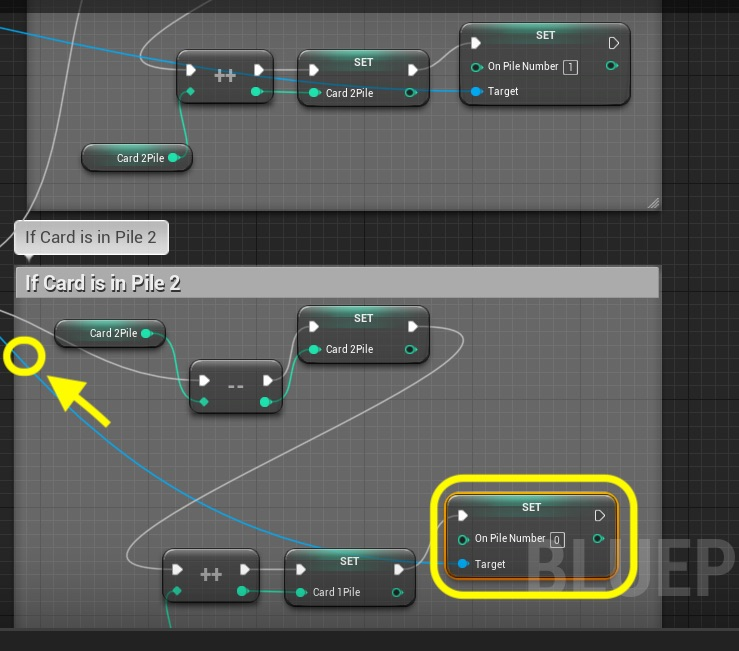

##### `Step 12.`\|`SPCRK`| :large_blue_diamond: :small_blue_diamond: :small_blue_diamond: 

Pull from the **Card Reference** pin and add a **Set Actor Location** node so we can readjust the **Z** depth of the card so the order stays the same.  Right click the **Location** pin and and select **Split Struct Pin**.

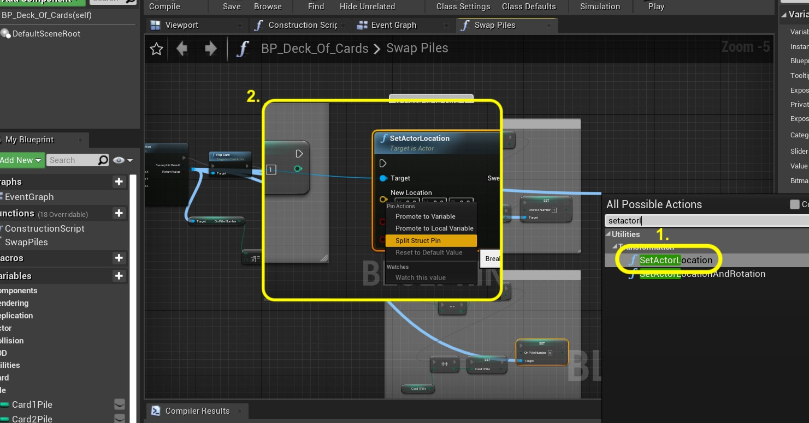

##### `Step 13.`\|`SPCRK`| :large_blue_diamond: :small_blue_diamond: :small_blue_diamond:  :small_blue_diamond: 

Add a **Get Actor Location** node and make sure the target is the card.  Split the output pins and connect **X** and **Y** to the **Set Actor Location**.  Then for **Z** take the output of **Card2Pile** number for its depth in the new pile.

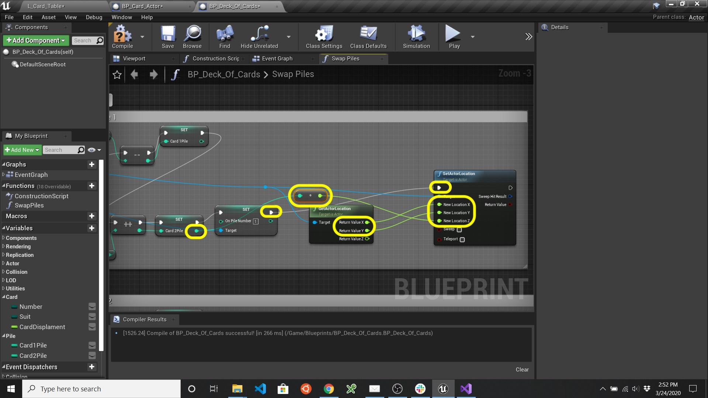

##### `Step 14.`\|`SPCRK`| :large_blue_diamond: :small_blue_diamond: :small_blue_diamond: :small_blue_diamond:  :small_blue_diamond: 

Duplicate this entire process for going from pile 2 back to pile 1.

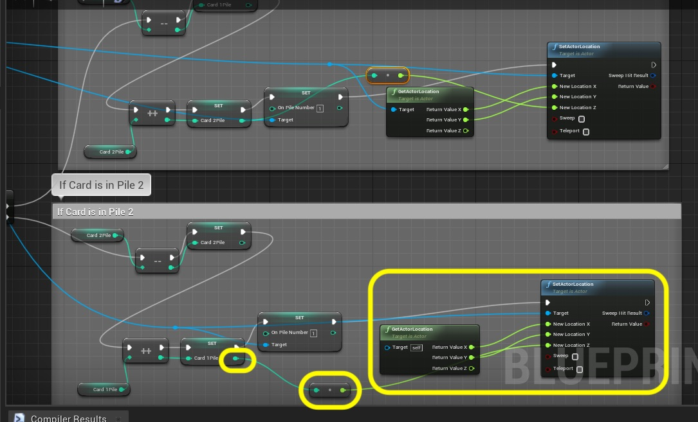

##### `Step 15.`\|`SPCRK`| :large_blue_diamond: :small_orange_diamond: 

Make sure the **Target** is connected to the **Card**.

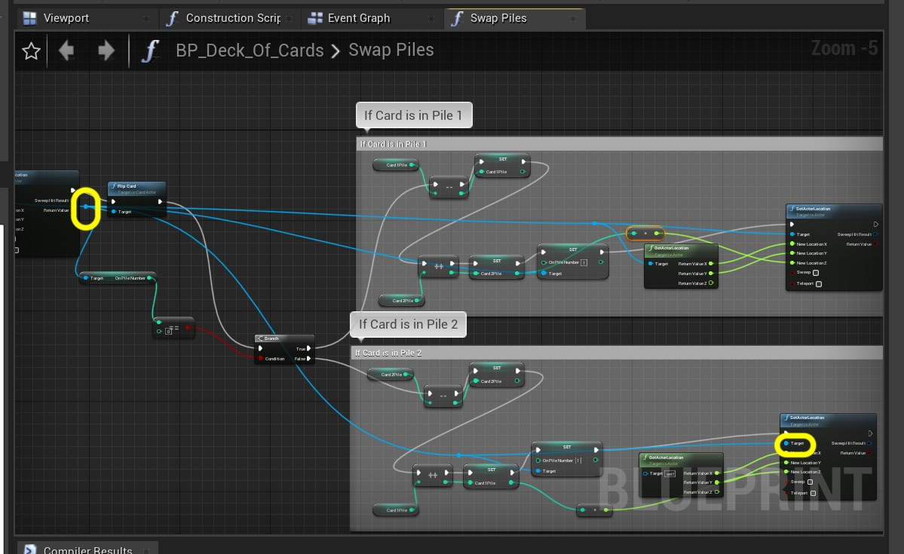

##### `Step 16.`\|`SPCRK`| :large_blue_diamond: :small_orange_diamond:   :small_blue_diamond: 
Go back to the begining and we will set the card either in negative `120` or positive `120` depending on which pile it is on.  Mame some room before the **Set Actor Location** like so:

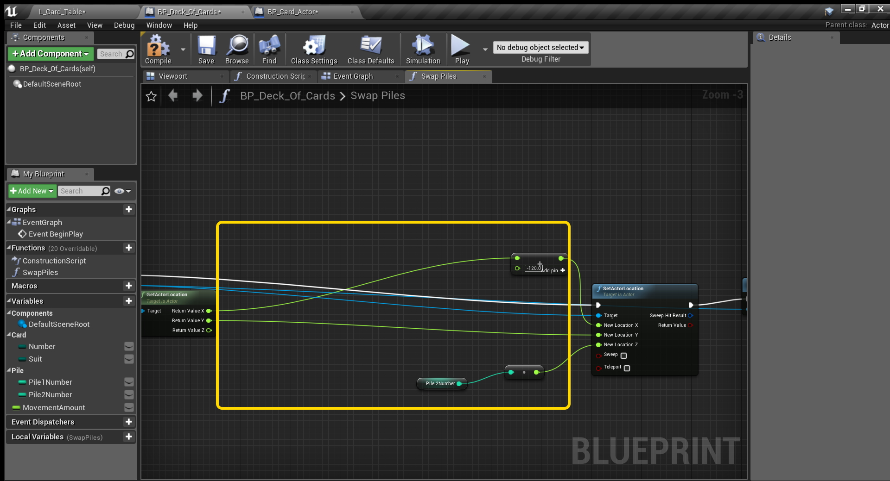

##### `Step 17.`\|`SPCRK`| :large_blue_diamond: :small_orange_diamond: :small_blue_diamond: :small_blue_diamond:

Now add a **Get On Pile Number** from the card target then check to see if it is equal to `0`.  Then go to a branch node.

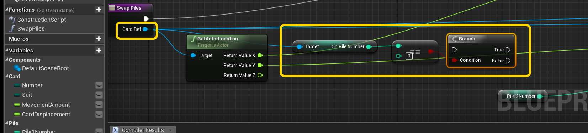

##### `Step 18.`\|`SPCRK`| :large_blue_diamond: :small_orange_diamond: :small_blue_diamond: :small_blue_diamond: :small_blue_diamond:

 Add a new private variable called `CardDisplacement` and set the default to `120`.  The set it to `-120` on the true branch path and to `120` on false branch.  Send the two outputs to **Set Actor Location**.  Then drag a **CardDisplacement** node and add it to its current **X** position and send it to the **New Location X** pin. 
 
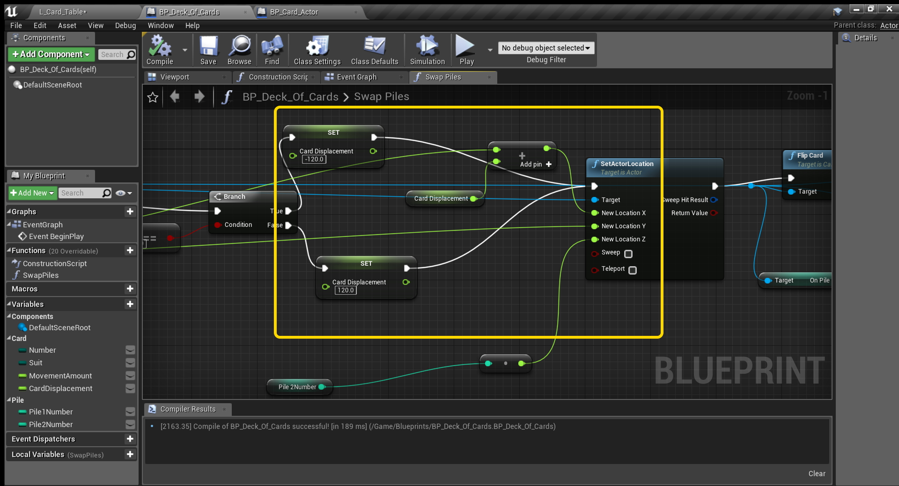

##### `Step 19.`\|`SPCRK`| :large_blue_diamond: :small_orange_diamond: :small_blue_diamond: :small_blue_diamond: :small_blue_diamond: :small_blue_diamond:

Compile and run the game and press the cards between the two piles.  Test it and make sure you can go through the entire deck from no discard to all cards discarded and back.  We will leave this here for now and end this walk through.

##### `Step 20.`\|`SPCRK`| :large_blue_diamond: :large_blue_diamond:

##### `Step 21.`\|`SPCRK`| :large_blue_diamond: :large_blue_diamond: :small_blue_diamond:

___

| [previous](../)| [home](../README.md#user-content-gms2-top-down-shooter) | [next](../)|
|---|---|---|
