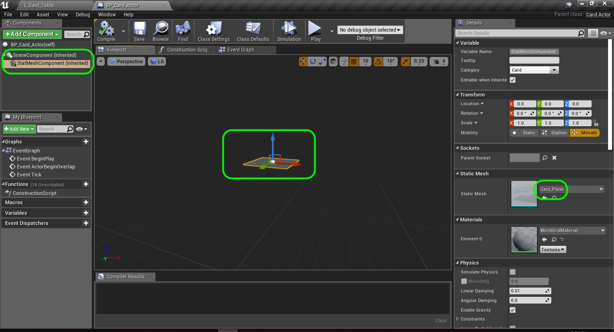
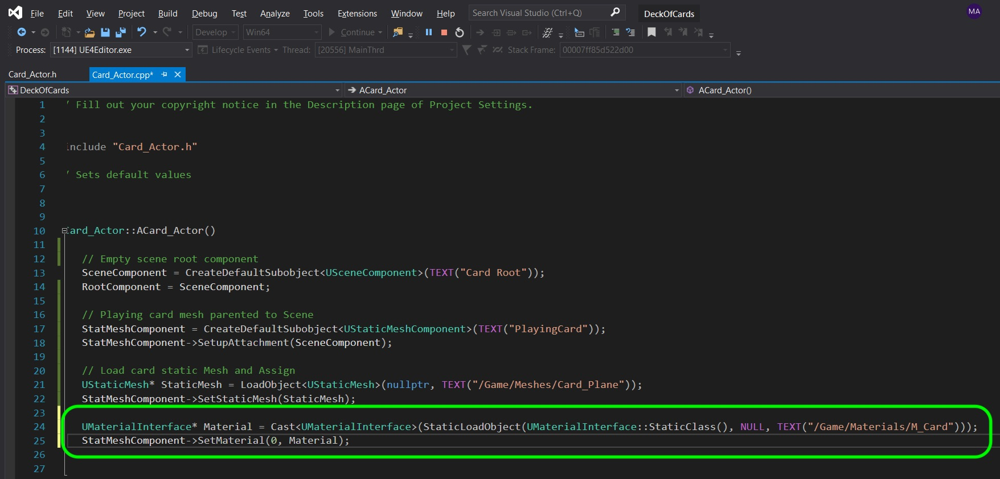
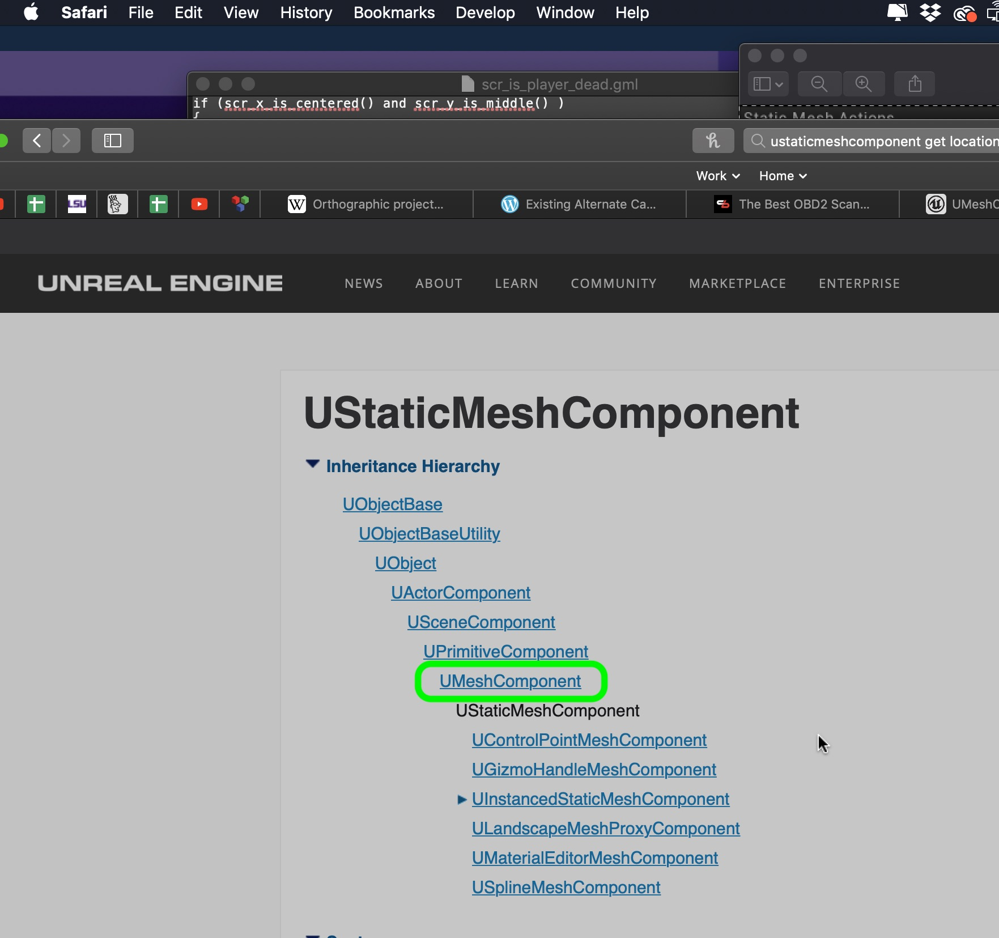
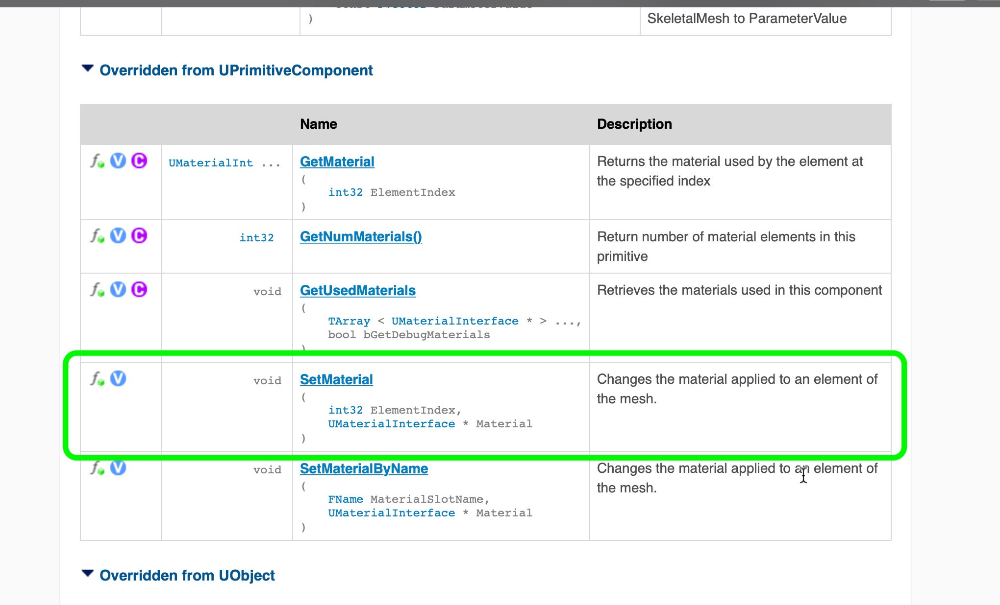
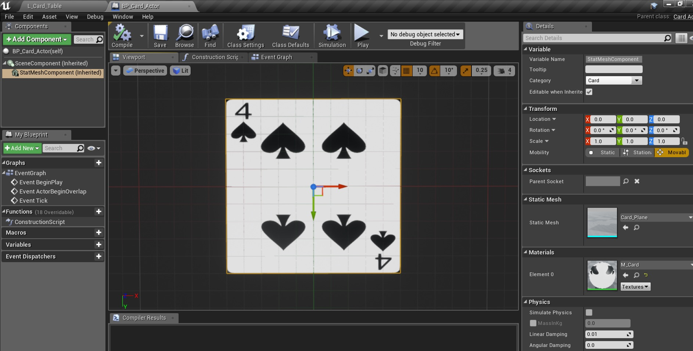
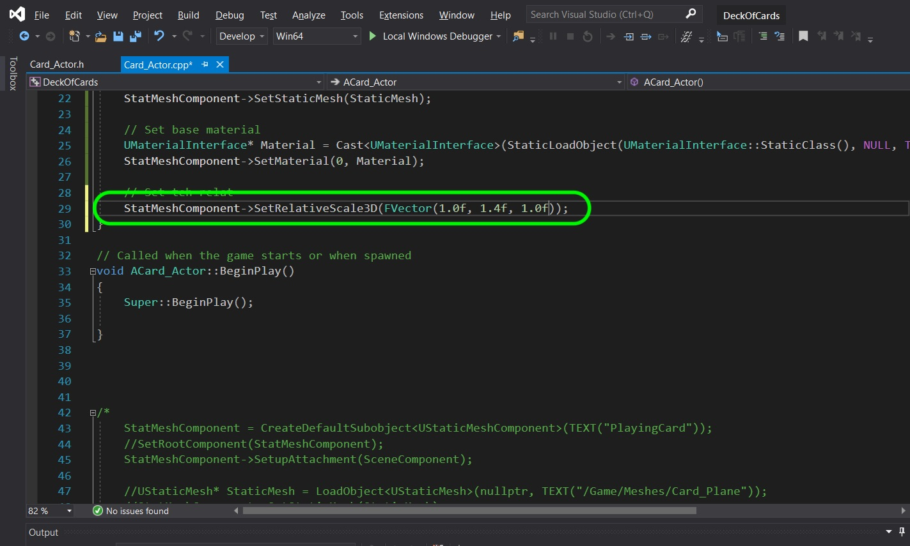
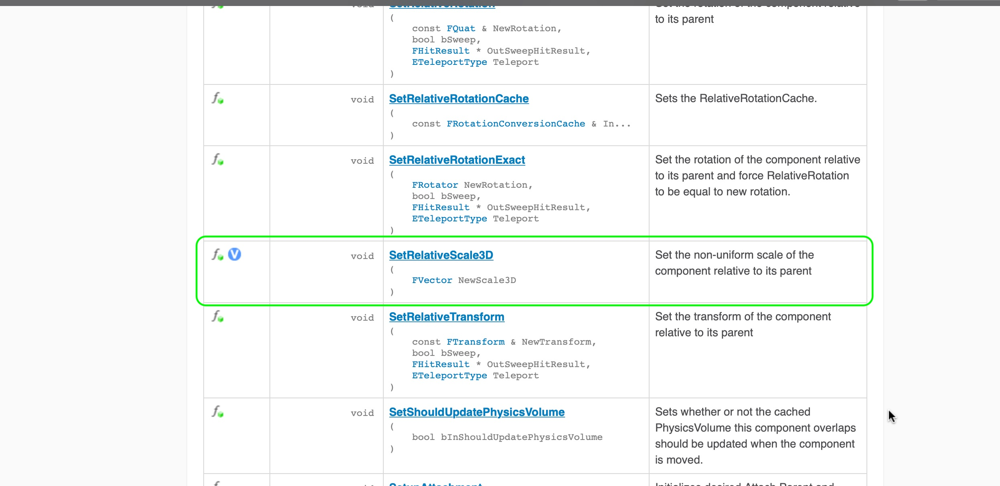
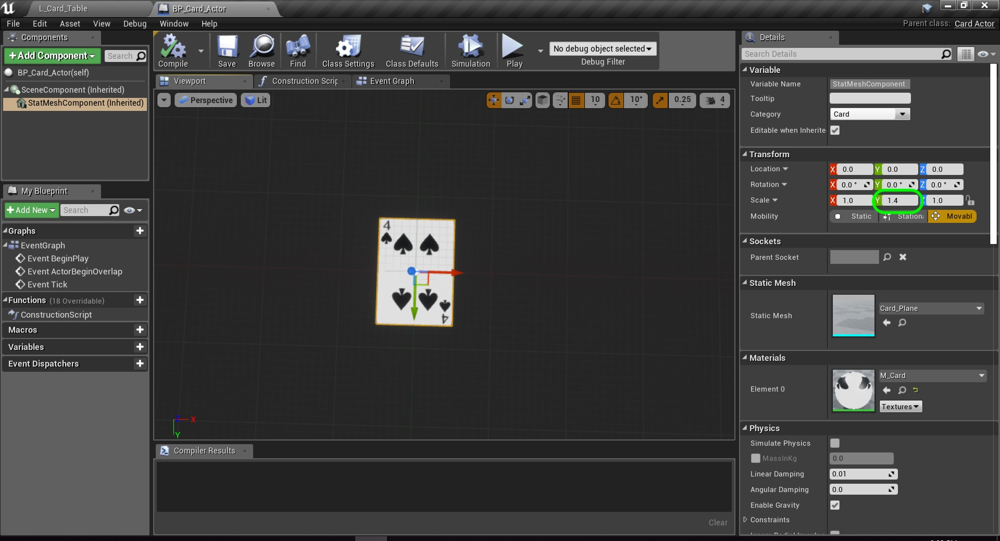
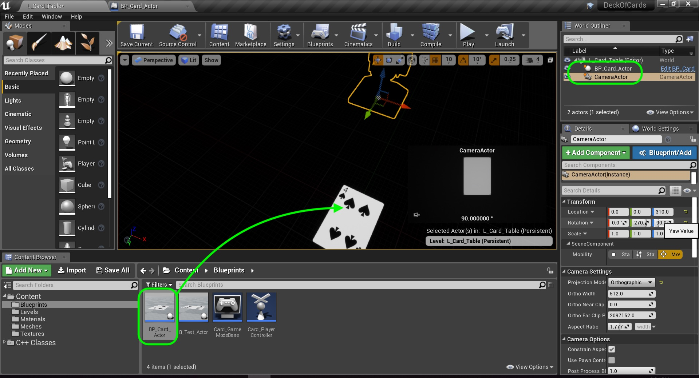
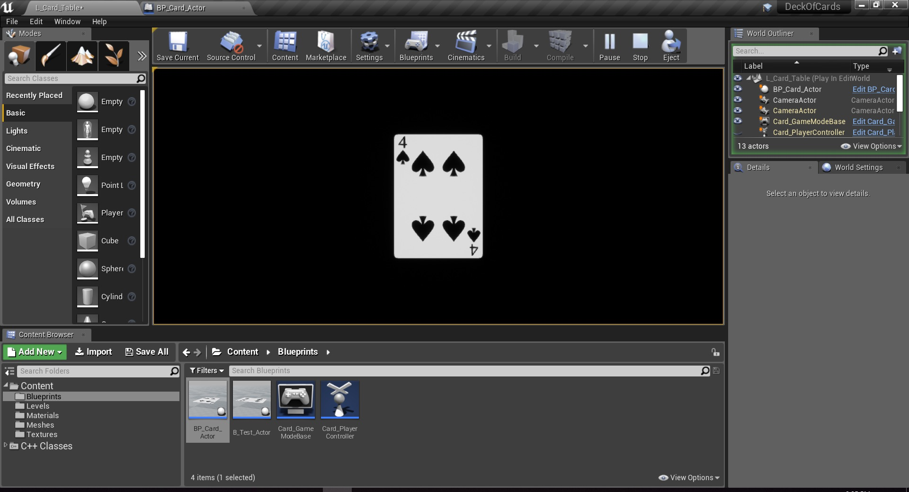

### AMimic Our Final C++ Class II

[previous](../) • [home](../README.md#user-content-gms2-top-down-shooter) • [next](../)

Setting up our first C++ class continued...

 

---

##### `Step 1.`\|`SPCRK`|:small_blue_diamond:

Restart the game as we are making changes in the constructor and they will not show up on a recompile in the editor.  Run the game and you now have a second component and it has a static mesh assigned (Card_Plane),

##### `Step 2.`\|`FHIU`|:small_blue_diamond: :small_blue_diamond: 

Now we are going to add a **Material** to the static mesh.  Go to the **Materials \| M_Card** in the Content Browser and right click to **Copy Reference** and find out the folder and name.  Then load it like we did the mesh then call another function `SetMaterial`.

##### `Step 3.`\|`SPCRK`|:small_blue_diamond: :small_blue_diamond: :small_blue_diamond:

 Now if you look at the [UStaticMesh](https://api.unrealengine.com/INT/API/Runtime/Engine/Components/UStaticMeshComponent/index.html) page you will not see this member function.  Look at the inheritance tree. Look at the classes it inherits from as it inherits all of its members. Go to the **UMeshComponent** class.

##### `Step 4.`\|`SPCRK`|:small_blue_diamond: :small_blue_diamond: :small_blue_diamond: :small_blue_diamond:

You can now find `SetMaterial` which defines what this function does.

##### `Step 5.`\|`SPCRK`| :small_orange_diamond:

Restart the game as we are making changes in the constructor and they will not show up on a recompile in the editor.  Now run the game and look at the **BP_Card_Actor** blueprint.  You now see that it loads the material.  But look at it.  It is square, remember we adjusted the scale of the mesh.  

##### `Step 6.`\|`SPCRK`| :small_orange_diamond: :small_blue_diamond:

Now again, anything we can do in the editor has a corresponding C++ class.  In this case it is a function called **SetRelativeScale3D** that we pass it an FVector.  This comprizes of three floats that alters the scale of **X**, **Y** and **Z** respectively.

##### `Step 7.`\|`SPCRK`| :small_orange_diamond: :small_blue_diamond: :small_blue_diamond:

Now the manual for **SetRelativeScale3D** can be found in another parent class **USceneComponent**.

##### `Step 8.`\|`SPCRK`| :small_orange_diamond: :small_blue_diamond: :small_blue_diamond: :small_blue_diamond:

 Restart the game as we are making changes in the constructor and they will not show up on a recompile in the editor.  Now run the game and open the blueprint.  Notice that the scale has changed and the card looks correct.

##### `Step 9.`\|`SPCRK`| :small_orange_diamond: :small_blue_diamond: :small_blue_diamond: :small_blue_diamond: :small_blue_diamond:

Go back and replace the test bluerpint in the game scene and replace it with **BP_Card_Actor**.  Then select the **CameraActor** then Rotate on the **Z** axis by 90 degrees.

##### `Step 10.`\|`SPCRK`| :large_blue_diamond:

Run the game and now we have receated what we did in the blueprint in C++!  Next up we will have to dynamically change the texture based on the card we want to select.

##### `Step 11.`\|`SPCRK`| :large_blue_diamond: :small_blue_diamond: 

##### `Step 12.`\|`SPCRK`| :large_blue_diamond: :small_blue_diamond: :small_blue_diamond: 

##### `Step 13.`\|`SPCRK`| :large_blue_diamond: :small_blue_diamond: :small_blue_diamond:  :small_blue_diamond: 

##### `Step 14.`\|`SPCRK`| :large_blue_diamond: :small_blue_diamond: :small_blue_diamond: :small_blue_diamond:  :small_blue_diamond: 

##### `Step 15.`\|`SPCRK`| :large_blue_diamond: :small_orange_diamond: 

##### `Step 16.`\|`SPCRK`| :large_blue_diamond: :small_orange_diamond:   :small_blue_diamond: 

##### `Step 17.`\|`SPCRK`| :large_blue_diamond: :small_orange_diamond: :small_blue_diamond: :small_blue_diamond:

##### `Step 18.`\|`SPCRK`| :large_blue_diamond: :small_orange_diamond: :small_blue_diamond: :small_blue_diamond: :small_blue_diamond:

##### `Step 19.`\|`SPCRK`| :large_blue_diamond: :small_orange_diamond: :small_blue_diamond: :small_blue_diamond: :small_blue_diamond: :small_blue_diamond:

##### `Step 20.`\|`SPCRK`| :large_blue_diamond: :large_blue_diamond:

##### `Step 21.`\|`SPCRK`| :large_blue_diamond: :large_blue_diamond: :small_blue_diamond:

___

| [previous](../)| [home](../README.md#user-content-gms2-top-down-shooter) | [next](../)|
|---|---|---|
