### Mimic Our Final C++ Class

[previous](../) • [home](../README.md#user-content-gms2-top-down-shooter) • [next](../)

Now we can't create a C++ class that behaves like this blueprint.  I can't find a UE4 C++ Component class that mimics the **Plane** class.  Now a plane is just a rigid body model.  So we need to make a change.  Open the **BP_Test_Actor** class.

 

---

##### `Step 1.`\|`SPCRK`|:small_blue_diamond:

Delete the **Card** Plane component and add a **Static Mesh** component.

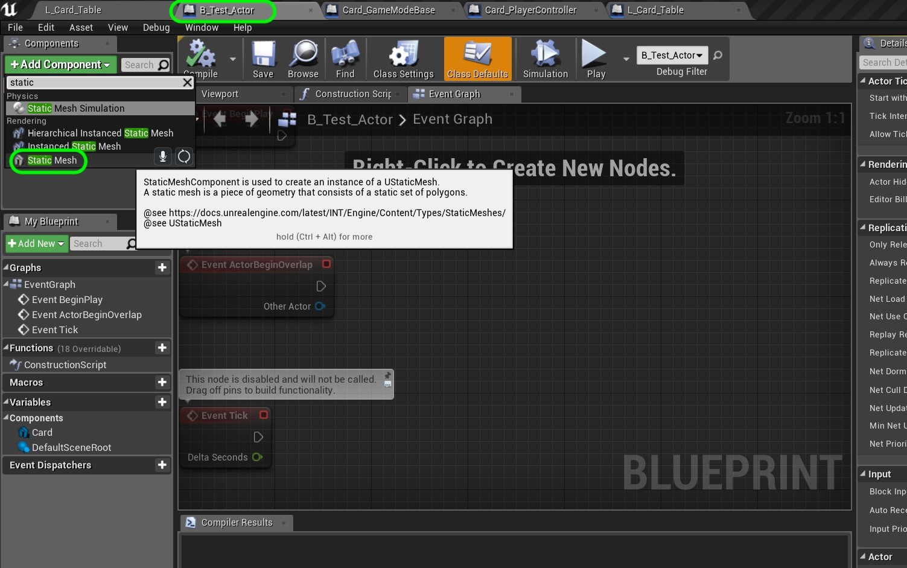

##### `Step 2.`\|`FHIU`|:small_blue_diamond: :small_blue_diamond: 

Click on the mesh and look for a **Plane**.  Can't find it.  It is not located in our **Content** folder.  But Unreal has a bunch of assets in the engine.  We can find it by clicking on **View Options** on the bottom right hand side and select **View Engine Content**.

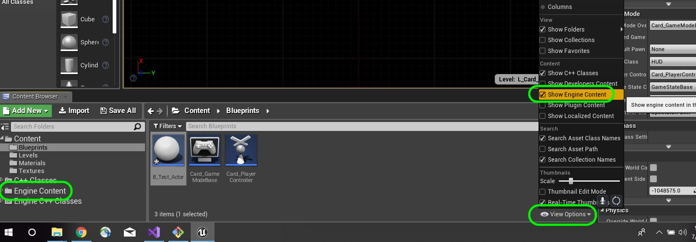

##### `Step 3.`\|`SPCRK`|:small_blue_diamond: :small_blue_diamond: :small_blue_diamond:

Now to to the **Engine Content \| Basic Shapes** folder and right click on **Plane** and select **Duplicate**.

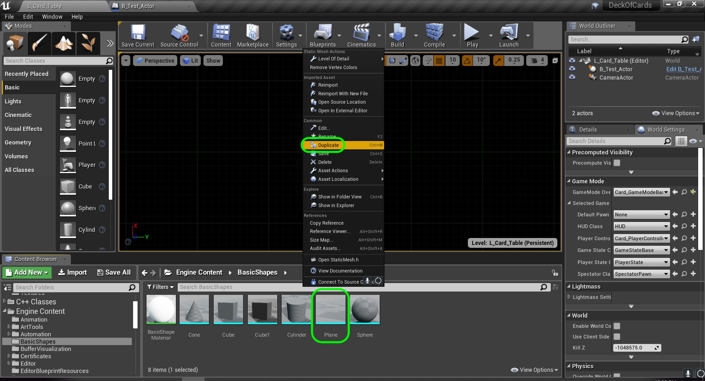

##### `Step 4.`\|`SPCRK`|:small_blue_diamond: :small_blue_diamond: :small_blue_diamond: :small_blue_diamond:

Call this new mesh `Card_Plane1`.  Then add a new folder to your Content directory called **Meshes**.  Drag this duplicate file into theis folder.

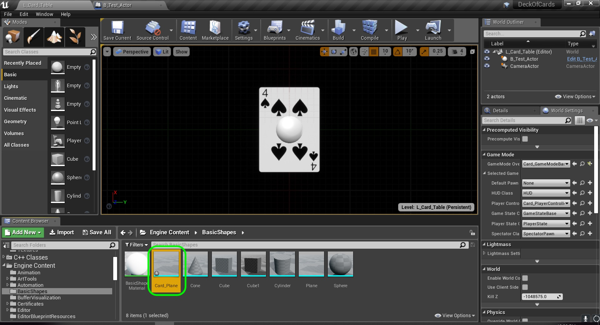

##### `Step 5.`\|`SPCRK`| :small_orange_diamond:

Now go back to **BP_Test_Actor** and you should now be able to select a `Card_Mesh1` as a static mesh.  Now you can select a **Material** so select the `M_Card` material.  Set the **Scale** on **Y** to `1.4` and rotate on **Z** axis by `90` degrees. This way the x and y axis line up with the card correctly. (Note in hindsight this is an error and we should have rotated the camera instead).

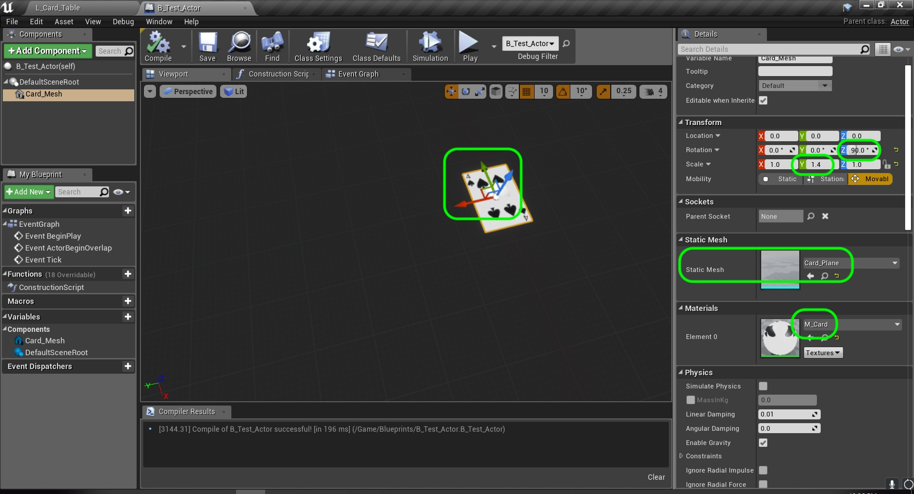

##### `Step 6.`\|`SPCRK`| :small_orange_diamond: :small_blue_diamond:

Press compile and check it out in game.  The card is rotated correctly but it looks similar to before.

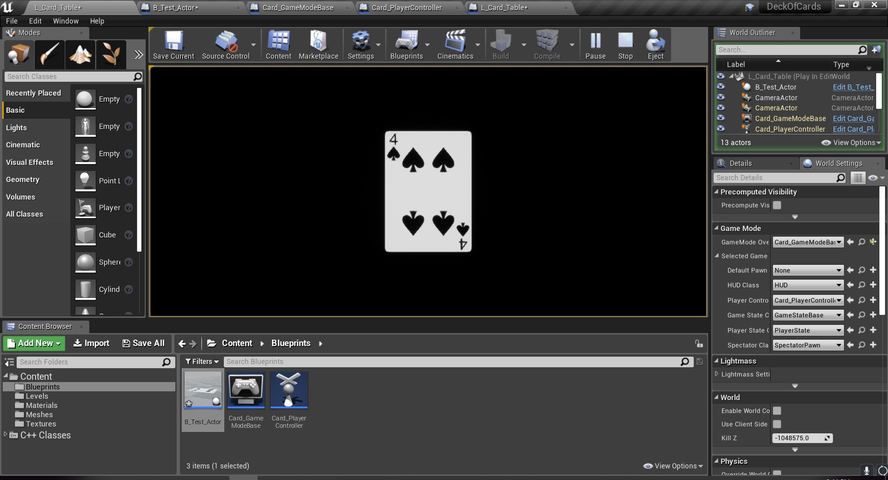

##### `Step 7.`\|`SPCRK`| :small_orange_diamond: :small_blue_diamond: :small_blue_diamond:

Now lets mimic this blueprint in a pure C++ class.  Lets try and make the class as generic as possible so other card games could be built and we could reuse this class. Create a new C++ Class and inherit from the **Actor** class.  Call this `Card_Actor`.

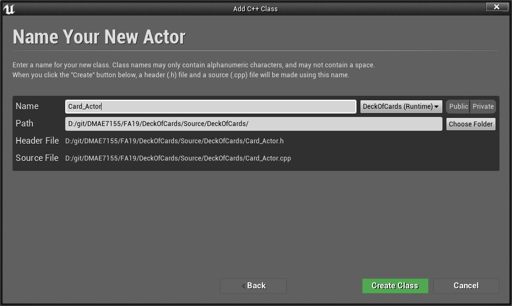

##### `Step 8.`\|`SPCRK`| :small_orange_diamond: :small_blue_diamond: :small_blue_diamond: :small_blue_diamond:

Look at the newly generated `.cpp` file.  We do not need this actor to tick.  It is optimal to turn this off.  This actor will run faster and more efficiently.

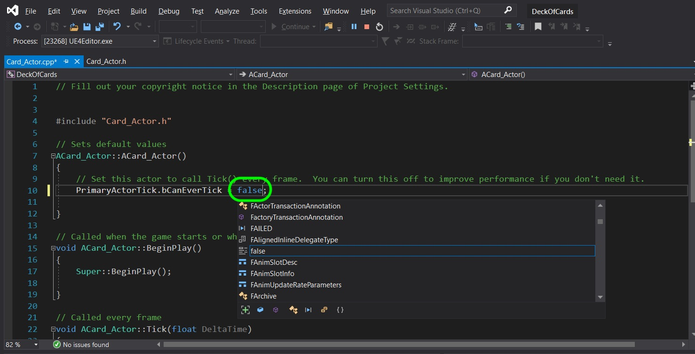

##### `Step 9.`\|`SPCRK`| :small_orange_diamond: :small_blue_diamond: :small_blue_diamond: :small_blue_diamond: :small_blue_diamond:

Now open the `.h` file and delete the Tick declaration:

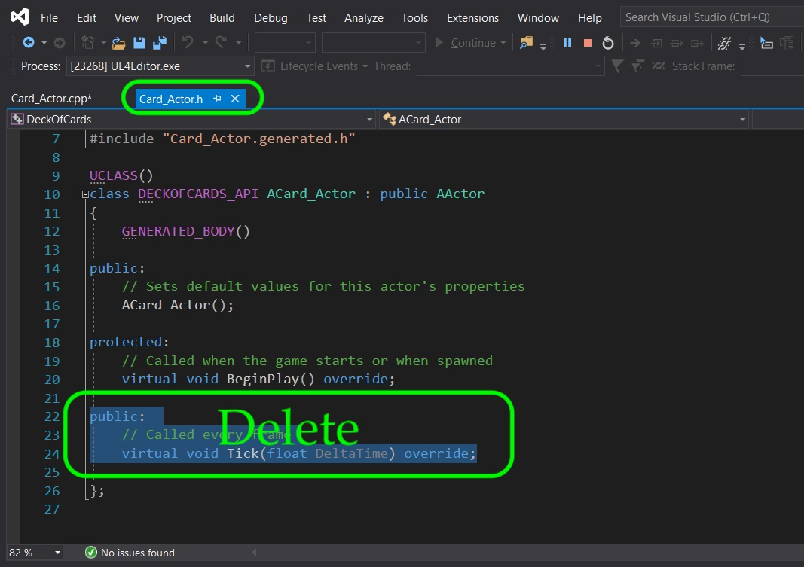

##### `Step 10.`\|`SPCRK`| :large_blue_diamond:

Delete the **Tick** definition from the `.cpp` file.  All right we are ready to go.

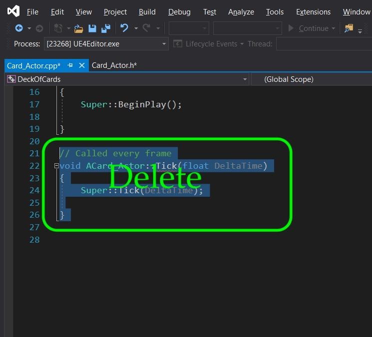

##### `Step 11.`\|`SPCRK`| :large_blue_diamond: :small_blue_diamond: 

Now look at our test blueprint again.  Notice that the mesh is not the item at the top component list.  Blueprints by default assign a root Scene component.  It is strongly recommended that you do so.  We will start by adding a scene component.

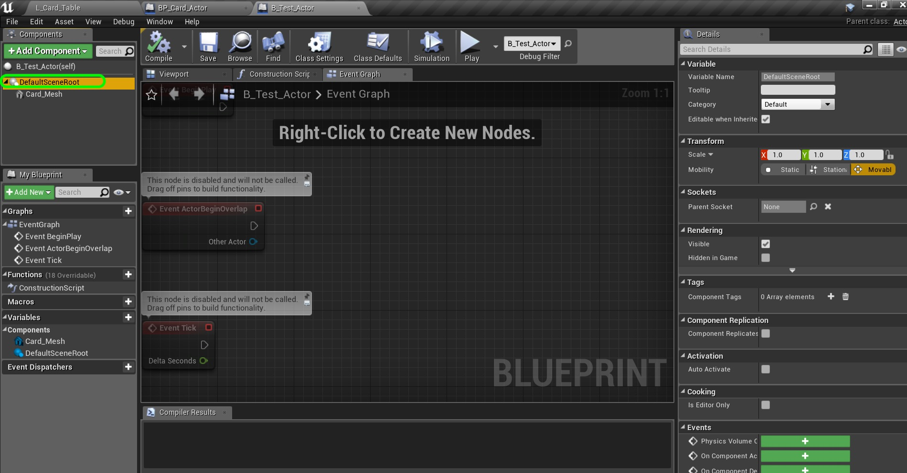

##### `Step 12.`\|`SPCRK`| :large_blue_diamond: :small_blue_diamond: :small_blue_diamond: 

Open **Card_Actor.h** and include the `USceneComponent` which directory can be found at the bottom of [UE4's website](https://api.unrealengine.com/INT/API/Runtime/Engine/Components/USceneComponent/index.html). Here is UE4's description: "A SceneComponent has a transform and supports attachment, but has no rendering or collision capabilities. Useful as a 'dummy' component in the hierarchy to offset others." Then we create a pointer so we can access the data structure.

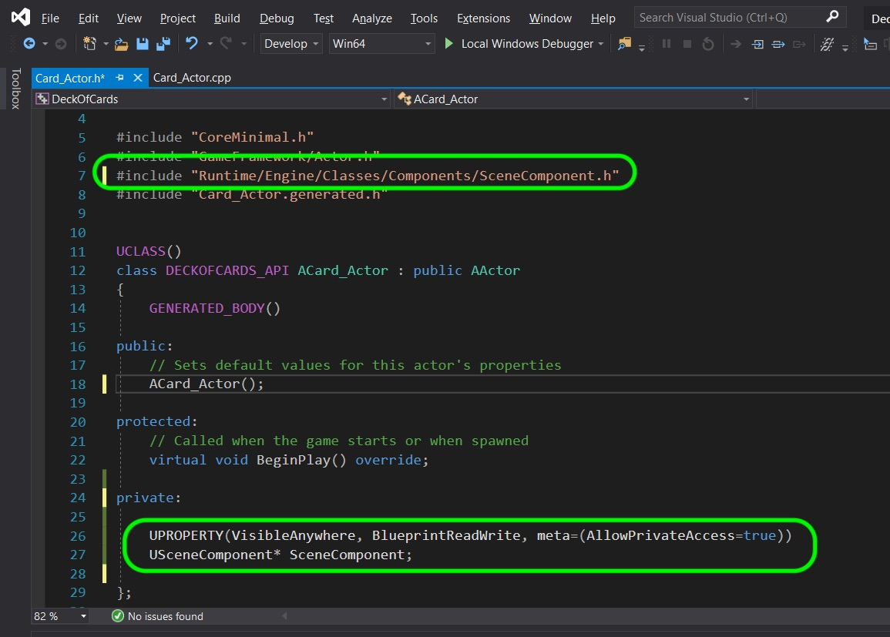

##### `Step 13.`\|`SPCRK`| :large_blue_diamond: :small_blue_diamond: :small_blue_diamond:  :small_blue_diamond: 
 
 Go back to **Card_Actor.cpp**.  In the constructor we call a template class that creates a component that attaches to an actor.  We also name the component `Card Root`.  We then need to set it as the root component.  There is only one root component in a blueprint.

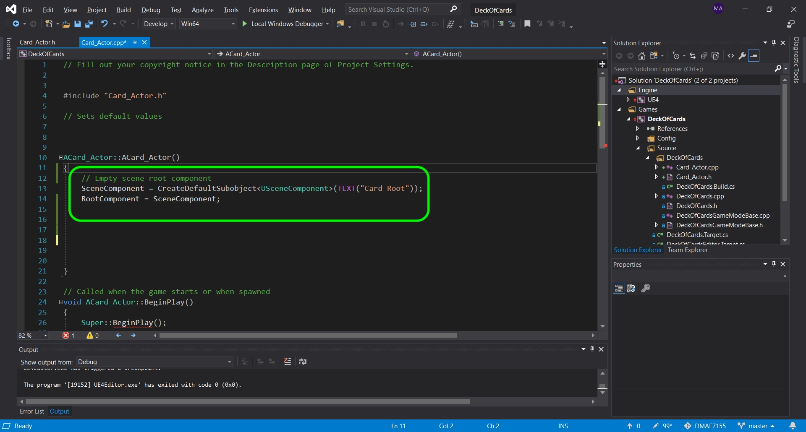

##### `Step 14.`\|`SPCRK`| :large_blue_diamond: :small_blue_diamond: :small_blue_diamond: :small_blue_diamond:  :small_blue_diamond: 

Go back to the main editor and right click on the **Card_Class** C++ icon and select **Create a Blueprint class based on Card_Actor**.

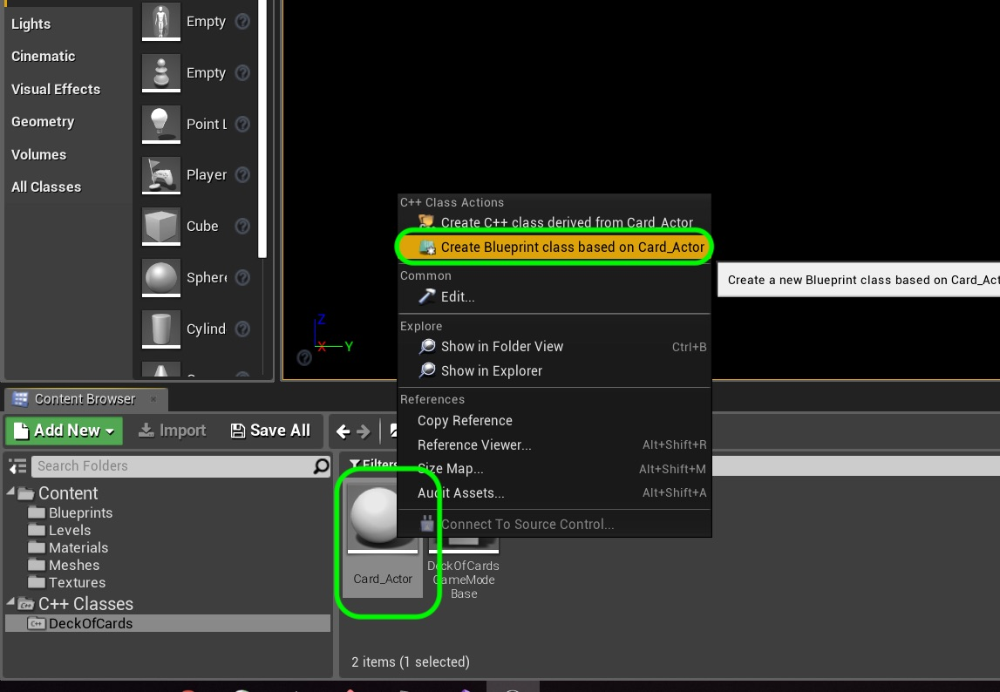

##### `Step 15.`\|`SPCRK`| :large_blue_diamond: :small_orange_diamond: 

Now name this new blueprint `BP_Card_Actor`. Move it into the blueprints folder.

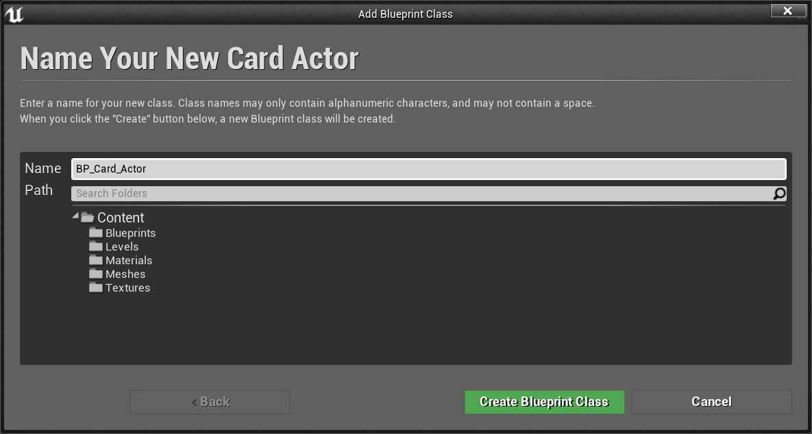

##### `Step 16.`\|`SPCRK`| :large_blue_diamond: :small_orange_diamond:   :small_blue_diamond: 

Open up the Blueprint and you see a root component.  It doesn't appear to carry the name of the component over to the blueprint.

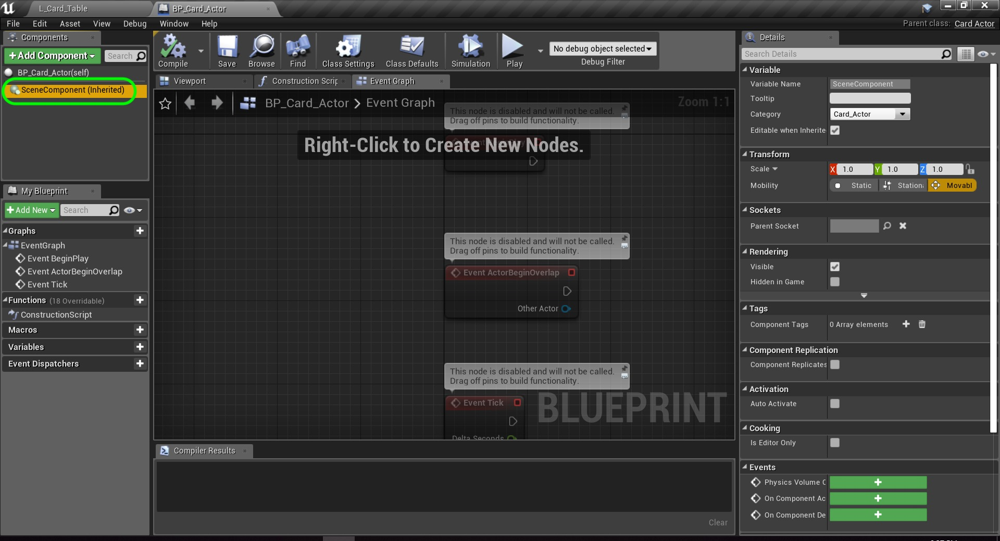

##### `Step 17.`\|`SPCRK`| :large_blue_diamond: :small_orange_diamond: :small_blue_diamond: :small_blue_diamond:

Include the `.h` file for the `UStaticMeshComponent.h`.  You can find the directory [here](https://api.unrealengine.com/INT/API/Runtime/Engine/Components/UStaticMeshComponent/index.html).  Then we create a pointer so we can access the data structure.

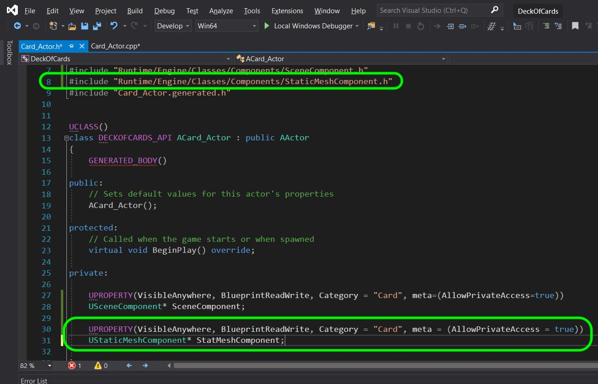

##### `Step 18.`\|`SPCRK`| :large_blue_diamond: :small_orange_diamond: :small_blue_diamond: :small_blue_diamond: :small_blue_diamond:

Now we want to load the static mesh.  Normally this would happen in the in game menu.  Since this is a more complex actor with lots going on we will do it in code. Warning - it needs to be clear that files cannot be mored or renamed without crashing this code.  This should be done on a limited basis. Go to **Meshes \| Card_Plane1** mesh and right click on it.  Then select **Copy Reference**.

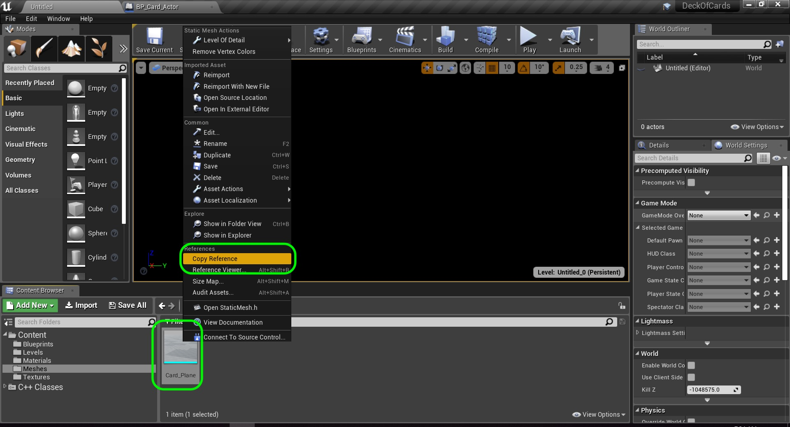

##### `Step 19.`\|`SPCRK`| :large_blue_diamond: :small_orange_diamond: :small_blue_diamond: :small_blue_diamond: :small_blue_diamond: :small_blue_diamond:

If you paste it gives you more information than we need.  We don't need the **type** nor do we need the extension.

##### `Step 20.`\|`SPCRK`| :large_blue_diamond: :large_blue_diamond:

Now we need a **Static Mesh Component** and we need the **Plane** static mesh to be assigned to it.  We just copied the location for it.  We create the **Static Mesh** reference in a similar way to the **Scene** Component.  The we load a pointer to a `UStaticMesh` and use the function `SetStaticMesh(mesh)`.

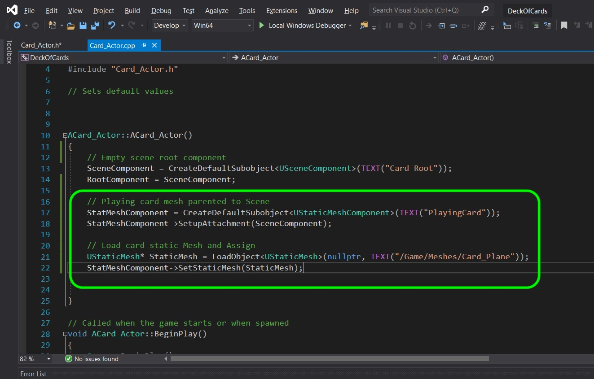

##### `Step 21.`\|`SPCRK`| :large_blue_diamond: :large_blue_diamond: :small_blue_diamond:

It is always good to check out the documentation for `UStaticMeshComponent` to find out what members are public and accessible.

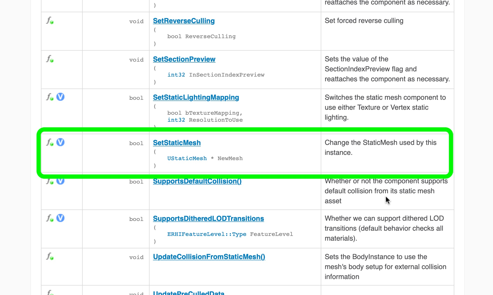

___

| [previous](../)| [home](../README.md#user-content-gms2-top-down-shooter) | [next](../)|
|---|---|---|
