### Setting Up

[previous](../) • [home](../README.md#user-content-gms2-top-down-shooter) • [next](../)

Lets start by getting a project and up and running.

 

---

##### `Step 1.`\|`SPCRK`|:small_blue_diamond:

Create a new project in UE4 and pick type **Games** and press the **Next** button:

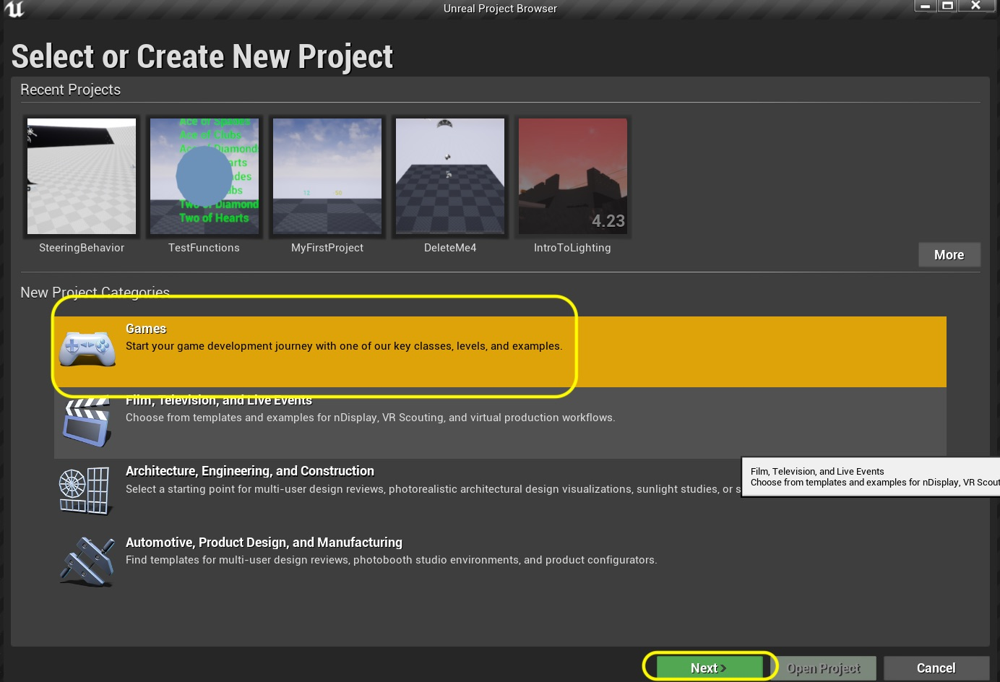

##### `Step 2.`\|`FHIU`|:small_blue_diamond: :small_blue_diamond: 

Select **Blank** and press the **Next** button:

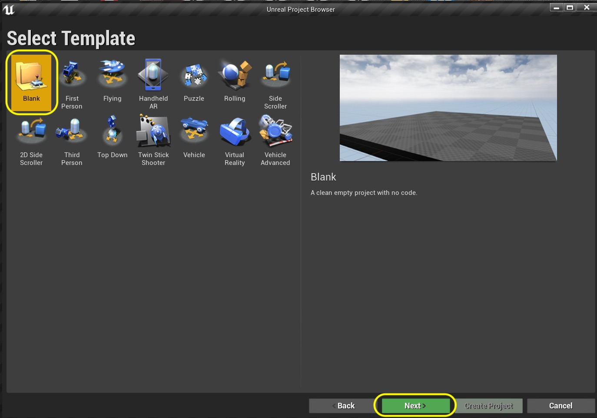

##### `Step 3.`\|`SPCRK`|:small_blue_diamond: :small_blue_diamond: :small_blue_diamond:

Select C++ Basic, no starter content project and pick a directory to save it in.  Call the project `DeckOfCardsI` then press the **Create Project** button.

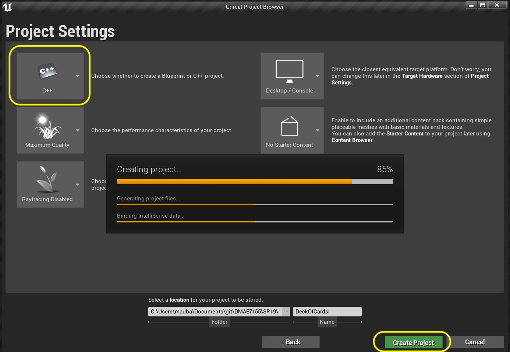

##### `Step 4.`\|`SPCRK`|:small_blue_diamond: :small_blue_diamond: :small_blue_diamond: :small_blue_diamond:

Press the **Add New** button and add 4 new folders called `Blueprints`, `Levels`, `Materials` and `Textures`.

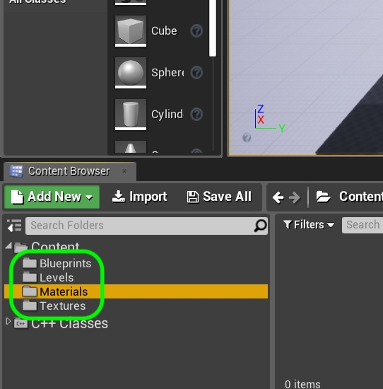

##### `Step 5.`\|`SPCRK`| :small_orange_diamond:

On Moodle you will find a zip folder with all the textures you need.  Download and **unzip** the **Playing Cards** folder.  Drag all the `.png` files into the **Textures** folder.  Take a moment to look at the names.  I have very consistent naming so that we can in a loop import the textures dynamically.

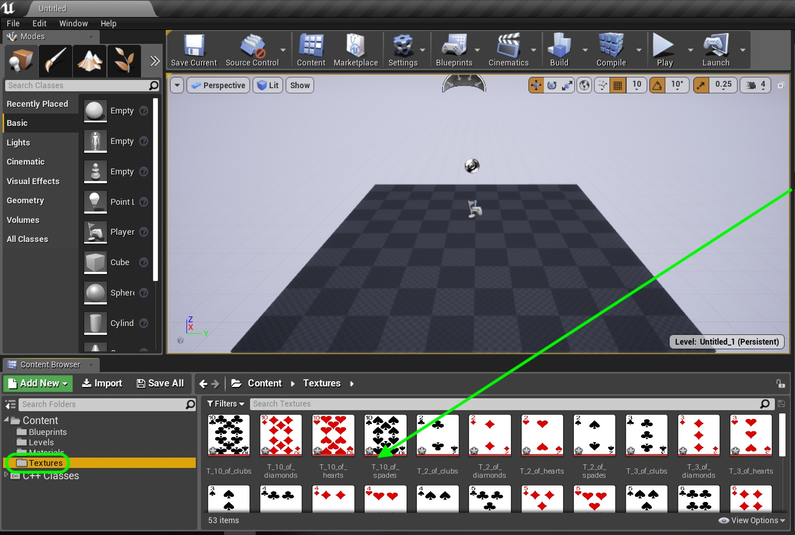

##### `Step 6.`\|`SPCRK`| :small_orange_diamond: :small_blue_diamond:

Now this is a 2-D game and we will not be lighting it conventionally like a 3-D game.  In fact we will have no lights in the scene.  Click on the **Add New** button and select **Material**:

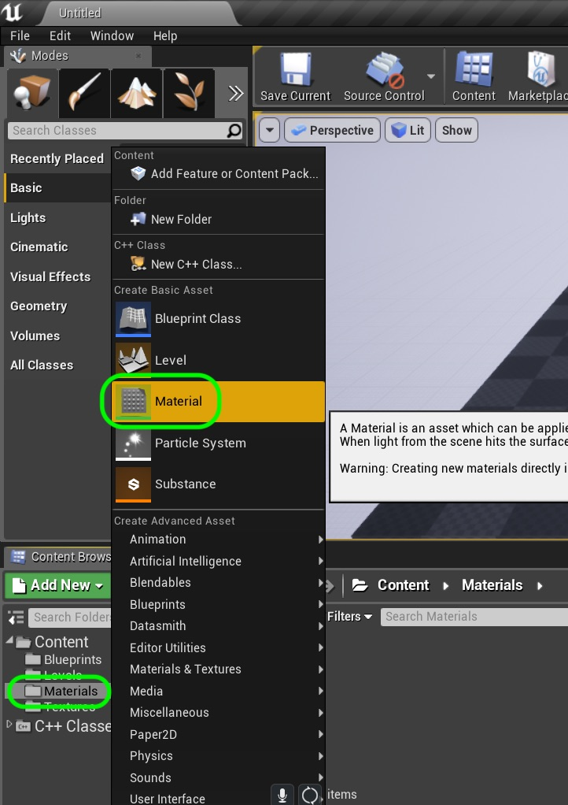

##### `Step 7.`\|`SPCRK`| :small_orange_diamond: :small_blue_diamond: :small_blue_diamond:
Name this material `M_Card` and double click it to enter the material editor.

##### `Step 8.`\|`SPCRK`| :small_orange_diamond: :small_blue_diamond: :small_blue_diamond: :small_blue_diamond:

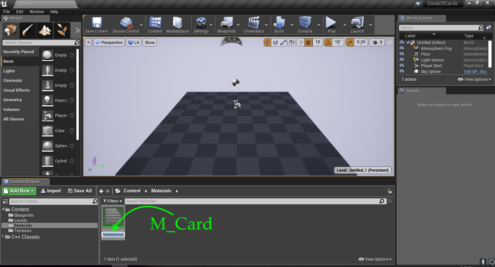

##### `Step 9.`\|`SPCRK`| :small_orange_diamond: :small_blue_diamond: :small_blue_diamond: :small_blue_diamond: :small_blue_diamond:

Now we right click on the graph and select a **Texture Sample** node.  Take the top **RGB** output pin and place it into the **Emissive Color** node in the M_Card node.  Since there are no lights this is a self lit texture (all will be lit with the same intensity).  Then select any of the card textures.  Look at the preview window and look at the texture on a flat plane. It is squished but we will be fixing that.

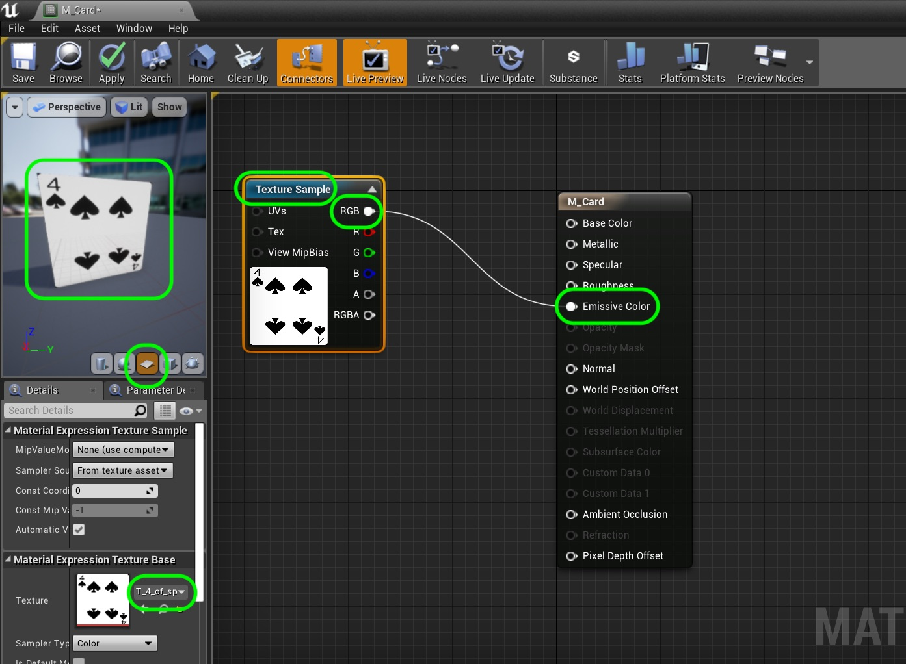

##### `Step 10.`\|`SPCRK`| :large_blue_diamond:

Now we want to be able to assign different card textures to different cards.  This means we need to manipulate this node.  We cannot unless we make it a parameter that we can edit. Right click on the **Texture Sample** node and select **Convert to Parameter** so we can edit it in a blueprint or in C++.

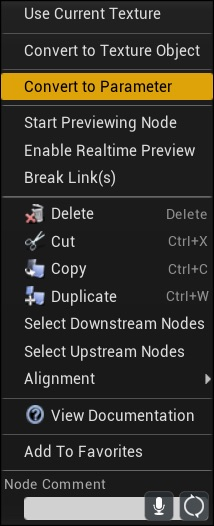

##### `Step 11.`\|`SPCRK`| :large_blue_diamond: :small_blue_diamond: 

Now you can give this parameter a name and call it `Card_Texture`. When you finish a material you always have to press the **Apply** button so that the matelerial is rendered and usable otherwise it will not affect the actor.

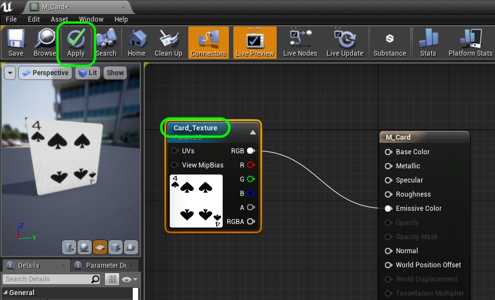

##### `Step 12.`\|`SPCRK`| :large_blue_diamond: :small_blue_diamond: :small_blue_diamond: 
Start a new empty level with no objects in the scene.  Call it `L_Card_Table`.

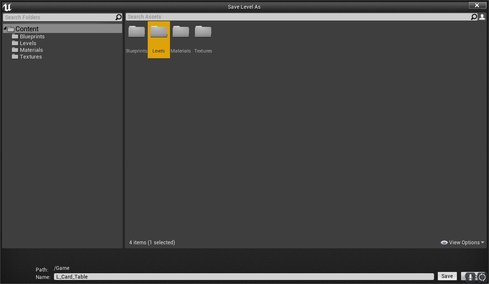

##### `Step 13.`\|`SPCRK`| :large_blue_diamond: :small_blue_diamond: :small_blue_diamond:  :small_blue_diamond: 

Now lets set this level as the default level.  Right click on **Edit \| Project Settings** and select **Maps & Modes** and change both the **Editor Startup Map** and **Game Default Map** to **L_Card_Table**.

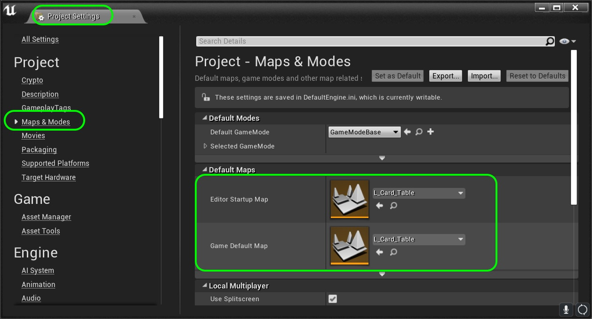

##### `Step 14.`\|`SPCRK`| :large_blue_diamond: :small_blue_diamond: :small_blue_diamond: :small_blue_diamond:  :small_blue_diamond: 
We need to add a camera to the scene.  Type **Camera** into the **Modes** tab and drag a camera into the scene.

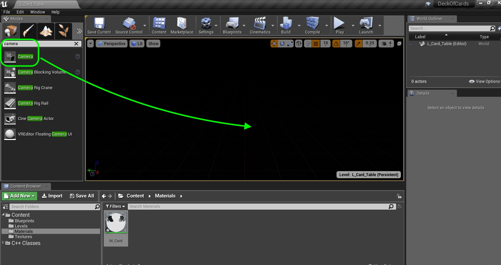

##### `Step 15.`\|`SPCRK`| :large_blue_diamond: :small_orange_diamond: 

Press the yellow arrow next to Location and press it to reset the position to `0,0`, `0.0, 0.0`.

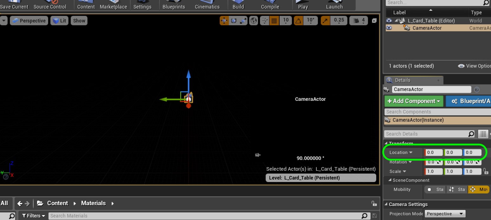

##### `Step 16.`\|`SPCRK`| :large_blue_diamond: :small_orange_diamond:   :small_blue_diamond: 

 Now since Unreal is Z up, I want my 2-d level to be on the **X Y** plane. So move the camera up the **Z** axis, to around `310` and then rotate on the **Y** axis by `270` degrees to shoot downwards. 

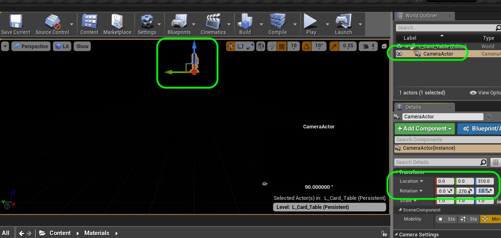

##### `Step 17.`\|`SPCRK`| :large_blue_diamond: :small_orange_diamond: :small_blue_diamond: :small_blue_diamond:

Since this is 2-D we don't want a perspective camera, we want an [orthographic](https://en.wikipedia.org/wiki/Orthographic_projection) one. This means that objects in front of the camera do not scale, they are always the same size.  So we can stack our cards in Z without affecting the scale of the cards.

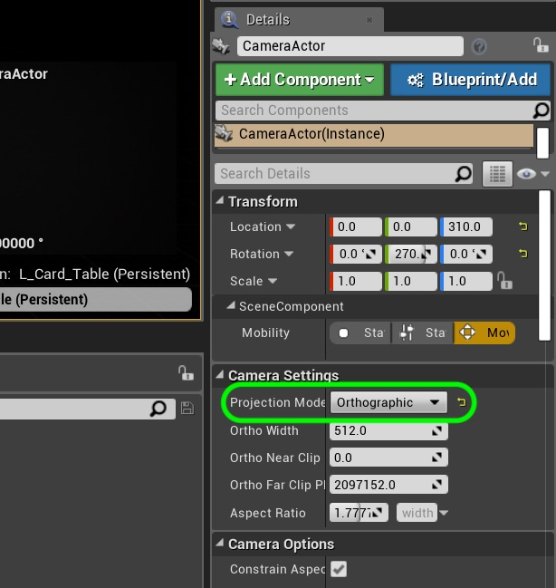

##### `Step 18.`\|`SPCRK`| :large_blue_diamond: :small_orange_diamond: :small_blue_diamond: :small_blue_diamond: :small_blue_diamond:

___

| [previous](../)| [home](../README.md#user-content-gms2-top-down-shooter) | [next](../)|
|---|---|---|
