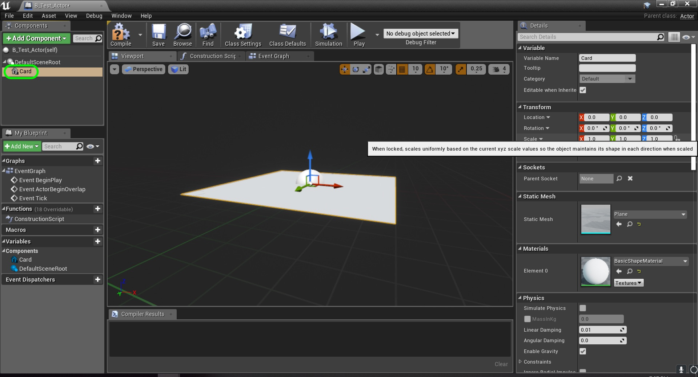
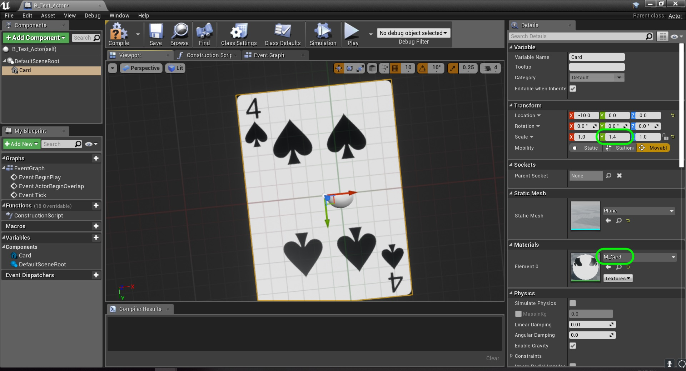
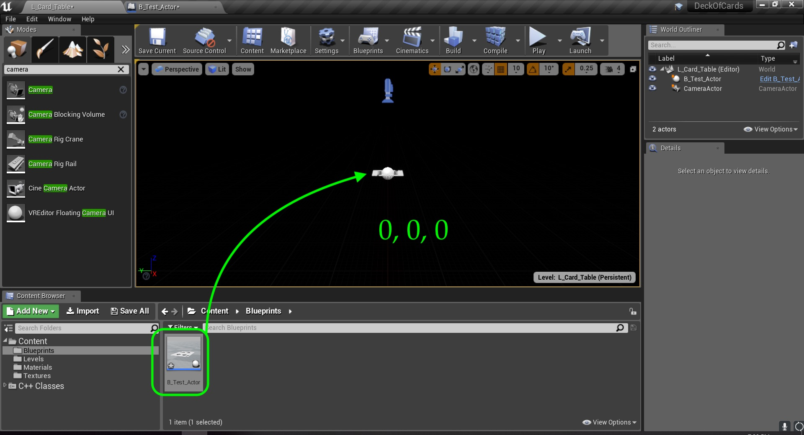
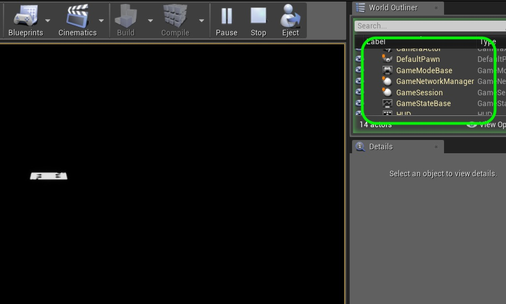

### Add Test Blueprint

[previous](../) • [home](../README.md#user-content-gms2-top-down-shooter) • [next](../)

So before we do anything in C++ lets look at what it looks like in a blueprint.  Normally we would import models in the blueprint editor.  Normally a piece of art is static.  If you place a rock, it stays a rock in the scene.  But with a playing card we want to dynamically change the card, turn it over etc...

 

---

##### `Step 1.`\|`SPCRK`|:small_blue_diamond:

Create a new blueprint and select an `Actor` class.  call it `B_Test_Actor` and add **Plane** component.  Change the name to `Card`:

##### `Step 2.`\|`FHIU`|:small_blue_diamond: :small_blue_diamond: 

Now a playing card is not square and we want a **1 : 1.4** ratio.  Change the **Y Scale** to `1.4`.  Select the **Materials** tab for the material we just made called **M_Card**.

##### `Step 3.`\|`SPCRK`|:small_blue_diamond: :small_blue_diamond: :small_blue_diamond:

Drag the card in the scene. Set the transform to `0.0`, `0.0` and `0.0` on the **X Y Z** axis.  Now press run.  What another camera appears?  Oh, you can move a player around the scene with the arrows or WASD keys?  Why?

##### `Step 4.`\|`SPCRK`|:small_blue_diamond: :small_blue_diamond: :small_blue_diamond: :small_blue_diamond:

Look at the **World Outliner** while the game is running and see that when you press play it adds a whole bunch of classes to the scene.  Pay attention to the second camera as well as the Default Player Pawn.  Now we want to set up the scene to use our new camera.  This will take a couple of steps.

___

| [previous](../)| [home](../README.md#user-content-gms2-top-down-shooter) | [next](../)|
|---|---|---|
