### Finish Two Piles

[previous](../) • [home](../README.md#user-content-gms2-top-down-shooter) • [next](../)

OK, now lets create two piles with the one on the left face down and the one on the right face up.  Clicking on each deck will switch the card between the two piles.

 

---

##### `Step 1.`\|`SPCRK`|:small_blue_diamond:

Now the deck object should keep track of which pile each card is in. Open up **BP_Deck_Of_Cards** and create 2 **integer** variables that tracks the number that card is on the pile.  Name them `Card1Pile` and `Card2Pile`, make them **private**.  The **Category** is set to `Pile` and we need to set **Card1Pile** to `0` and **Card2Pile** to `-1`. If a number is greater or equal to zero then it is on that pile. Since the cards all start on pile 1 we will leave them at 0 for now and adjust them in the **Begin Play** event.

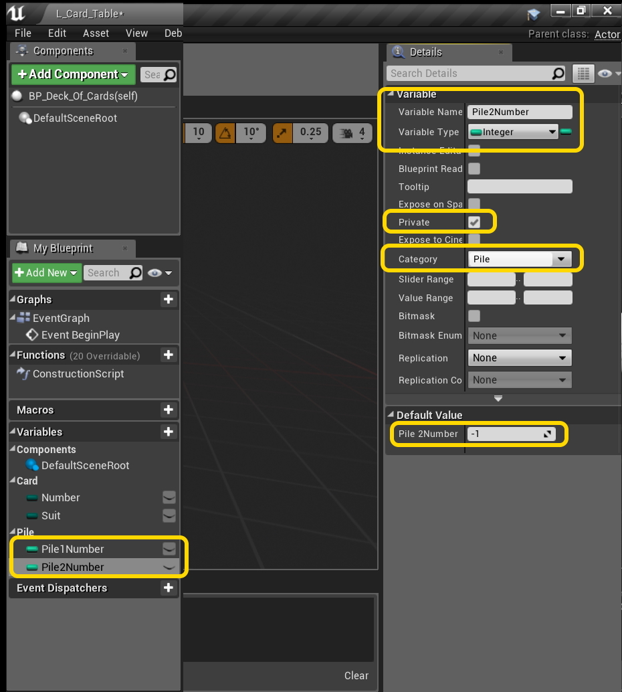

##### `Step 2.`\|`FHIU`|:small_blue_diamond: :small_blue_diamond: 

Lets make a small change.  Now we want to have each card on a different level on the **Z** axis.  Since the camera is orhtographic it will present no scale issues with the art (there is no depth so the objects don't scale relative to the camera).  So lets use the varibles we just created to not only indicate what number on the pile it is, but use it to set the Z value.  The highest value is the top of the deck and 0 is the bottomm (-1 is that it is NOT in the pile). Disconnect the pin from **Get Actor Location** and right click on the **Return Value** and select **Split Struct Pin**. Then reconnect the **X** and **Y** pins and plug the new **Pile Number** variable into **Z**.

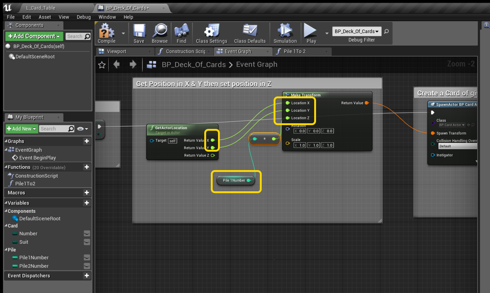

##### `Step 3.`\|`SPCRK`|:small_blue_diamond: :small_blue_diamond: :small_blue_diamond:

Now we will move the control of the card from the card blueprint to the deck blueprint.  Create a new **Function** and call it `Pile1To2` and add an input with **Object Reference** to the specific instance of thee **BP_Card_Actor**.  We don't want a class reference as we want to access a specific instance of that deck as there could be more than one deck at play in the game.

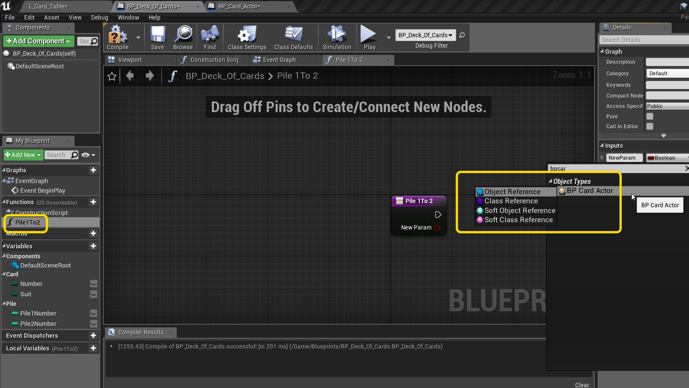

##### `Step 4.`\|`SPCRK`|:small_blue_diamond: :small_blue_diamond: :small_blue_diamond: :small_blue_diamond:

Open up **BP_Card_Actor** and shift select all the nodes and copy and delete these nodes as we will move them to the function in the deck:

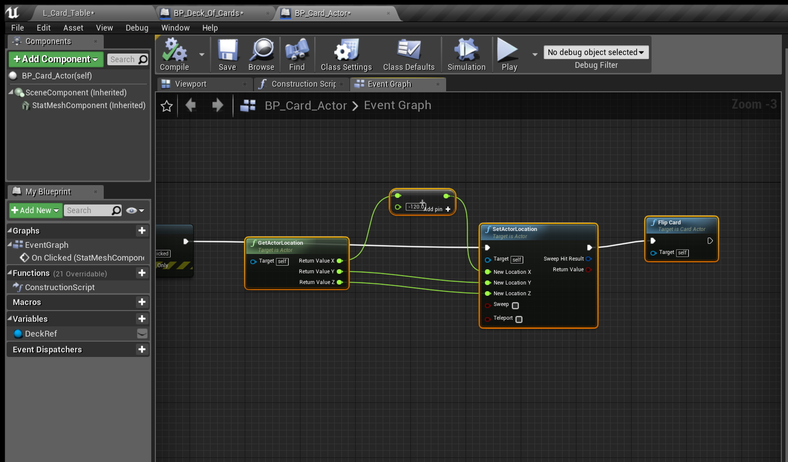

##### `Step 5.`\|`SPCRK`| :small_orange_diamond:
Paste the nodes into the **Pile1To2** function and connect thee execution pin.  Now the target is the card and not the deck so connect the **CardRef** input pin to the **Get Actor Location**, **Set Actor Location** and **Flip Card** function.

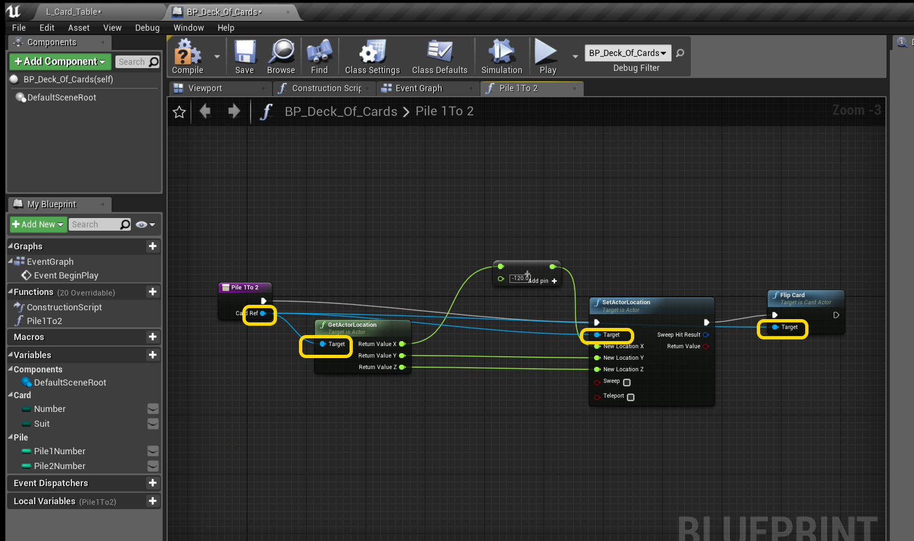

##### `Step 6.`\|`SPCRK`| :small_orange_diamond: :small_blue_diamond:

Now drag a a **Get Pile 2 Number** and plug it into the **Z** axis so that the top of the deck is sorted on top.

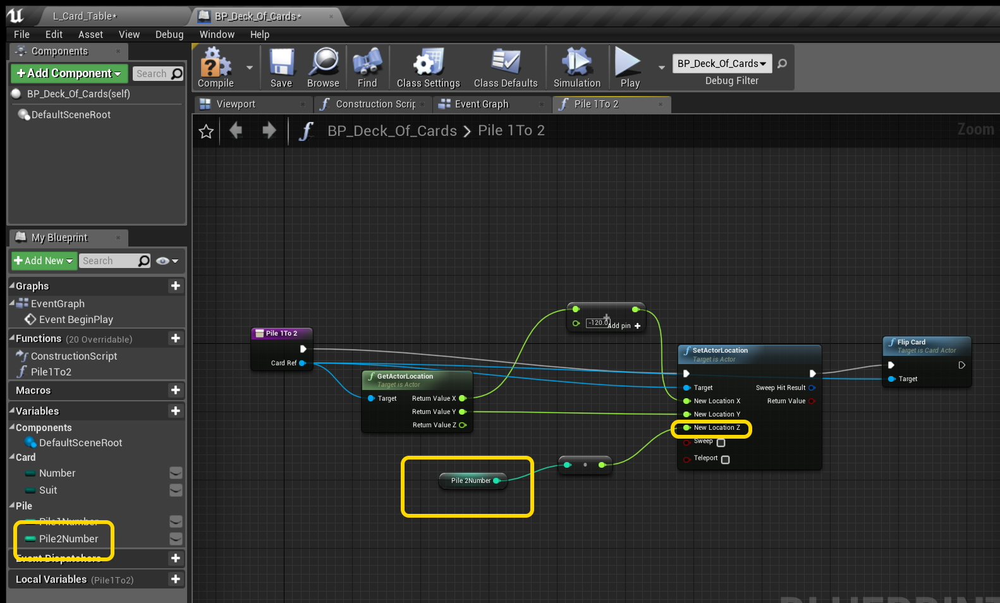

##### `Step 7.`\|`SPCRK`| :small_orange_diamond: :small_blue_diamond: :small_blue_diamond:

Now when a card goes from deck 1 to deck 2 we need to subtract a number from pile 1 and add a number to pile 2.

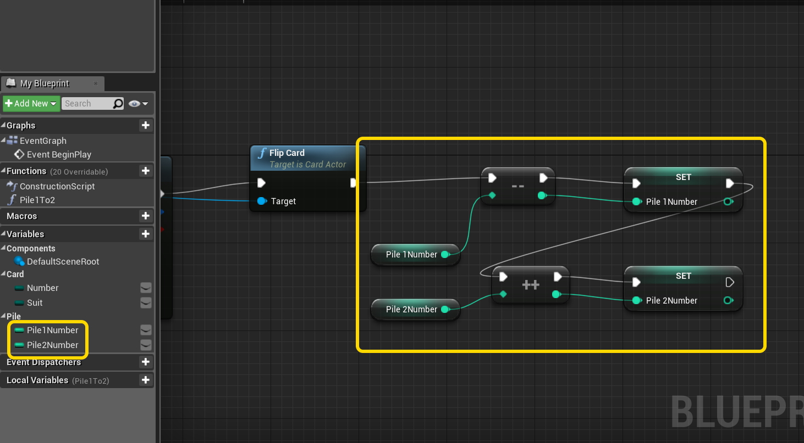

##### `Step 8.`\|`SPCRK`| :small_orange_diamond: :small_blue_diamond: :small_blue_diamond: :small_blue_diamond:

Now the card will need to communicate to the deck.  How will it get access to it?  We will open up **BP_Card_Actor** and add a new **Variable** reference to the deck of type **Object Reference** of a **BP Deck Of Cards**. 

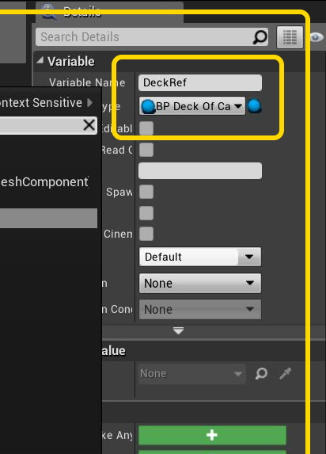

##### `Step 9.`\|`SPCRK`| :small_orange_diamond: :small_blue_diamond: :small_blue_diamond: :small_blue_diamond: :small_blue_diamond:

Now on the event graph, drag a reference of the variable **Deck Ref** to the graph.  Then pull off the pin and call the **Pile1To2** function.  Add a **Self** reference to the **Card Ref** pin so that the deck's function can manipulate the card. Connect the execution pin from **OnClicked** node to **Pile1To2** node.

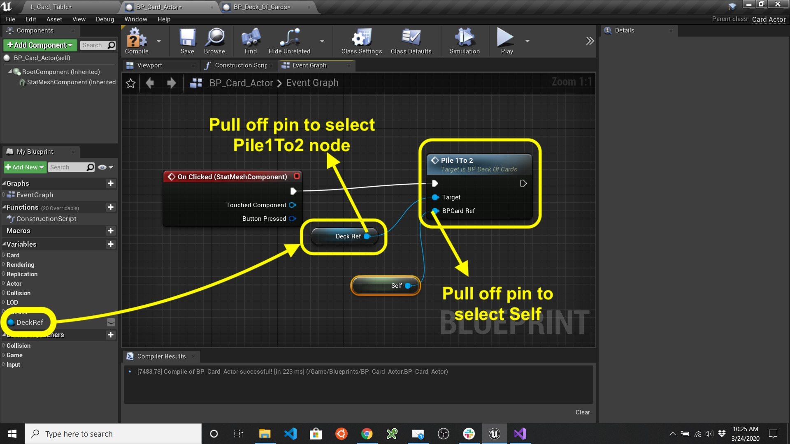

##### `Step 10.`\|`SPCRK`| :large_blue_diamond:

Now go back to **BP_Deck_Of_Cards** and add a **Self** reference to pass to the deck of cards so it can access the **Deck**'s public members.

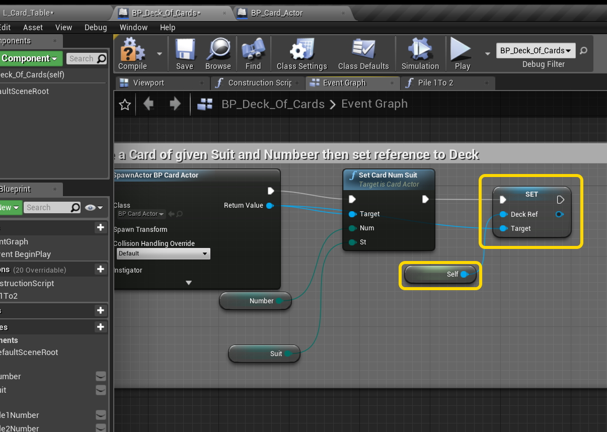

##### `Step 11.`\|`SPCRK`| :large_blue_diamond: :small_blue_diamond: 

 Now also increment the **Pile 1 Number** after the card iis spawned to put each subsequent card on the pile.

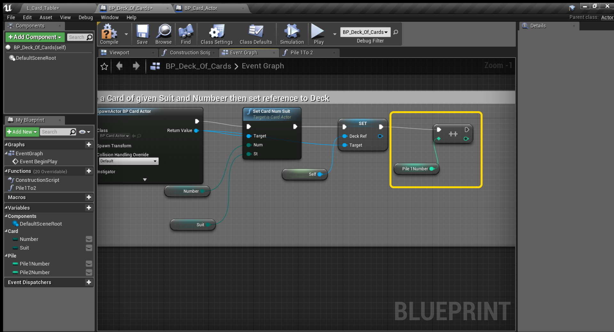

##### `Step 12.`\|`SPCRK`| :large_blue_diamond: :small_blue_diamond: :small_blue_diamond: 

Compile the game and run it.  Now click on the pile and we start with the last dealt card and it goes from kings to aces in reverse order.  But you can still keep moving cards right.  Look at the Z position to make sure that it is changing as you expect (the lowest number at the bottom of the deck and the highest at the top). In the next page lets finish up our two pile exercise.

___

| [previous](../)| [home](../README.md#user-content-gms2-top-down-shooter) | [next](../)|
|---|---|---|
