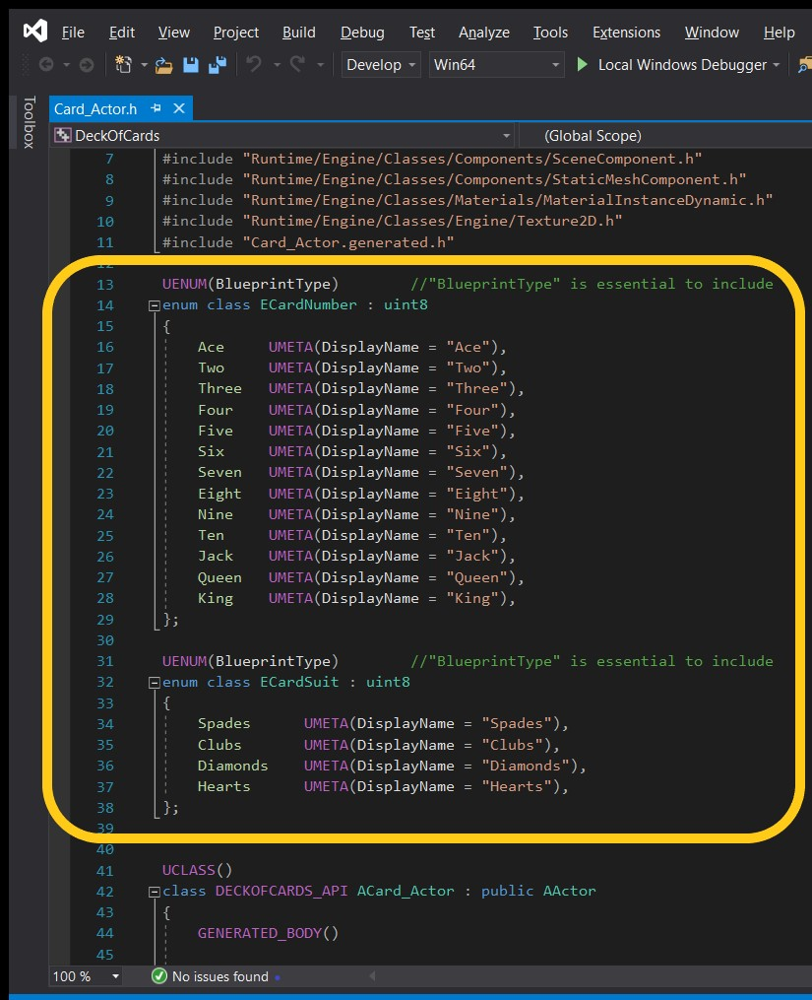
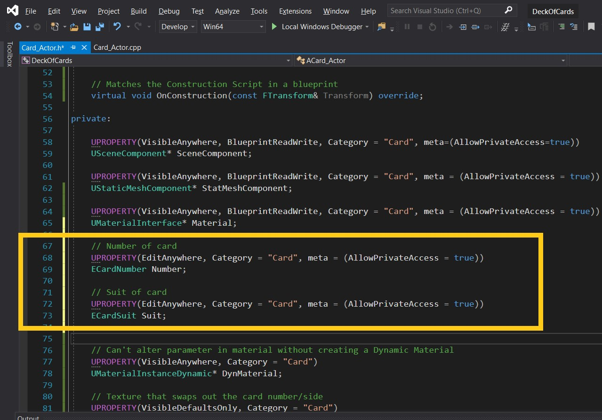
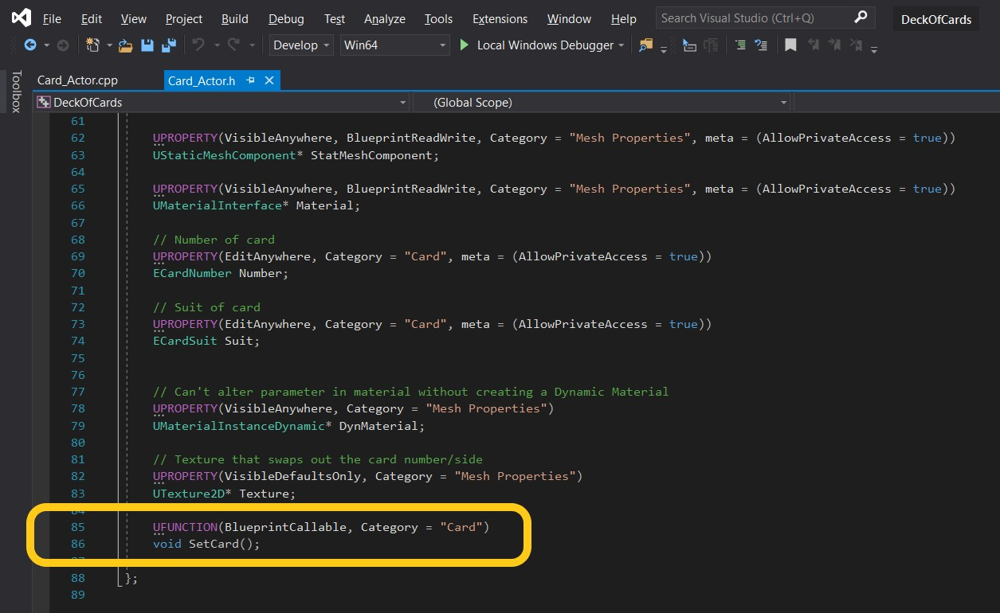
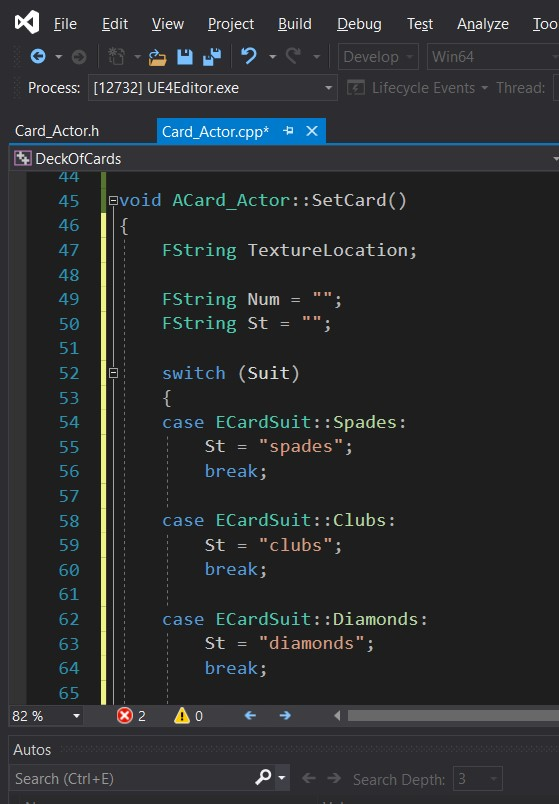
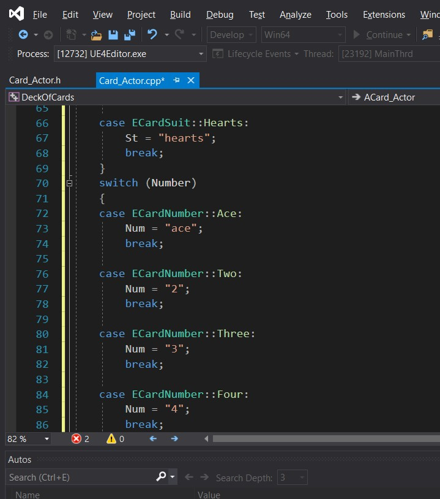
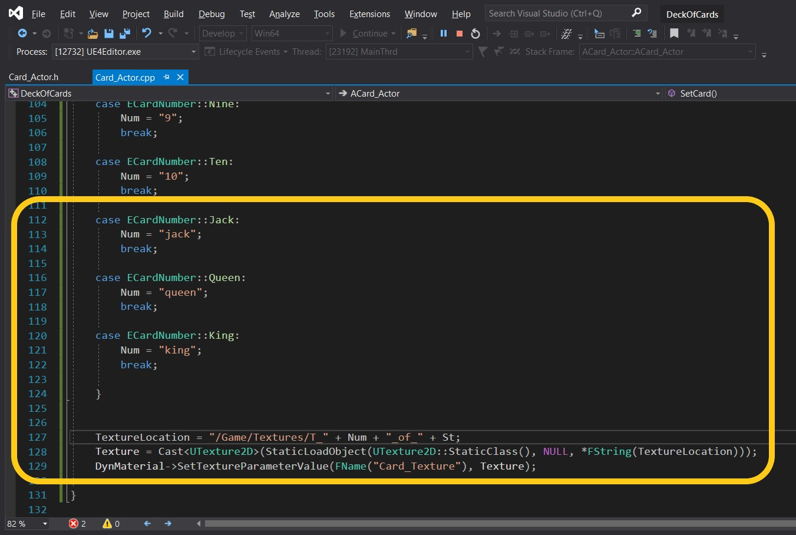
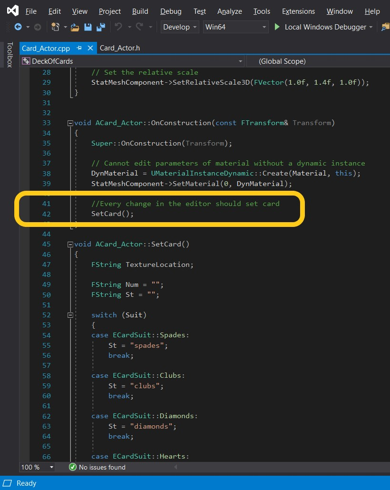

### User Selected Card Suit

[previous](../) • [home](../README.md#user-content-gms2-top-down-shooter) • [next](../)

Now we want the user to be able to choose which card and suit to pick in the editor.  We want the varibales to be exposed and editable in the editor.  We will start by storing the suit and card numbers in special UE4 Enumerators.

 

---

##### `Step 1.`\|`SPCRK`|:small_blue_diamond:

Lets create two more enumerator classes to store both the card number and the suit.  We could use a plain c++ enumerator class but we will not be able to edit it in blueprints or the editor.  There is a [UENUM](https://api.unrealengine.com/INT/API/Runtime/CoreUObject/UObject/UEnum/index.html) that inherits from a **UObject** which makes it accessible in the editor.  There is one large limitation which it is only available with a uint8 font which allows for 256 different enumerators per class.  More than enough for a deck of cards but could cause issues with larger structures where another solution might have to be implemented.  It is a UE4 standard to name an enumerator with a capital **E**.

##### `Step 2.`\|`FHIU`|:small_blue_diamond: :small_blue_diamond: 

Now lets add two new variables with a special indicationn that we want to edit the variables even though they are in a private class.  We create a number and suit enumerator reference. We use the enumerator types we created above.

##### `Step 3.`\|`SPCRK`|:small_blue_diamond: :small_blue_diamond: :small_blue_diamond:

Add a new function that will select the correct texture for the card.  Now they are named CONSISTENTLY so that we can use a loop to construt their full name without having to retype the entire path every time.  Open the `.h` file and add a new functiono called `void SetCard()`.

##### `Step 4.`\|`SPCRK`|:small_blue_diamond: :small_blue_diamond: :small_blue_diamond: :small_blue_diamond:

We are going to have to construct an entire directory name that we will destroy after the function is called named `TextureLocation`.  We will have two **FString** variables to store the number `Num` and suit `St`.  Then we switch the the suit enumerators to attach the correct string.

##### `Step 5.`\|`SPCRK`| :small_orange_diamond:

##### `Step 6.`\|`SPCRK`| :small_orange_diamond: :small_blue_diamond:

We do the same thing with the card number.  

##### `Step 7.`\|`SPCRK`| :small_orange_diamond: :small_blue_diamond: :small_blue_diamond:

Finish off the rest of the numbers from Jack to King.  We assemble the name to match the location of the card textures.  To pass the **FName** to **StaticLoadObject** we can just dereference the **Fstring** and it will load the textures.

##### `Step 8.`\|`SPCRK`| :small_orange_diamond: :small_blue_diamond: :small_blue_diamond: :small_blue_diamond:

Now we could call this function in **BeginPlay** but you will have to play the game after you set the card to see if it works.  By placing it in the **OnConstruction** event we will run this script anytime anything changes in the editor.

##### `Step 9.`\|`SPCRK`| :small_orange_diamond: :small_blue_diamond: :small_blue_diamond: :small_blue_diamond: :small_blue_diamond:

Drag a copy of thee new CPP class into the game screen if it is not already there.  Compile and Run the game and look click on the card number and suit in the World Outliner.  Notice that you can change the card and it changes in the game at the exact same time!

___

| [previous](../)| [home](../README.md#user-content-gms2-top-down-shooter) | [next](../)|
|---|---|---|
